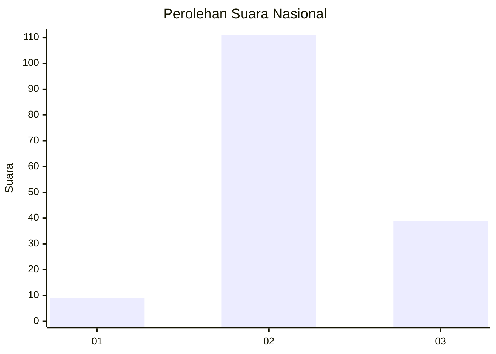
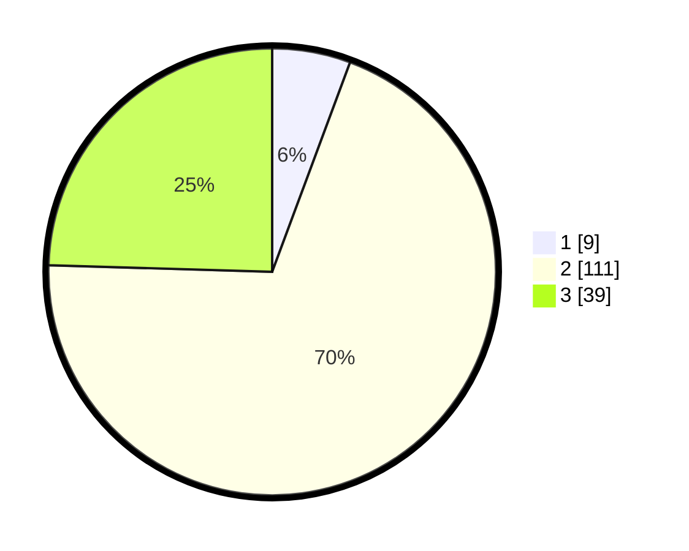

# Hasil

## Grafik

## Tabel

| No. | Nama Paslon    | Suara | Suara (raw) | Persentase |
|:--- |:-------------- | -----:| -----------:| ----------:|
| 1   | ANIES MUHAIMIN | 9     | [9][p-1]    | 5,66       |
| 2   | PRABOWO GIBRAN | 111   | [111][p-2]  | 69,81      |
| 3   | GANJAR MAHFUD  | 39    | [39][p-3]   | 24,53      |

[p-1]: https://github.com/gigit-pemilu/pemilu-2024/blob/main/pilpres/hitung-suara/sub/81-maluku/sub/07-kepulauan-aru/sub/01-pulau-pulau-aru/sub/1012-galai-dubu/sub/018-tps/sub/paslon-1.txt
[p-2]: https://github.com/gigit-pemilu/pemilu-2024/blob/main/pilpres/hitung-suara/sub/81-maluku/sub/07-kepulauan-aru/sub/01-pulau-pulau-aru/sub/1012-galai-dubu/sub/018-tps/sub/paslon-2.txt
[p-3]: https://github.com/gigit-pemilu/pemilu-2024/blob/main/pilpres/hitung-suara/sub/81-maluku/sub/07-kepulauan-aru/sub/01-pulau-pulau-aru/sub/1012-galai-dubu/sub/018-tps/sub/paslon-3.txt

## Foto C Plano

https://sirekap-obj-formc.kpu.go.id/e548/pemilu/ppwp/81/07/01/10/12/8107011012018-20240215-030411--bfdcb58a-f0c1-4ed6-aee6-8ad560202b36.jpg

https://sirekap-obj-formc.kpu.go.id/e548/pemilu/ppwp/81/07/01/10/12/8107011012018-20240215-030752--e481a56a-dedf-4d1e-a3f8-5046401bdf81.jpg

## Metadata

| Key        | Value               |
| ---------- | ------------------- |
| Time Stamp | 2024-02-15 15:00:29 |

