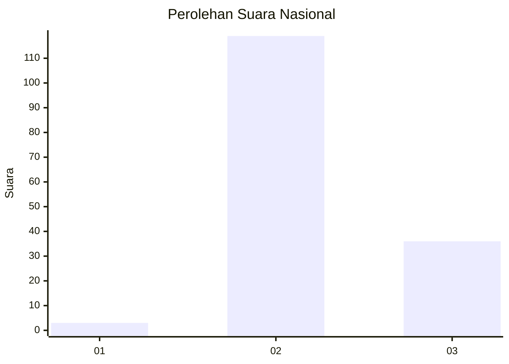
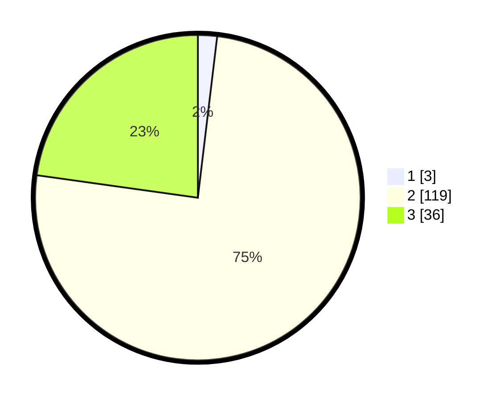

# Hasil

## Grafik

## Tabel

| No. | Nama Paslon    | Suara | Suara (raw) | Persentase |
|:--- |:-------------- | -----:| -----------:| ----------:|
| 1   | ANIES MUHAIMIN | 3     | [3][p-1]    | 1,90       |
| 2   | PRABOWO GIBRAN | 119   | [119][p-2]  | 75,32      |
| 3   | GANJAR MAHFUD  | 36    | [36][p-3]   | 22,78      |

[p-1]: https://github.com/gigit-pemilu/pemilu-2024/blob/main/pilpres/hitung-suara/sub/81-maluku/sub/07-kepulauan-aru/sub/01-pulau-pulau-aru/sub/1012-galai-dubu/sub/019-tps/sub/paslon-1.txt
[p-2]: https://github.com/gigit-pemilu/pemilu-2024/blob/main/pilpres/hitung-suara/sub/81-maluku/sub/07-kepulauan-aru/sub/01-pulau-pulau-aru/sub/1012-galai-dubu/sub/019-tps/sub/paslon-2.txt
[p-3]: https://github.com/gigit-pemilu/pemilu-2024/blob/main/pilpres/hitung-suara/sub/81-maluku/sub/07-kepulauan-aru/sub/01-pulau-pulau-aru/sub/1012-galai-dubu/sub/019-tps/sub/paslon-3.txt

## Foto C Plano

https://sirekap-obj-formc.kpu.go.id/2e56/pemilu/ppwp/81/07/01/10/12/8107011012019-20240214-224902--82dab039-03a0-426f-94b0-76d22e4409ac.jpg

https://sirekap-obj-formc.kpu.go.id/2e56/pemilu/ppwp/81/07/01/10/12/8107011012019-20240214-225848--f0cf8f5e-0857-48c9-b061-71ac23d25a39.jpg

https://sirekap-obj-formc.kpu.go.id/2e56/pemilu/ppwp/81/07/01/10/12/8107011012019-20240214-230317--64c0f466-8718-47de-9459-511de35220d1.jpg

## Metadata

| Key        | Value               |
| ---------- | ------------------- |
| Time Stamp | 2024-02-15 12:00:28 |

