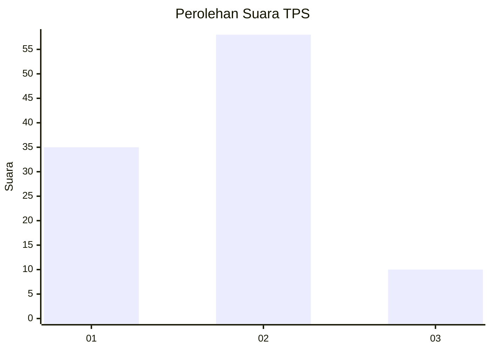
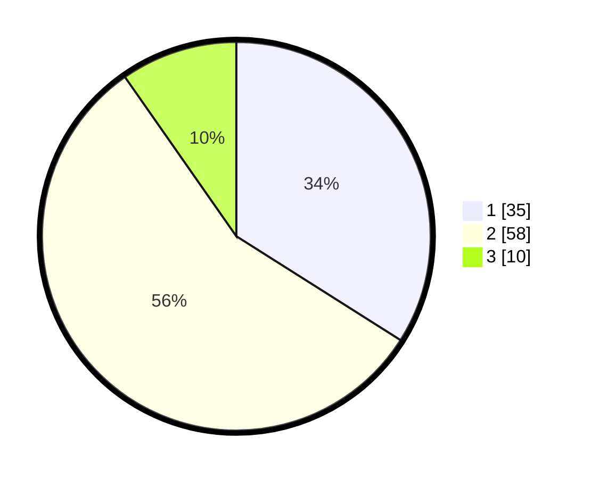

# Hasil

## Grafik

## Tabel

| No. | Nama Paslon    | Suara | Suara (raw) | Persentase |
|:--- |:-------------- | -----:| -----------:| ----------:|
| 1   | ANIES MUHAIMIN | 35    | [35][p-1]   | 33,98      |
| 2   | PRABOWO GIBRAN | 58    | [58][p-2]   | 56,31      |
| 3   | GANJAR MAHFUD  | 10    | [10][p-3]   | 9,71       |

[p-1]: https://github.com/gigit-pemilu/pemilu-2024-81-maluku/blob/main/pilpres/hitung-suara/sub/81-maluku/sub/07-kepulauan-aru/sub/01-pulau-pulau-aru/sub/2011-durjela/sub/004-tps/sub/paslon-1.txt
[p-2]: https://github.com/gigit-pemilu/pemilu-2024-81-maluku/blob/main/pilpres/hitung-suara/sub/81-maluku/sub/07-kepulauan-aru/sub/01-pulau-pulau-aru/sub/2011-durjela/sub/004-tps/sub/paslon-2.txt
[p-3]: https://github.com/gigit-pemilu/pemilu-2024-81-maluku/blob/main/pilpres/hitung-suara/sub/81-maluku/sub/07-kepulauan-aru/sub/01-pulau-pulau-aru/sub/2011-durjela/sub/004-tps/sub/paslon-3.txt

## Foto C Plano

https://sirekap-obj-formc.kpu.go.id/3d08/pemilu/ppwp/81/07/01/20/11/8107012011004-20240215-151719--46b912d4-c94a-44e4-997b-07e24bec1aa5.jpg

https://sirekap-obj-formc.kpu.go.id/3d08/pemilu/ppwp/81/07/01/20/11/8107012011004-20240215-152146--0af9092c-02d1-478a-865f-7b986964ffad.jpg

https://sirekap-obj-formc.kpu.go.id/3d08/pemilu/ppwp/81/07/01/20/11/8107012011004-20240215-152326--4843ea7b-fd36-474e-887a-67b2ad2a6abc.jpg

## Metadata

| Key        | Value               |
| ---------- | ------------------- |
| Time Stamp | 2024-02-15 16:30:25 |

