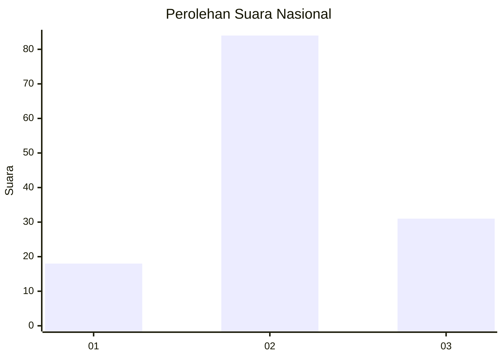
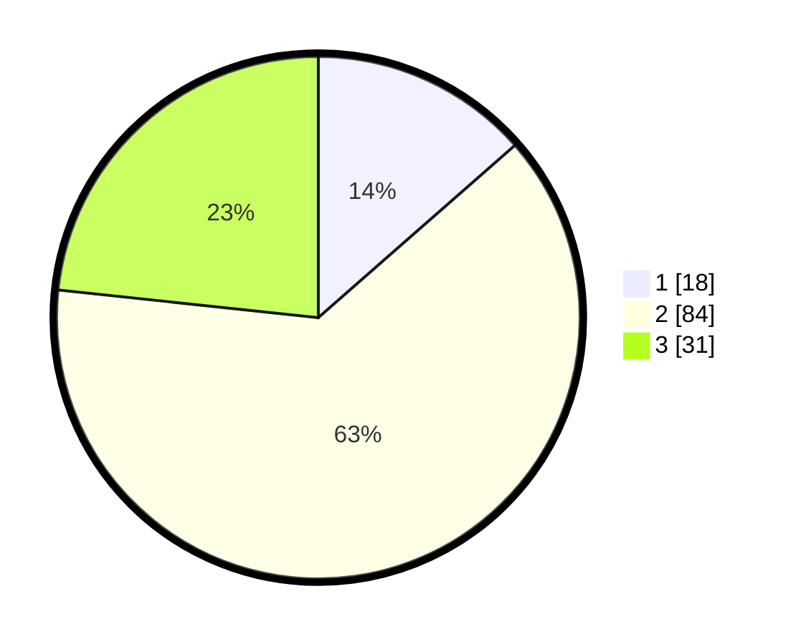

# Hasil

## Grafik

## Tabel

| No. | Nama Paslon    | Suara | Suara (raw) | Persentase |
|:--- |:-------------- | -----:| -----------:| ----------:|
| 1   | ANIES MUHAIMIN | 18    | [18][p-1]   | 13,53      |
| 2   | PRABOWO GIBRAN | 84    | [84][p-2]   | 63,16      |
| 3   | GANJAR MAHFUD  | 31    | [31][p-3]   | 23,31      |

[p-1]: https://github.com/gigit-pemilu/pemilu-2024/blob/main/pilpres/hitung-suara/sub/81-maluku/sub/07-kepulauan-aru/sub/03-aru-tengah/sub/2001-benjina/sub/003-tps/sub/paslon-1.txt
[p-2]: https://github.com/gigit-pemilu/pemilu-2024/blob/main/pilpres/hitung-suara/sub/81-maluku/sub/07-kepulauan-aru/sub/03-aru-tengah/sub/2001-benjina/sub/003-tps/sub/paslon-2.txt
[p-3]: https://github.com/gigit-pemilu/pemilu-2024/blob/main/pilpres/hitung-suara/sub/81-maluku/sub/07-kepulauan-aru/sub/03-aru-tengah/sub/2001-benjina/sub/003-tps/sub/paslon-3.txt

## Foto C Plano

https://sirekap-obj-formc.kpu.go.id/2281/pemilu/ppwp/81/07/03/20/01/8107032001003-20240215-071103--7ed0137f-cee1-4809-9c63-1f14b6ec01b9.jpg

https://sirekap-obj-formc.kpu.go.id/2281/pemilu/ppwp/81/07/03/20/01/8107032001003-20240215-074612--5a572f25-67b7-414b-95ca-3cb907bc3c5c.jpg

https://sirekap-obj-formc.kpu.go.id/2281/pemilu/ppwp/81/07/03/20/01/8107032001003-20240215-074522--aeda3ff1-bf0b-4151-a528-87747c11154a.jpg

## Metadata

| Key        | Value               |
| ---------- | ------------------- |
| Time Stamp | 2024-02-19 06:16:00 |

