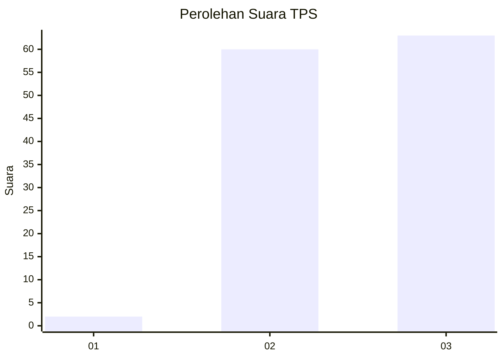
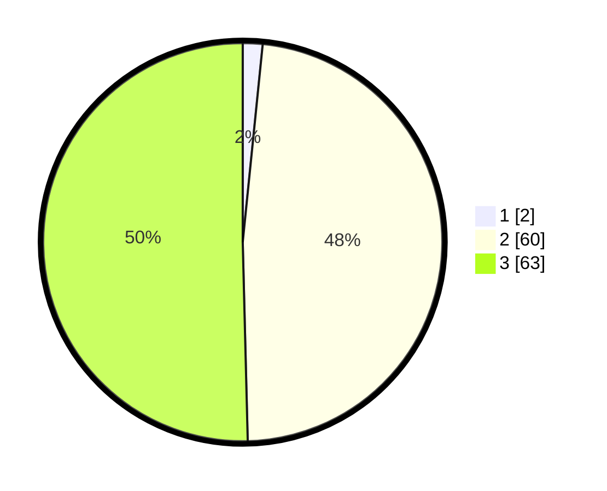

# Hasil

## Grafik

## Tabel

| No. | Nama Paslon    | Suara | Suara (raw) | Persentase |
|:--- |:-------------- | -----:| -----------:| ----------:|
| 1   | ANIES MUHAIMIN | 2     | [2][p-1]    | 1,60       |
| 2   | PRABOWO GIBRAN | 60    | [60][p-2]   | 48,00      |
| 3   | GANJAR MAHFUD  | 63    | [63][p-3]   | 50,40      |

[p-1]: https://github.com/gigit-pemilu/pemilu-2024-81-maluku/blob/main/pilpres/hitung-suara/sub/81-maluku/sub/07-kepulauan-aru/sub/03-aru-tengah/sub/2006-lorang/sub/001-tps/sub/paslon-1.txt
[p-2]: https://github.com/gigit-pemilu/pemilu-2024-81-maluku/blob/main/pilpres/hitung-suara/sub/81-maluku/sub/07-kepulauan-aru/sub/03-aru-tengah/sub/2006-lorang/sub/001-tps/sub/paslon-2.txt
[p-3]: https://github.com/gigit-pemilu/pemilu-2024-81-maluku/blob/main/pilpres/hitung-suara/sub/81-maluku/sub/07-kepulauan-aru/sub/03-aru-tengah/sub/2006-lorang/sub/001-tps/sub/paslon-3.txt

## Foto C Plano

https://sirekap-obj-formc.kpu.go.id/9dcb/pemilu/ppwp/81/07/03/20/06/8107032006001-20240215-002259--cd42fb0d-22d4-43bb-88bd-851821f2e8d7.jpg

https://sirekap-obj-formc.kpu.go.id/9dcb/pemilu/ppwp/81/07/03/20/06/8107032006001-20240215-002622--1b49231a-35ce-4dcb-928f-eb8f7953674e.jpg

https://sirekap-obj-formc.kpu.go.id/9dcb/pemilu/ppwp/81/07/03/20/06/8107032006001-20240215-002811--27727ac8-de89-4f88-99b7-33c2a39d8c75.jpg

## Metadata

| Key        | Value               |
| ---------- | ------------------- |
| Time Stamp | 2024-02-15 15:00:29 |

