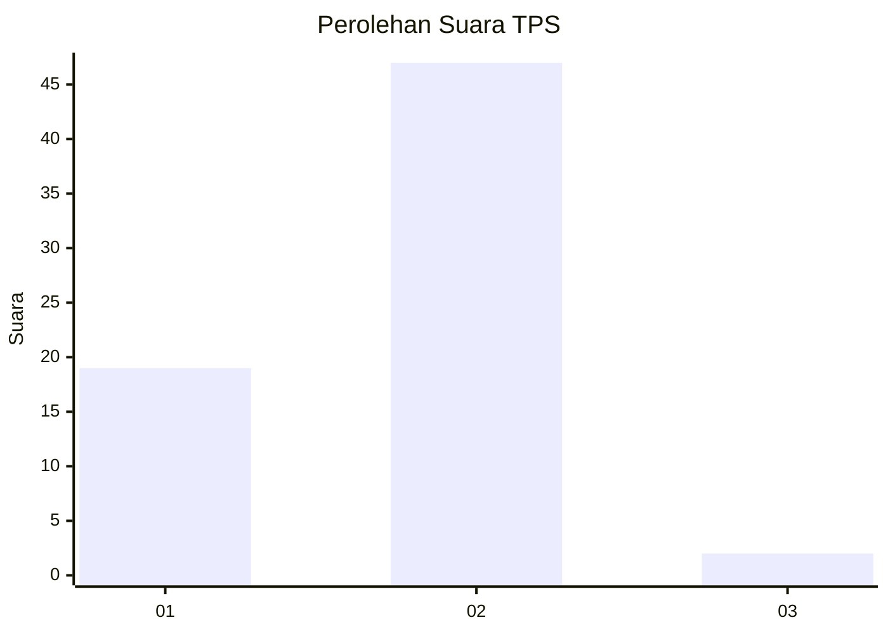
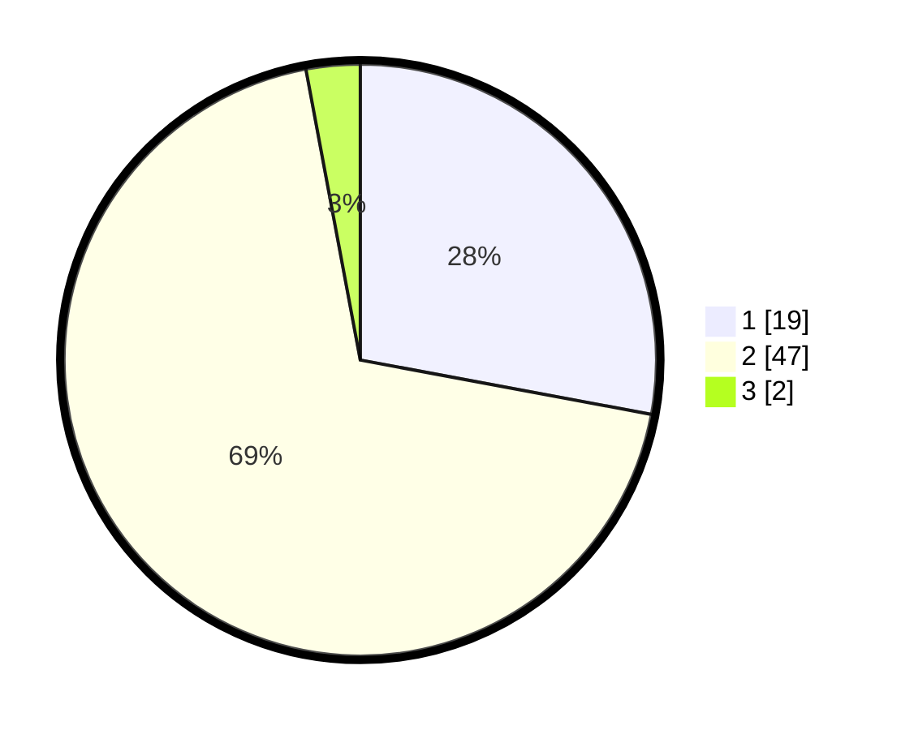

# Hasil

## Grafik

## Tabel

| No. | Nama Paslon    | Suara | Suara (raw) | Persentase |
|:--- |:-------------- | -----:| -----------:| ----------:|
| 1   | ANIES MUHAIMIN | 19    | [19][p-1]   | 27,94      |
| 2   | PRABOWO GIBRAN | 47    | [47][p-2]   | 69,12      |
| 3   | GANJAR MAHFUD  | 2     | [2][p-3]    | 2,94       |

[p-1]: https://github.com/gigit-pemilu/pemilu-2024-81-maluku/blob/main/pilpres/hitung-suara/sub/81-maluku/sub/07-kepulauan-aru/sub/06-sir-sir/sub/2008-mohongsel/sub/001-tps/sub/paslon-1.txt
[p-2]: https://github.com/gigit-pemilu/pemilu-2024-81-maluku/blob/main/pilpres/hitung-suara/sub/81-maluku/sub/07-kepulauan-aru/sub/06-sir-sir/sub/2008-mohongsel/sub/001-tps/sub/paslon-2.txt
[p-3]: https://github.com/gigit-pemilu/pemilu-2024-81-maluku/blob/main/pilpres/hitung-suara/sub/81-maluku/sub/07-kepulauan-aru/sub/06-sir-sir/sub/2008-mohongsel/sub/001-tps/sub/paslon-3.txt

## Foto C Plano

https://sirekap-obj-formc.kpu.go.id/e537/pemilu/ppwp/81/07/06/20/08/8107062008001-20240215-122345--c9f14dbd-7a61-435e-a9c1-780df43e836a.jpg

https://sirekap-obj-formc.kpu.go.id/e537/pemilu/ppwp/81/07/06/20/08/8107062008001-20240215-122606--1f26de80-2773-40dc-b011-43e2067362b3.jpg

https://sirekap-obj-formc.kpu.go.id/e537/pemilu/ppwp/81/07/06/20/08/8107062008001-20240215-133234--e7550362-45b8-4f9b-8d62-13ad725866fb.jpg

## Metadata

| Key        | Value               |
| ---------- | ------------------- |
| Time Stamp | 2024-02-25 16:00:00 |

