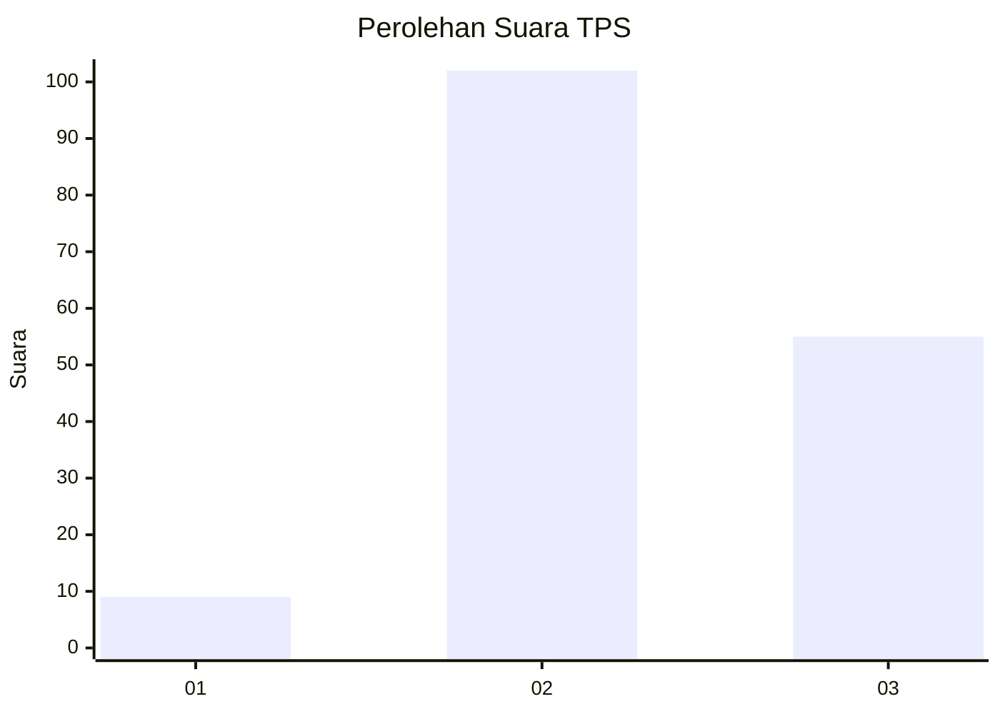
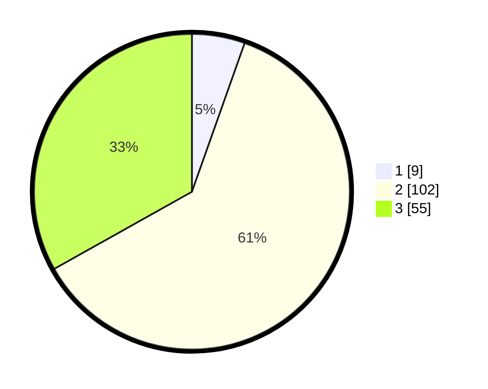

# Hasil

## Grafik

## Tabel

| No. | Nama Paslon    | Suara | Suara (raw) | Persentase |
|:--- |:-------------- | -----:| -----------:| ----------:|
| 1   | ANIES MUHAIMIN | 9     | [9][p-1]    | 5,42       |
| 2   | PRABOWO GIBRAN | 102   | [102][p-2]  | 61,45      |
| 3   | GANJAR MAHFUD  | 55    | [55][p-3]   | 33,13      |

[p-1]: https://github.com/gigit-pemilu/pemilu-2024-81-maluku/blob/main/pilpres/hitung-suara/sub/81-maluku/sub/08-maluku-barat-daya/sub/04-babar-barat/sub/2001-tepa/sub/001-tps/sub/paslon-1.txt
[p-2]: https://github.com/gigit-pemilu/pemilu-2024-81-maluku/blob/main/pilpres/hitung-suara/sub/81-maluku/sub/08-maluku-barat-daya/sub/04-babar-barat/sub/2001-tepa/sub/001-tps/sub/paslon-2.txt
[p-3]: https://github.com/gigit-pemilu/pemilu-2024-81-maluku/blob/main/pilpres/hitung-suara/sub/81-maluku/sub/08-maluku-barat-daya/sub/04-babar-barat/sub/2001-tepa/sub/001-tps/sub/paslon-3.txt

## Foto C Plano

https://sirekap-obj-formc.kpu.go.id/e439/pemilu/ppwp/81/08/04/20/01/8108042001001-20240215-015318--effc468f-c5bd-4b06-946e-7a05ba393c12.jpg

https://sirekap-obj-formc.kpu.go.id/e439/pemilu/ppwp/81/08/04/20/01/8108042001001-20240215-015550--f534363a-72c1-487c-9354-2e84928b0eed.jpg

https://sirekap-obj-formc.kpu.go.id/e439/pemilu/ppwp/81/08/04/20/01/8108042001001-20240215-015609--78b82e6c-75e2-4dd7-97a1-6c45d99b57ba.jpg

## Metadata

| Key        | Value               |
| ---------- | ------------------- |
| Time Stamp | 2024-02-15 12:00:28 |

