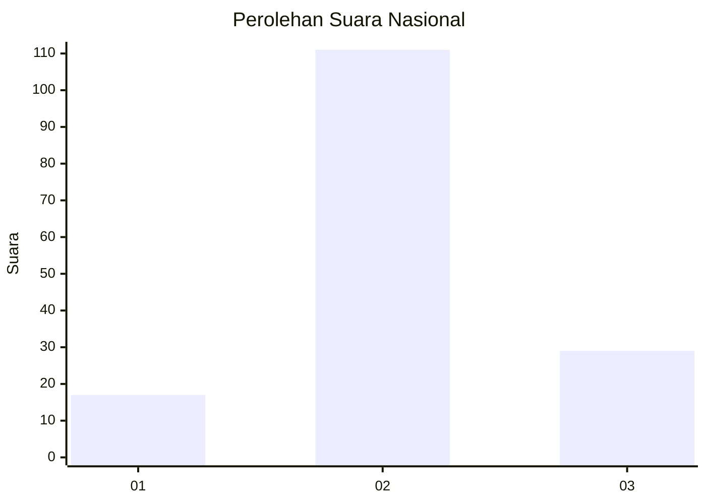
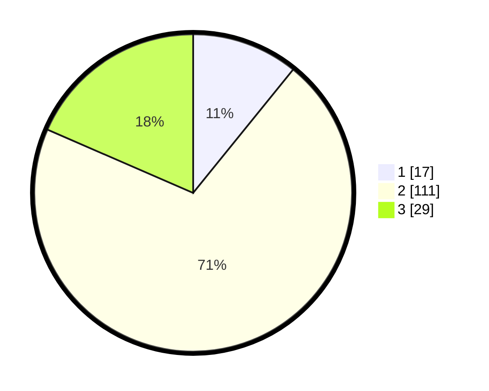

# Hasil

## Grafik

## Tabel

| No. | Nama Paslon    | Suara | Suara (raw) | Persentase |
|:--- |:-------------- | -----:| -----------:| ----------:|
| 1   | ANIES MUHAIMIN | 17    | [17][p-1]   | 10,83      |
| 2   | PRABOWO GIBRAN | 111   | [111][p-2]  | 70,70      |
| 3   | GANJAR MAHFUD  | 29    | [29][p-3]   | 18,47      |

[p-1]: https://github.com/gigit-pemilu/pemilu-2024/blob/main/pilpres/hitung-suara/sub/81-maluku/sub/08-maluku-barat-daya/sub/13-wetar-utara/sub/2004-lurang/sub/903-tps/sub/paslon-1.txt
[p-2]: https://github.com/gigit-pemilu/pemilu-2024/blob/main/pilpres/hitung-suara/sub/81-maluku/sub/08-maluku-barat-daya/sub/13-wetar-utara/sub/2004-lurang/sub/903-tps/sub/paslon-2.txt
[p-3]: https://github.com/gigit-pemilu/pemilu-2024/blob/main/pilpres/hitung-suara/sub/81-maluku/sub/08-maluku-barat-daya/sub/13-wetar-utara/sub/2004-lurang/sub/903-tps/sub/paslon-3.txt

## Foto C Plano

https://sirekap-obj-formc.kpu.go.id/b6a3/pemilu/ppwp/81/08/13/20/04/8108132004903-20240214-155053--daad0fcc-dfbc-4bfb-b171-d5951e82afe4.jpg

https://sirekap-obj-formc.kpu.go.id/b6a3/pemilu/ppwp/81/08/13/20/04/8108132004903-20240214-155231--a5480361-c9df-4af8-889d-c56739bfea4e.jpg

https://sirekap-obj-formc.kpu.go.id/b6a3/pemilu/ppwp/81/08/13/20/04/8108132004903-20240214-155329--5cbaa30e-e56d-4f96-912b-fab105e68bd7.jpg

## Metadata

| Key        | Value               |
| ---------- | ------------------- |
| Time Stamp | 2024-02-14 21:46:01 |

