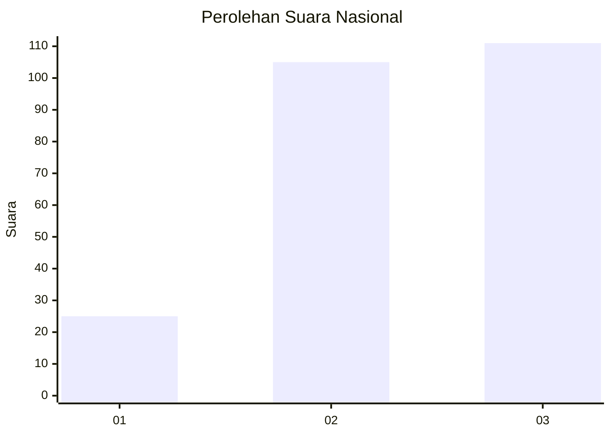
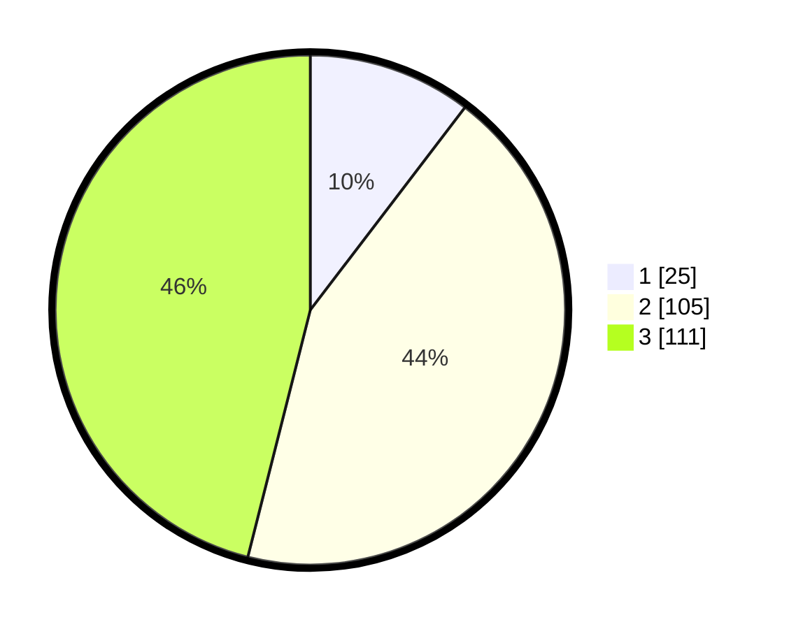

# Hasil

## Grafik

## Tabel

| No. | Nama Paslon    | Suara | Suara (raw) | Persentase |
|:--- |:-------------- | -----:| -----------:| ----------:|
| 1   | ANIES MUHAIMIN | 25    | [25][p-1]   | 10,37      |
| 2   | PRABOWO GIBRAN | 105   | [105][p-2]  | 43,57      |
| 3   | GANJAR MAHFUD  | 111   | [111][p-3]  | 46,06      |

[p-1]: https://github.com/gigit-pemilu/pemilu-2024/blob/main/pilpres/hitung-suara/sub/81-maluku/sub/08-maluku-barat-daya/sub/16-kepulauan-romang/sub/2001-hila/sub/004-tps/sub/paslon-1.txt
[p-2]: https://github.com/gigit-pemilu/pemilu-2024/blob/main/pilpres/hitung-suara/sub/81-maluku/sub/08-maluku-barat-daya/sub/16-kepulauan-romang/sub/2001-hila/sub/004-tps/sub/paslon-2.txt
[p-3]: https://github.com/gigit-pemilu/pemilu-2024/blob/main/pilpres/hitung-suara/sub/81-maluku/sub/08-maluku-barat-daya/sub/16-kepulauan-romang/sub/2001-hila/sub/004-tps/sub/paslon-3.txt

## Foto C Plano

https://sirekap-obj-formc.kpu.go.id/0eba/pemilu/ppwp/81/08/16/20/01/8108162001004-20240214-214050--3715d65f-bb65-4fc2-abfd-61aa729af557.jpg

https://sirekap-obj-formc.kpu.go.id/0eba/pemilu/ppwp/81/08/16/20/01/8108162001004-20240214-214204--b9fa716f-7d1b-4cb5-8994-8e6f2c100436.jpg

https://sirekap-obj-formc.kpu.go.id/0eba/pemilu/ppwp/81/08/16/20/01/8108162001004-20240214-214325--b5e96507-017e-4b49-8cde-c5c5b554d864.jpg

## Metadata

| Key        | Value               |
| ---------- | ------------------- |
| Time Stamp | 2024-02-15 12:00:28 |

