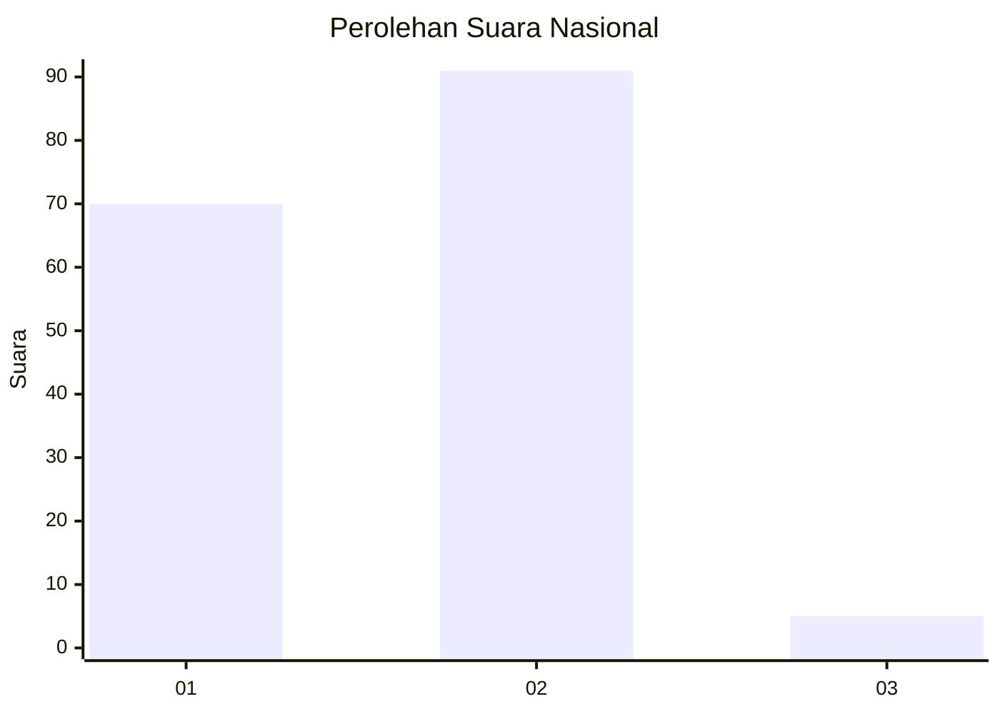
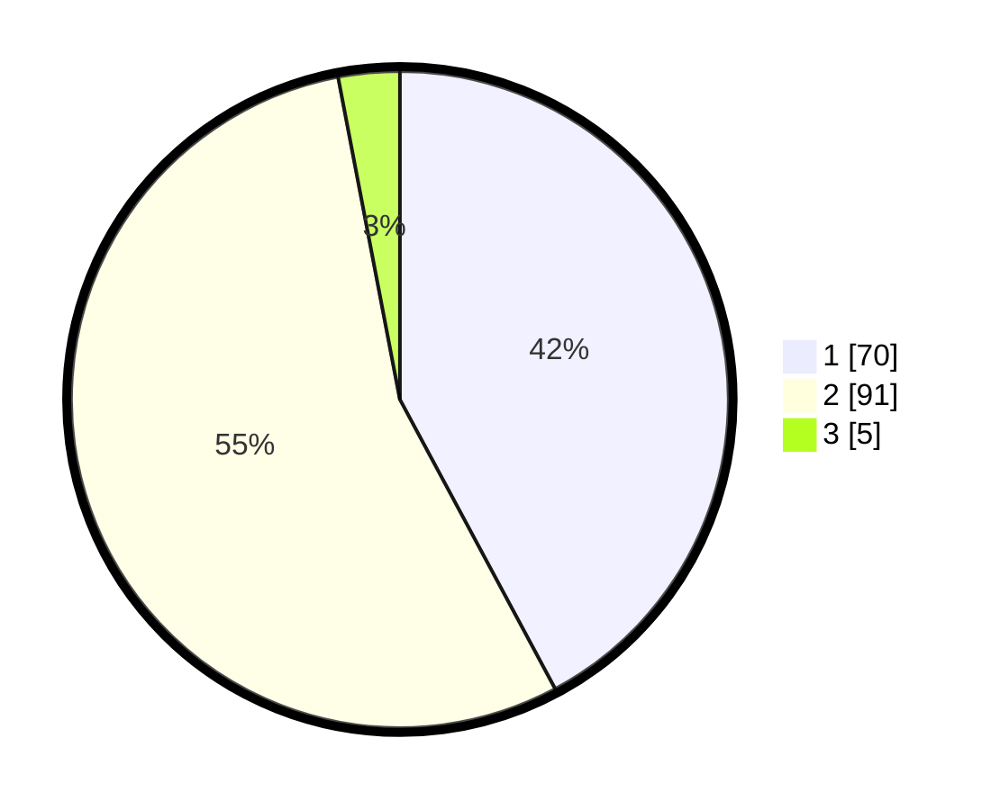

# Hasil

## Grafik

## Tabel

| No. | Nama Paslon    | Suara | Suara (raw) | Persentase |
|:--- |:-------------- | -----:| -----------:| ----------:|
| 1   | ANIES MUHAIMIN | 70    | [70][p-1]   | 42,17      |
| 2   | PRABOWO GIBRAN | 91    | [91][p-2]   | 54,82      |
| 3   | GANJAR MAHFUD  | 5     | [5][p-3]    | 3,01       |

[p-1]: https://github.com/gigit-pemilu/pemilu-2024/blob/main/pilpres/hitung-suara/sub/81-maluku/sub/09-buru-selatan/sub/01-namrole/sub/2003-lektama/sub/002-tps/sub/paslon-1.txt
[p-2]: https://github.com/gigit-pemilu/pemilu-2024/blob/main/pilpres/hitung-suara/sub/81-maluku/sub/09-buru-selatan/sub/01-namrole/sub/2003-lektama/sub/002-tps/sub/paslon-2.txt
[p-3]: https://github.com/gigit-pemilu/pemilu-2024/blob/main/pilpres/hitung-suara/sub/81-maluku/sub/09-buru-selatan/sub/01-namrole/sub/2003-lektama/sub/002-tps/sub/paslon-3.txt

## Foto C Plano

https://sirekap-obj-formc.kpu.go.id/6db6/pemilu/ppwp/81/09/01/20/03/8109012003002-20240215-170841--99183c93-a7ab-4a66-b472-d161e66b5261.jpg

https://sirekap-obj-formc.kpu.go.id/6db6/pemilu/ppwp/81/09/01/20/03/8109012003002-20240215-170943--ad0d9fde-0de2-4406-a80e-8a031d5fb1f7.jpg

https://sirekap-obj-formc.kpu.go.id/6db6/pemilu/ppwp/81/09/01/20/03/8109012003002-20240215-145827--99f37134-6e73-4940-aeda-84f00dd5132f.jpg

## Metadata

| Key        | Value               |
| ---------- | ------------------- |
| Time Stamp | 2024-02-17 16:00:02 |

