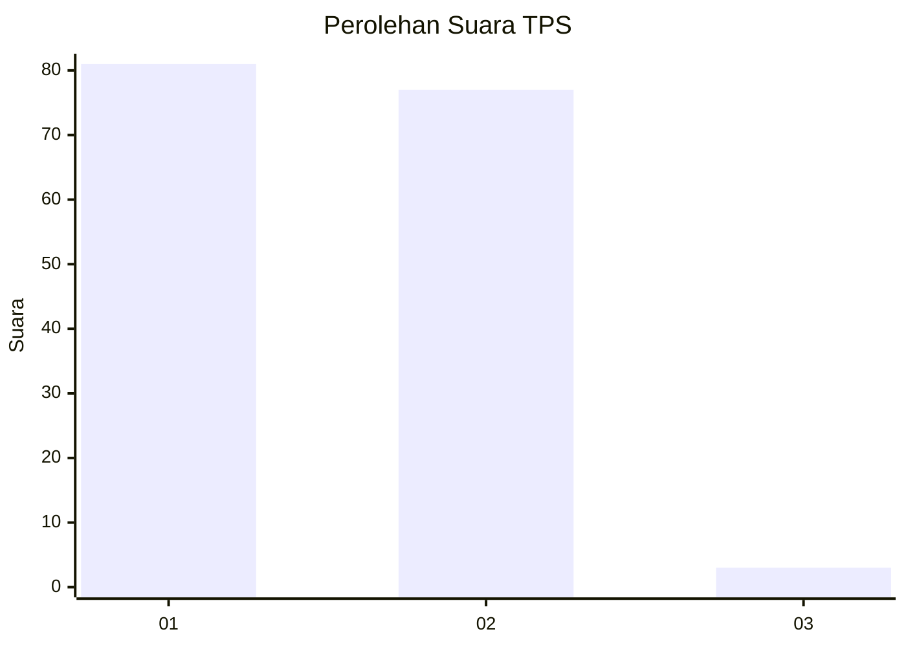
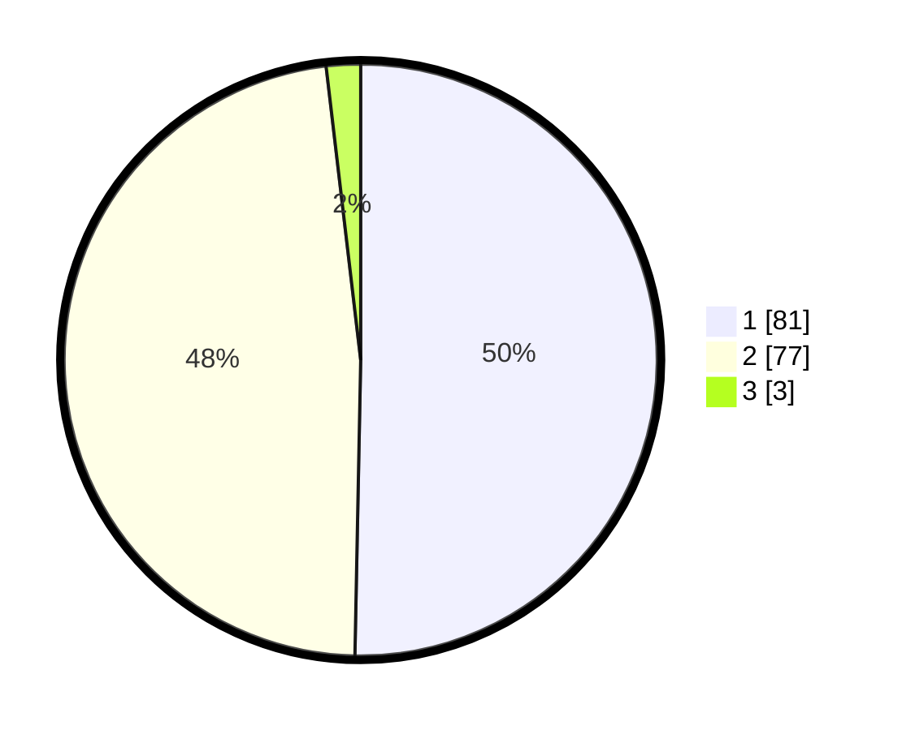

# Hasil

## Grafik

## Tabel

| No. | Nama Paslon    | Suara | Suara (raw) | Persentase |
|:--- |:-------------- | -----:| -----------:| ----------:|
| 1   | ANIES MUHAIMIN | 81    | [81][p-1]   | 50,31      |
| 2   | PRABOWO GIBRAN | 77    | [77][p-2]   | 47,83      |
| 3   | GANJAR MAHFUD  | 3     | [3][p-3]    | 1,86       |

[p-1]: https://github.com/gigit-pemilu/pemilu-2024-81-maluku/blob/main/pilpres/hitung-suara/sub/81-maluku/sub/09-buru-selatan/sub/01-namrole/sub/2003-lektama/sub/004-tps/sub/paslon-1.txt
[p-2]: https://github.com/gigit-pemilu/pemilu-2024-81-maluku/blob/main/pilpres/hitung-suara/sub/81-maluku/sub/09-buru-selatan/sub/01-namrole/sub/2003-lektama/sub/004-tps/sub/paslon-2.txt
[p-3]: https://github.com/gigit-pemilu/pemilu-2024-81-maluku/blob/main/pilpres/hitung-suara/sub/81-maluku/sub/09-buru-selatan/sub/01-namrole/sub/2003-lektama/sub/004-tps/sub/paslon-3.txt

## Foto C Plano

https://sirekap-obj-formc.kpu.go.id/e13e/pemilu/ppwp/81/09/01/20/03/8109012003004-20240215-123838--da5f2ef6-d6a4-4028-ba34-9b040873bbff.jpg

https://sirekap-obj-formc.kpu.go.id/e13e/pemilu/ppwp/81/09/01/20/03/8109012003004-20240215-143702--53ce7504-75b4-40a3-a845-d4b45eb48108.jpg

https://sirekap-obj-formc.kpu.go.id/e13e/pemilu/ppwp/81/09/01/20/03/8109012003004-20240215-183436--369799d2-9007-4a15-9390-3d89358850dd.jpg

## Metadata

| Key        | Value               |
| ---------- | ------------------- |
| Time Stamp | 2024-02-17 16:00:02 |

