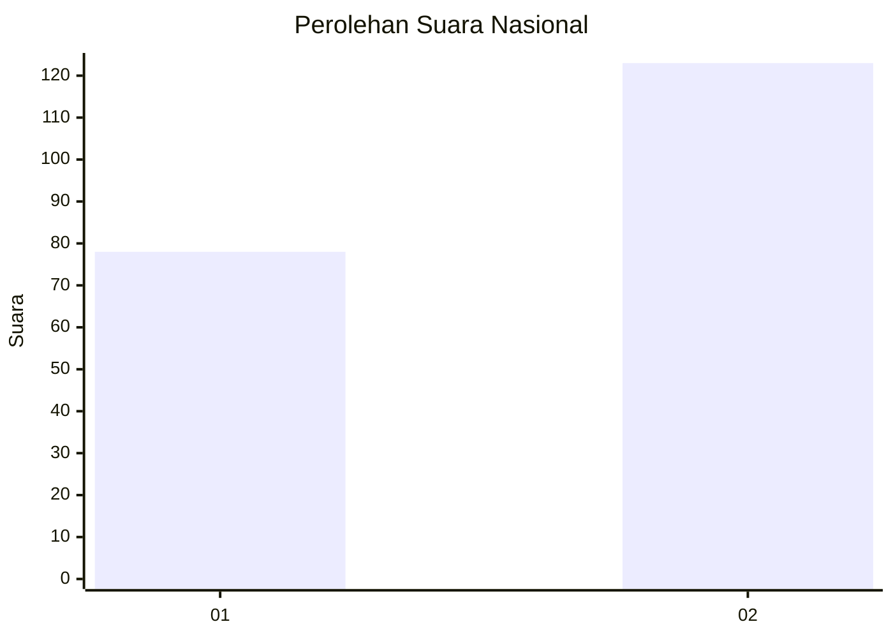
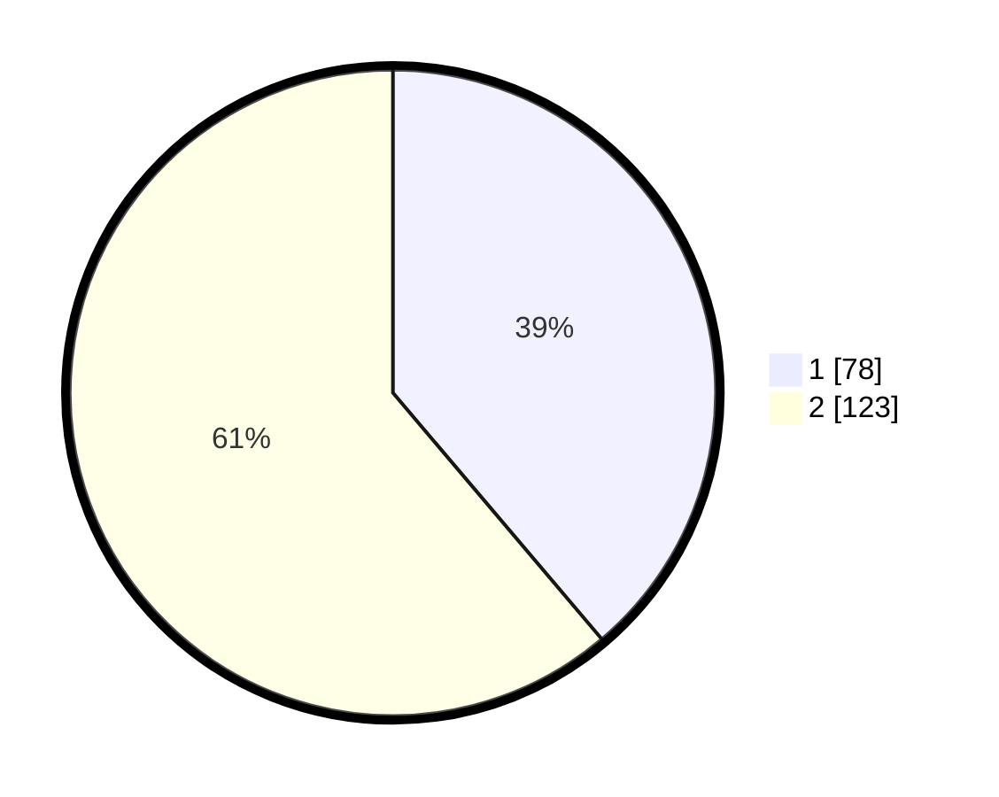

# Hasil

## Grafik

## Tabel

| No. | Nama Paslon    | Suara | Suara (raw) | Persentase |
|:--- |:-------------- | -----:| -----------:| ----------:|
| 1   | ANIES MUHAIMIN | 78    | [78][p-1]   | 38,81      |
| 2   | PRABOWO GIBRAN | 123   | [123][p-2]  | 61,19      |

[p-1]: https://github.com/gigit-pemilu/pemilu-2024/blob/main/pilpres/hitung-suara/sub/81-maluku/sub/09-buru-selatan/sub/01-namrole/sub/2004-fatmite/sub/002-tps/sub/paslon-1.txt
[p-2]: https://github.com/gigit-pemilu/pemilu-2024/blob/main/pilpres/hitung-suara/sub/81-maluku/sub/09-buru-selatan/sub/01-namrole/sub/2004-fatmite/sub/002-tps/sub/paslon-2.txt
[p-3]: https://github.com/gigit-pemilu/pemilu-2024/blob/main/pilpres/hitung-suara/sub/81-maluku/sub/09-buru-selatan/sub/01-namrole/sub/2004-fatmite/sub/002-tps/sub/paslon-3.txt

## Foto C Plano

https://sirekap-obj-formc.kpu.go.id/9ce1/pemilu/ppwp/81/09/01/20/04/8109012004002-20240215-191351--a60f5a9c-15ba-4ce2-9841-7d7c8c9e189b.jpg

https://sirekap-obj-formc.kpu.go.id/9ce1/pemilu/ppwp/81/09/01/20/04/8109012004002-20240215-191524--6008368e-ae1c-4930-9832-f82f95a809eb.jpg

https://sirekap-obj-formc.kpu.go.id/9ce1/pemilu/ppwp/81/09/01/20/04/8109012004002-20240215-191752--dd43a7d4-7eeb-42da-8499-140b02d789ab.jpg

## Metadata

| Key        | Value               |
| ---------- | ------------------- |
| Time Stamp | 2024-02-24 22:31:28 |

