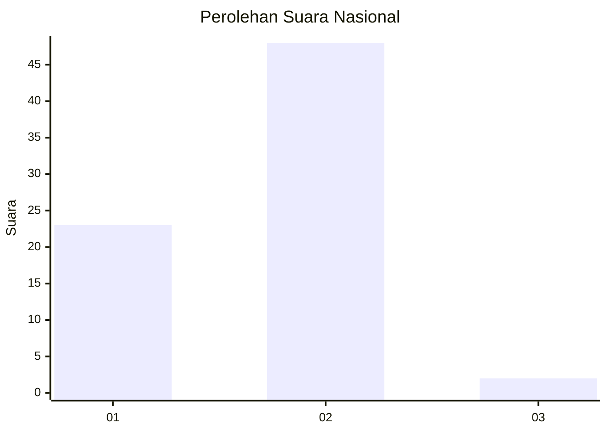
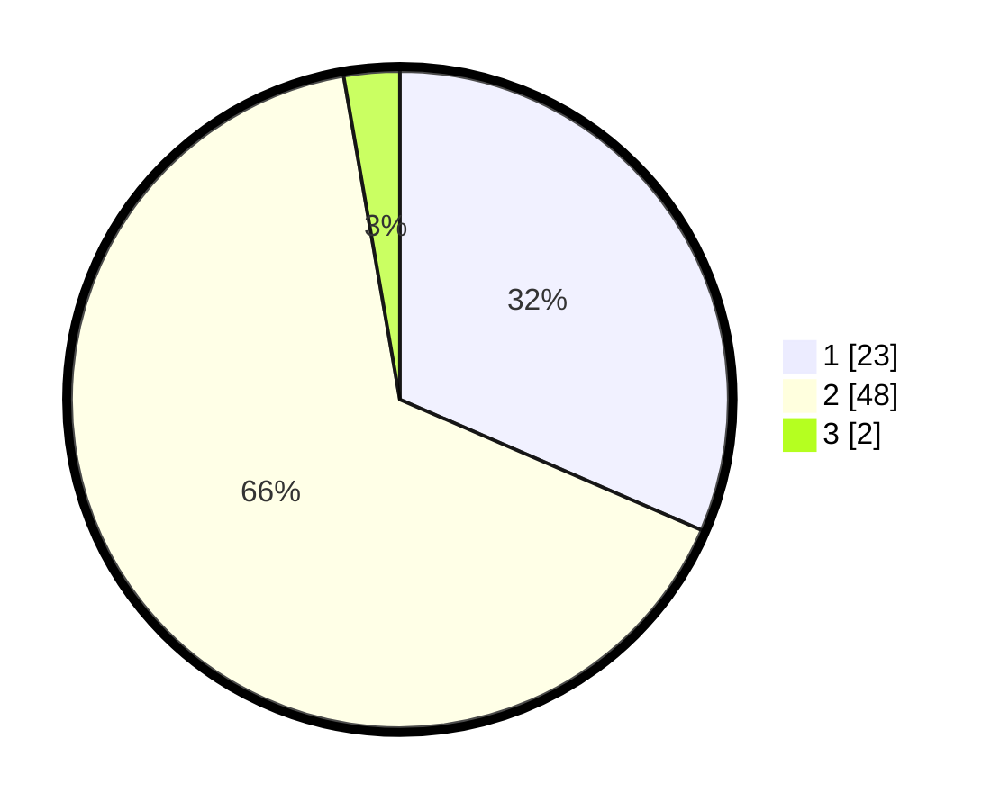

# Hasil

## Grafik

## Tabel

| No. | Nama Paslon    | Suara | Suara (raw) | Persentase |
|:--- |:-------------- | -----:| -----------:| ----------:|
| 1   | ANIES MUHAIMIN | 23    | [23][p-1]   | 31,51      |
| 2   | PRABOWO GIBRAN | 48    | [48][p-2]   | 65,75      |
| 3   | GANJAR MAHFUD  | 2     | [2][p-3]    | 2,74       |

[p-1]: https://github.com/gigit-pemilu/pemilu-2024/blob/main/pilpres/hitung-suara/sub/81-maluku/sub/09-buru-selatan/sub/01-namrole/sub/2010-wali/sub/003-tps/sub/paslon-1.txt
[p-2]: https://github.com/gigit-pemilu/pemilu-2024/blob/main/pilpres/hitung-suara/sub/81-maluku/sub/09-buru-selatan/sub/01-namrole/sub/2010-wali/sub/003-tps/sub/paslon-2.txt
[p-3]: https://github.com/gigit-pemilu/pemilu-2024/blob/main/pilpres/hitung-suara/sub/81-maluku/sub/09-buru-selatan/sub/01-namrole/sub/2010-wali/sub/003-tps/sub/paslon-3.txt

## Foto C Plano

https://sirekap-obj-formc.kpu.go.id/702e/pemilu/ppwp/81/09/01/20/10/8109012010003-20240215-015218--01d40c55-e145-4ec3-be52-7680a994a3eb.jpg

https://sirekap-obj-formc.kpu.go.id/702e/pemilu/ppwp/81/09/01/20/10/8109012010003-20240215-015508--0aed49e6-f35e-4b38-afd2-3ecb3babf155.jpg

https://sirekap-obj-formc.kpu.go.id/702e/pemilu/ppwp/81/09/01/20/10/8109012010003-20240215-015721--ed4b083a-4fab-4bfc-a17f-98a2b305ea56.jpg

## Metadata

| Key        | Value               |
| ---------- | ------------------- |
| Time Stamp | 2024-02-17 16:00:02 |

