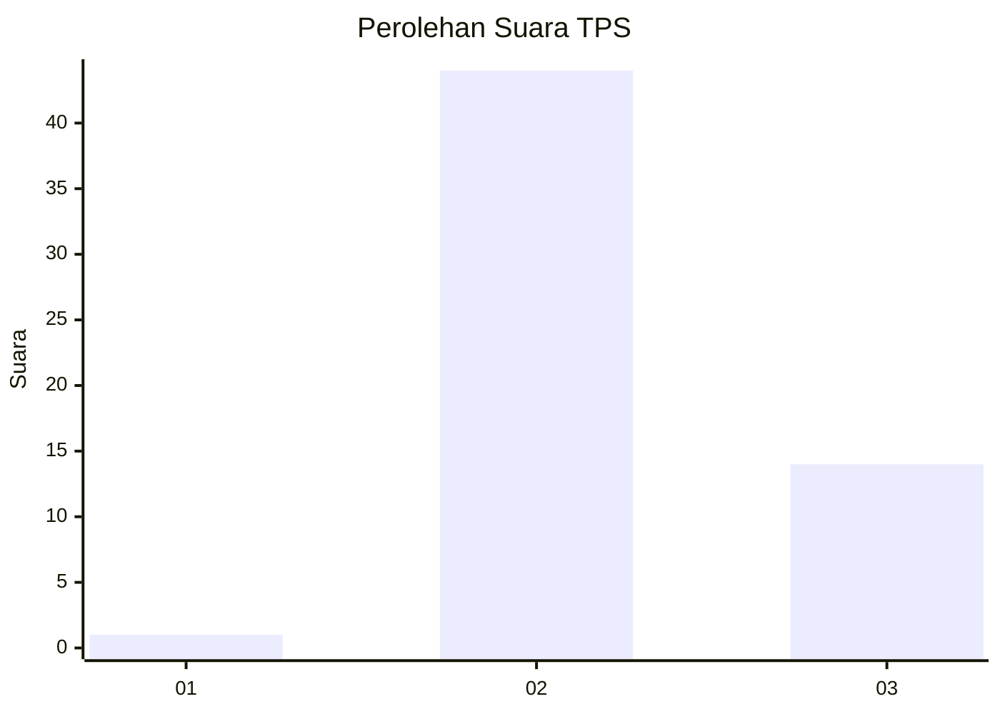
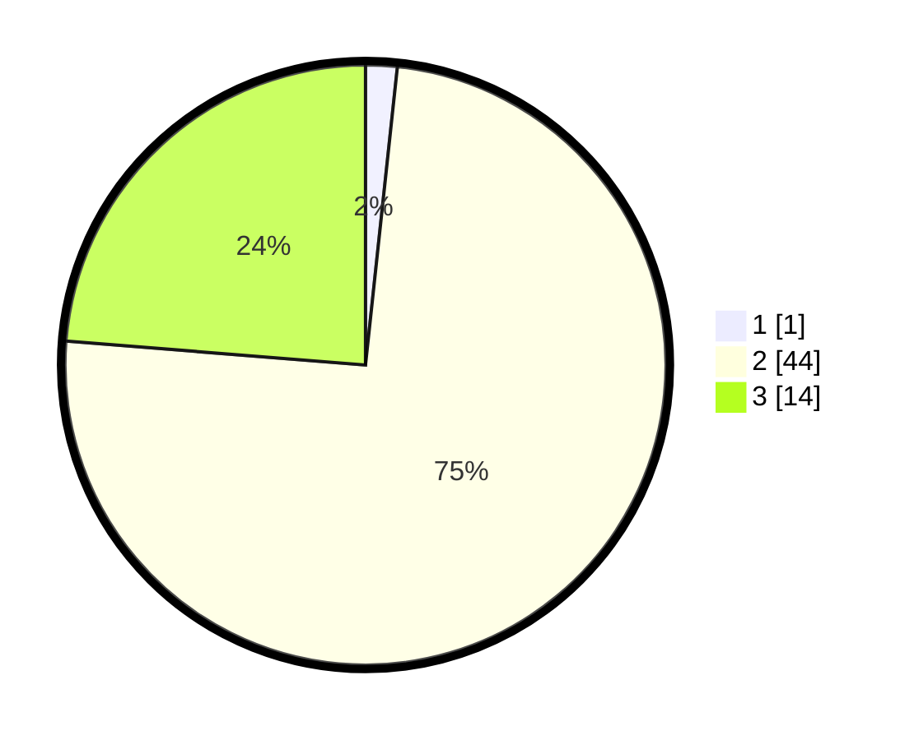

# Hasil

## Grafik

## Tabel

| No. | Nama Paslon    | Suara | Suara (raw) | Persentase |
|:--- |:-------------- | -----:| -----------:| ----------:|
| 1   | ANIES MUHAIMIN | 1     | [1][p-1]    | 1,69       |
| 2   | PRABOWO GIBRAN | 44    | [44][p-2]   | 74,58      |
| 3   | GANJAR MAHFUD  | 14    | [14][p-3]   | 23,73      |

[p-1]: https://github.com/gigit-pemilu/pemilu-2024-81-maluku/blob/main/pilpres/hitung-suara/sub/81-maluku/sub/09-buru-selatan/sub/01-namrole/sub/2015-namrinat/sub/003-tps/sub/paslon-1.txt
[p-2]: https://github.com/gigit-pemilu/pemilu-2024-81-maluku/blob/main/pilpres/hitung-suara/sub/81-maluku/sub/09-buru-selatan/sub/01-namrole/sub/2015-namrinat/sub/003-tps/sub/paslon-2.txt
[p-3]: https://github.com/gigit-pemilu/pemilu-2024-81-maluku/blob/main/pilpres/hitung-suara/sub/81-maluku/sub/09-buru-selatan/sub/01-namrole/sub/2015-namrinat/sub/003-tps/sub/paslon-3.txt

## Foto C Plano

https://sirekap-obj-formc.kpu.go.id/790b/pemilu/ppwp/81/09/01/20/15/8109012015003-20240214-125302--ed5398fc-19d4-4638-95f3-827dac113c76.jpg

https://sirekap-obj-formc.kpu.go.id/790b/pemilu/ppwp/81/09/01/20/15/8109012015003-20240214-125419--85103270-1b97-4f73-b877-3bd06869ad62.jpg

## Metadata

| Key        | Value               |
| ---------- | ------------------- |
| Time Stamp | 2024-02-15 07:00:44 |

