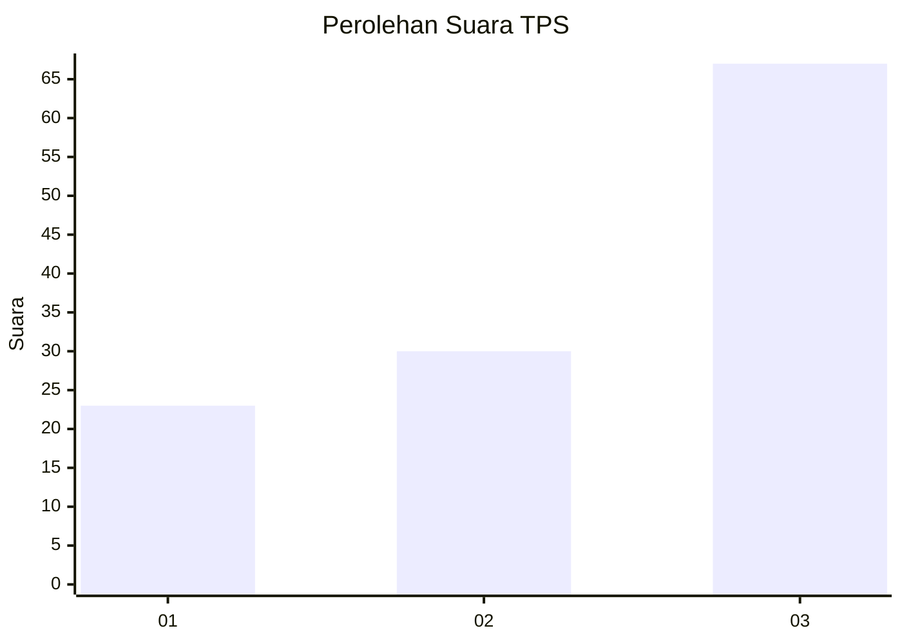
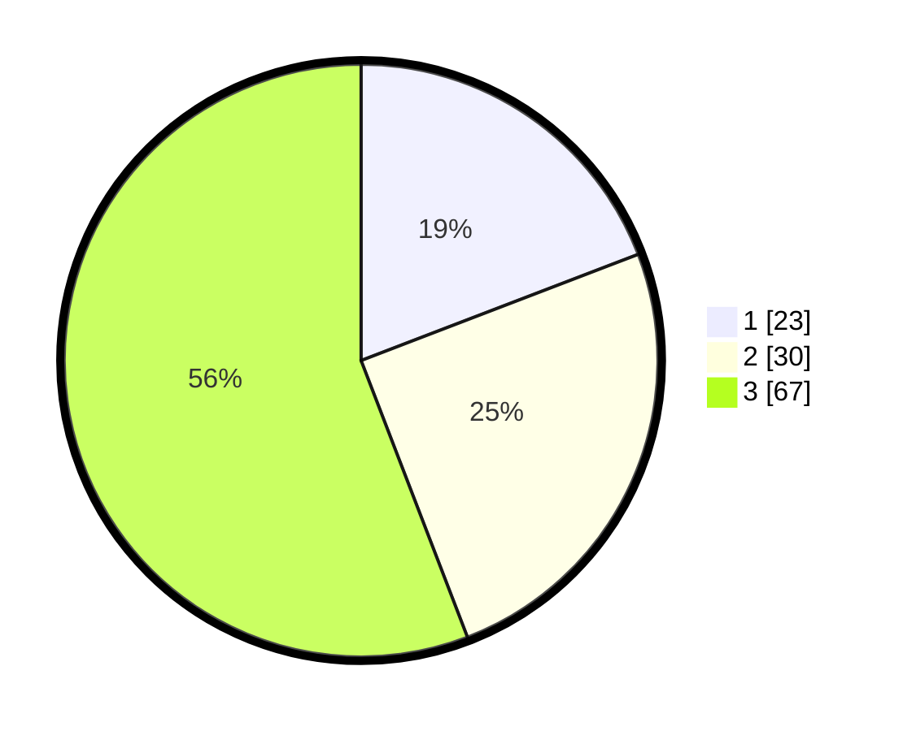

# Hasil

## Grafik

## Tabel

| No. | Nama Paslon    | Suara | Suara (raw) | Persentase |
|:--- |:-------------- | -----:| -----------:| ----------:|
| 1   | ANIES MUHAIMIN | 23    | [23][p-1]   | 19,17      |
| 2   | PRABOWO GIBRAN | 30    | [30][p-2]   | 25,00      |
| 3   | GANJAR MAHFUD  | 67    | [67][p-3]   | 55,83      |

[p-1]: https://github.com/gigit-pemilu/pemilu-2024-81-maluku/blob/main/pilpres/hitung-suara/sub/81-maluku/sub/09-buru-selatan/sub/02-waesama/sub/2005-waelikut/sub/004-tps/sub/paslon-1.txt
[p-2]: https://github.com/gigit-pemilu/pemilu-2024-81-maluku/blob/main/pilpres/hitung-suara/sub/81-maluku/sub/09-buru-selatan/sub/02-waesama/sub/2005-waelikut/sub/004-tps/sub/paslon-2.txt
[p-3]: https://github.com/gigit-pemilu/pemilu-2024-81-maluku/blob/main/pilpres/hitung-suara/sub/81-maluku/sub/09-buru-selatan/sub/02-waesama/sub/2005-waelikut/sub/004-tps/sub/paslon-3.txt

## Foto C Plano

https://sirekap-obj-formc.kpu.go.id/c46b/pemilu/ppwp/81/09/02/20/05/8109022005004-20240214-232652--5dd0baf9-d028-4a7e-8ebd-e6a54a00a4bd.jpg

https://sirekap-obj-formc.kpu.go.id/c46b/pemilu/ppwp/81/09/02/20/05/8109022005004-20240214-233451--b8d4dea9-3409-4d37-94b7-92952176c1d3.jpg

https://sirekap-obj-formc.kpu.go.id/c46b/pemilu/ppwp/81/09/02/20/05/8109022005004-20240214-234243--1be7a883-a832-468c-aab9-69cacd92127f.jpg

## Metadata

| Key        | Value               |
| ---------- | ------------------- |
| Time Stamp | 2024-02-17 16:00:02 |

