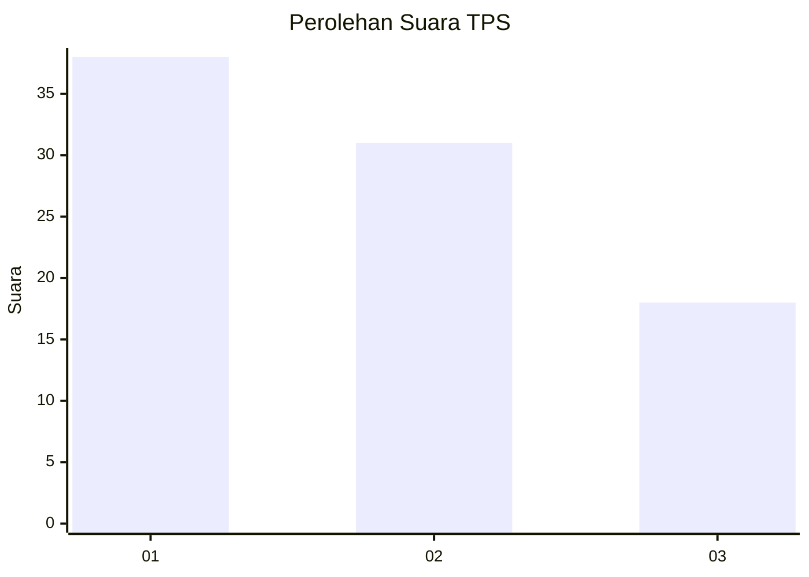
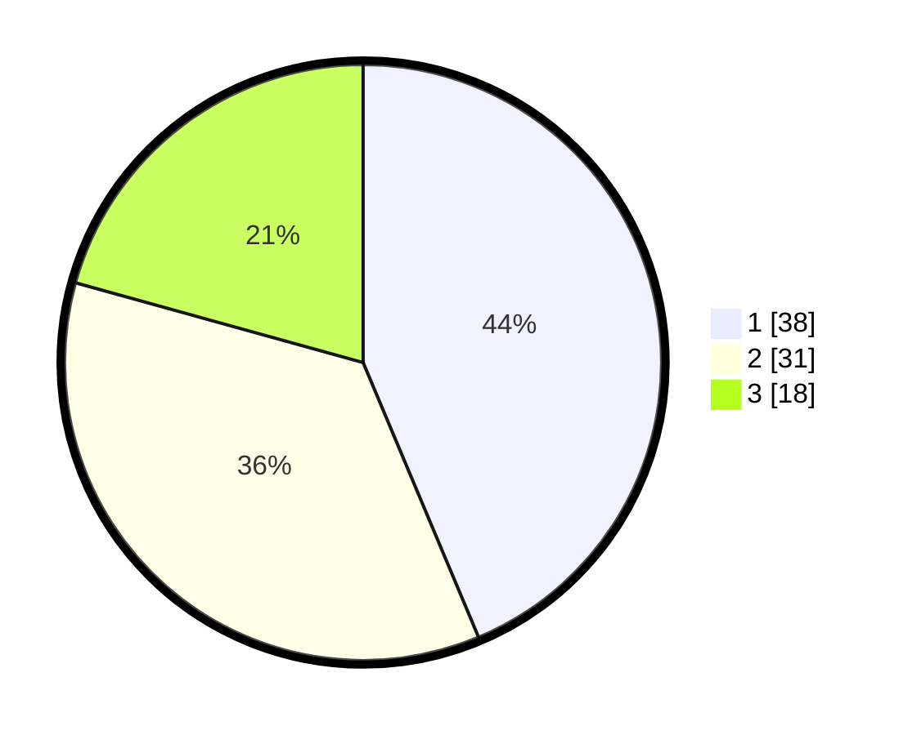

# Hasil

## Grafik

## Tabel

| No. | Nama Paslon    | Suara | Suara (raw) | Persentase |
|:--- |:-------------- | -----:| -----------:| ----------:|
| 1   | ANIES MUHAIMIN | 38    | [38][p-1]   | 43,68      |
| 2   | PRABOWO GIBRAN | 31    | [31][p-2]   | 35,63      |
| 3   | GANJAR MAHFUD  | 18    | [18][p-3]   | 20,69      |

[p-1]: https://github.com/gigit-pemilu/pemilu-2024-81-maluku/blob/main/pilpres/hitung-suara/sub/81-maluku/sub/09-buru-selatan/sub/02-waesama/sub/2011-batu-kasa/sub/001-tps/sub/paslon-1.txt
[p-2]: https://github.com/gigit-pemilu/pemilu-2024-81-maluku/blob/main/pilpres/hitung-suara/sub/81-maluku/sub/09-buru-selatan/sub/02-waesama/sub/2011-batu-kasa/sub/001-tps/sub/paslon-2.txt
[p-3]: https://github.com/gigit-pemilu/pemilu-2024-81-maluku/blob/main/pilpres/hitung-suara/sub/81-maluku/sub/09-buru-selatan/sub/02-waesama/sub/2011-batu-kasa/sub/001-tps/sub/paslon-3.txt

## Foto C Plano

https://sirekap-obj-formc.kpu.go.id/952a/pemilu/ppwp/81/09/02/20/11/8109022011001-20240215-091300--fa771307-c146-4342-bac1-af5f412b8fa7.jpg

https://sirekap-obj-formc.kpu.go.id/952a/pemilu/ppwp/81/09/02/20/11/8109022011001-20240215-091723--59cbeac4-4acc-4347-ad7a-aeee8ea676d6.jpg

https://sirekap-obj-formc.kpu.go.id/952a/pemilu/ppwp/81/09/02/20/11/8109022011001-20240215-091937--15327a4b-fa6e-40ed-bf58-ec6bea24477d.jpg

## Metadata

| Key        | Value               |
| ---------- | ------------------- |
| Time Stamp | 2024-02-17 16:00:02 |

