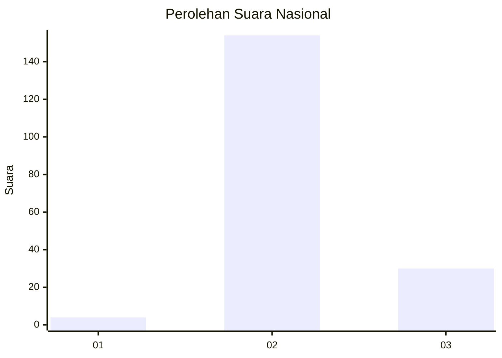
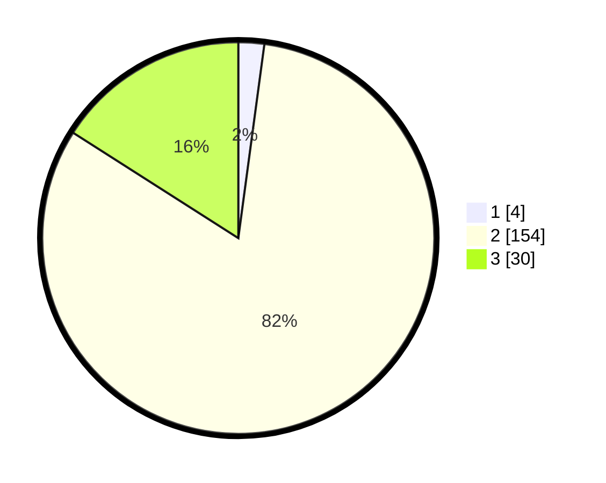

# Hasil

## Grafik

## Tabel

| No. | Nama Paslon    | Suara | Suara (raw) | Persentase |
|:--- |:-------------- | -----:| -----------:| ----------:|
| 1   | ANIES MUHAIMIN | 4     | [4][p-1]    | 2,13       |
| 2   | PRABOWO GIBRAN | 154   | [154][p-2]  | 81,91      |
| 3   | GANJAR MAHFUD  | 30    | [30][p-3]   | 15,96      |

[p-1]: https://github.com/gigit-pemilu/pemilu-2024/blob/main/pilpres/hitung-suara/sub/81-maluku/sub/09-buru-selatan/sub/05-leksula/sub/2005-erwiri/sub/004-tps/sub/paslon-1.txt
[p-2]: https://github.com/gigit-pemilu/pemilu-2024/blob/main/pilpres/hitung-suara/sub/81-maluku/sub/09-buru-selatan/sub/05-leksula/sub/2005-erwiri/sub/004-tps/sub/paslon-2.txt
[p-3]: https://github.com/gigit-pemilu/pemilu-2024/blob/main/pilpres/hitung-suara/sub/81-maluku/sub/09-buru-selatan/sub/05-leksula/sub/2005-erwiri/sub/004-tps/sub/paslon-3.txt

## Foto C Plano

https://sirekap-obj-formc.kpu.go.id/1afc/pemilu/ppwp/81/09/05/20/05/8109052005004-20240215-210845--69f8f953-490a-43d3-93fe-1e2753191655.jpg

https://sirekap-obj-formc.kpu.go.id/1afc/pemilu/ppwp/81/09/05/20/05/8109052005004-20240215-205951--be57f28d-4011-404d-a4d1-58802baf64e5.jpg

https://sirekap-obj-formc.kpu.go.id/1afc/pemilu/ppwp/81/09/05/20/05/8109052005004-20240215-210008--7b8fa335-e3dd-4373-896a-98f8ebaf7cf0.jpg

## Metadata

| Key        | Value               |
| ---------- | ------------------- |
| Time Stamp | 2024-02-17 16:00:02 |

