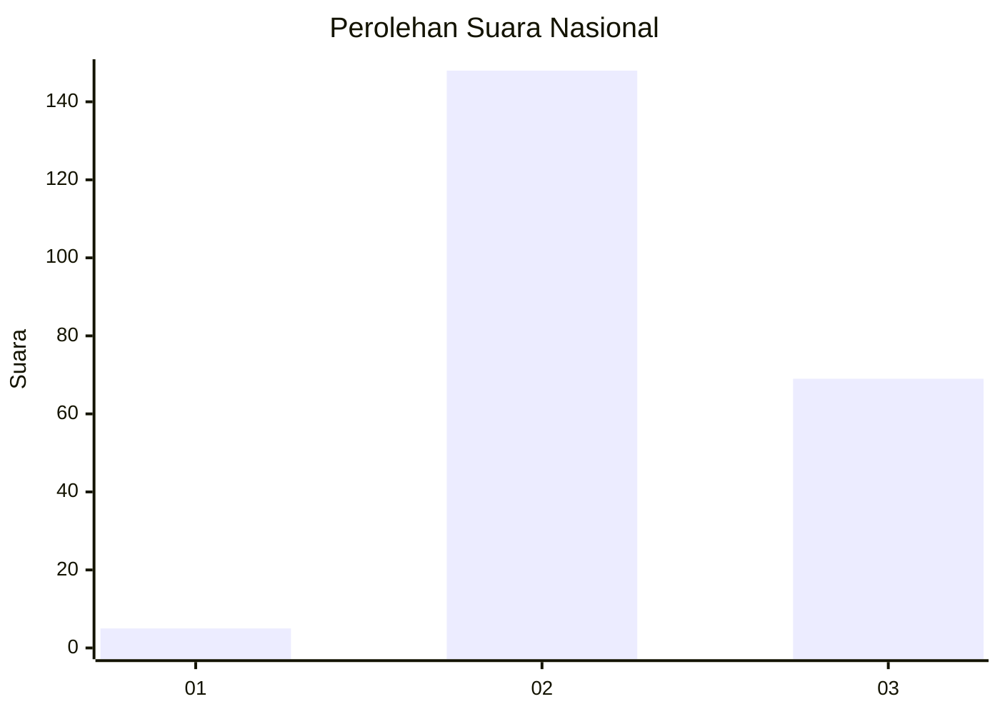
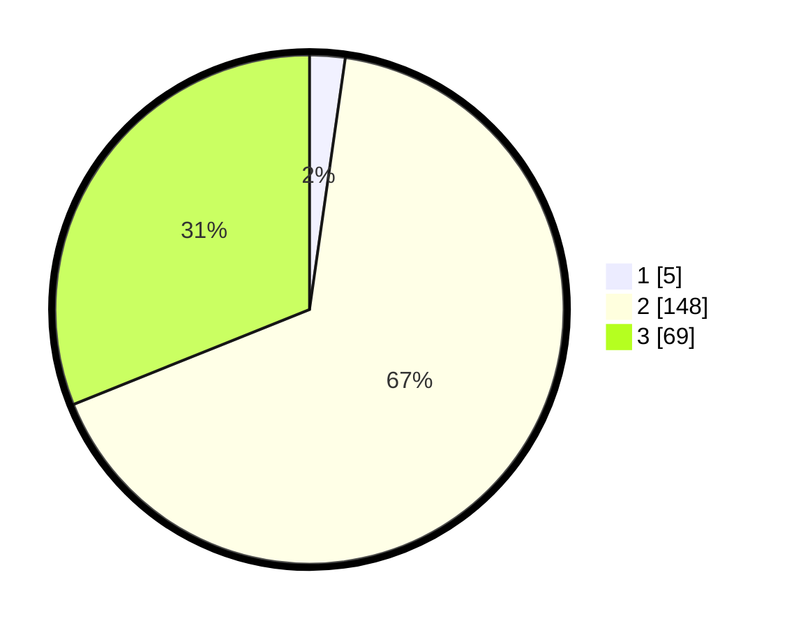

# Hasil

## Grafik

## Tabel

| No. | Nama Paslon    | Suara | Suara (raw) | Persentase |
|:--- |:-------------- | -----:| -----------:| ----------:|
| 1   | ANIES MUHAIMIN | 5     | [5][p-1]    | 2,25       |
| 2   | PRABOWO GIBRAN | 148   | [148][p-2]  | 66,67      |
| 3   | GANJAR MAHFUD  | 69    | [69][p-3]   | 31,08      |

[p-1]: https://github.com/gigit-pemilu/pemilu-2024/blob/main/pilpres/hitung-suara/sub/81-maluku/sub/09-buru-selatan/sub/06-fena-fafan/sub/2004-fakal/sub/001-tps/sub/paslon-1.txt
[p-2]: https://github.com/gigit-pemilu/pemilu-2024/blob/main/pilpres/hitung-suara/sub/81-maluku/sub/09-buru-selatan/sub/06-fena-fafan/sub/2004-fakal/sub/001-tps/sub/paslon-2.txt
[p-3]: https://github.com/gigit-pemilu/pemilu-2024/blob/main/pilpres/hitung-suara/sub/81-maluku/sub/09-buru-selatan/sub/06-fena-fafan/sub/2004-fakal/sub/001-tps/sub/paslon-3.txt

## Foto C Plano

https://sirekap-obj-formc.kpu.go.id/e359/pemilu/ppwp/81/09/06/20/04/8109062004001-20240214-205322--1476dc3f-317b-4c31-84a1-2f12295f0e19.jpg

https://sirekap-obj-formc.kpu.go.id/e359/pemilu/ppwp/81/09/06/20/04/8109062004001-20240214-202233--f0610fc4-267a-48ae-a954-6085ff398d6d.jpg

https://sirekap-obj-formc.kpu.go.id/e359/pemilu/ppwp/81/09/06/20/04/8109062004001-20240214-202445--893ce39e-6724-4048-ac58-71a0b7597f6e.jpg

## Metadata

| Key        | Value               |
| ---------- | ------------------- |
| Time Stamp | 2024-02-17 16:36:25 |

