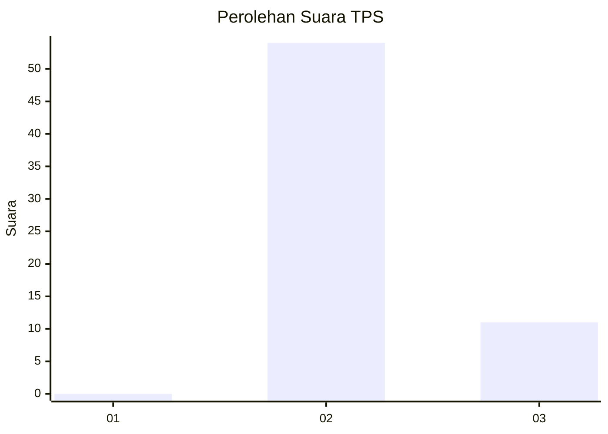
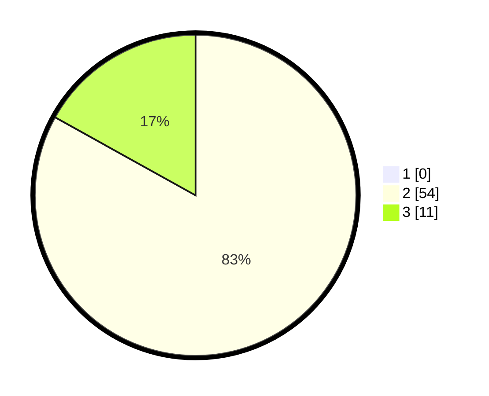

# Hasil

## Grafik

## Tabel

| No. | Nama Paslon    | Suara | Suara (raw) | Persentase |
|:--- |:-------------- | -----:| -----------:| ----------:|
| 1   | ANIES MUHAIMIN | 0     | [0][p-1]    | 0,00       |
| 2   | PRABOWO GIBRAN | 54    | [54][p-2]   | 83,08      |
| 3   | GANJAR MAHFUD  | 11    | [11][p-3]   | 16,92      |

[p-1]: https://github.com/gigit-pemilu/pemilu-2024-81-maluku/blob/main/pilpres/hitung-suara/sub/81-maluku/sub/09-buru-selatan/sub/06-fena-fafan/sub/2010-waeken/sub/001-tps/sub/paslon-1.txt
[p-2]: https://github.com/gigit-pemilu/pemilu-2024-81-maluku/blob/main/pilpres/hitung-suara/sub/81-maluku/sub/09-buru-selatan/sub/06-fena-fafan/sub/2010-waeken/sub/001-tps/sub/paslon-2.txt
[p-3]: https://github.com/gigit-pemilu/pemilu-2024-81-maluku/blob/main/pilpres/hitung-suara/sub/81-maluku/sub/09-buru-selatan/sub/06-fena-fafan/sub/2010-waeken/sub/001-tps/sub/paslon-3.txt

## Foto C Plano

https://sirekap-obj-formc.kpu.go.id/a1ed/pemilu/ppwp/81/09/06/20/10/8109062010001-20240215-091228--43acbd96-aa2d-4cd1-b29e-e0a60170efe9.jpg

https://sirekap-obj-formc.kpu.go.id/a1ed/pemilu/ppwp/81/09/06/20/10/8109062010001-20240215-091609--a6e7f3f0-36bb-431c-a31e-19c4ebe651bd.jpg

https://sirekap-obj-formc.kpu.go.id/a1ed/pemilu/ppwp/81/09/06/20/10/8109062010001-20240215-091937--4832802e-c245-4355-8afa-62e6bdfdb2a4.jpg

## Metadata

| Key        | Value               |
| ---------- | ------------------- |
| Time Stamp | 2024-02-17 16:36:25 |

