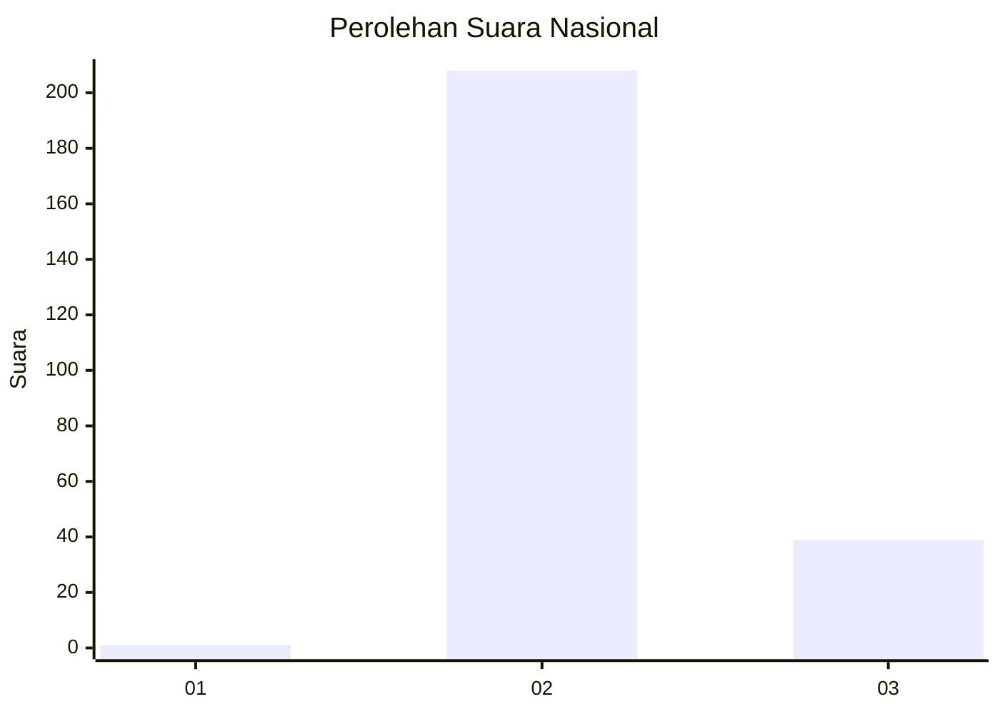
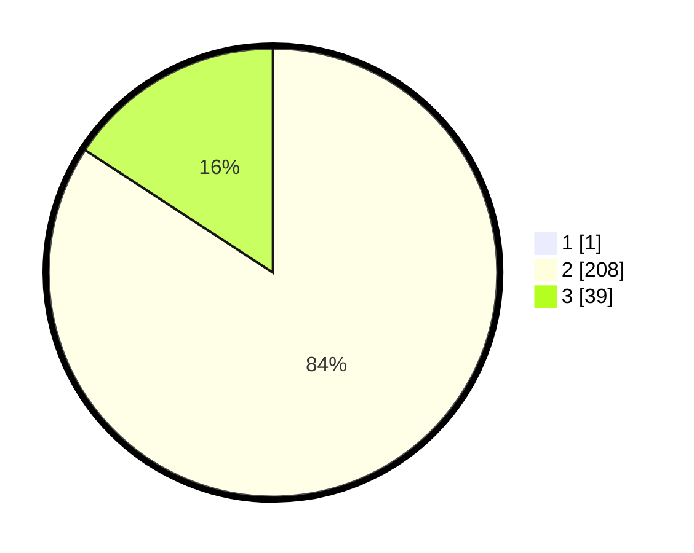

# Hasil

## Grafik

## Tabel

| No. | Nama Paslon    | Suara | Suara (raw) | Persentase |
|:--- |:-------------- | -----:| -----------:| ----------:|
| 1   | ANIES MUHAIMIN | 1     | [1][p-1]    | 0,40       |
| 2   | PRABOWO GIBRAN | 208   | [208][p-2]  | 83,87      |
| 3   | GANJAR MAHFUD  | 39    | [39][p-3]   | 15,73      |

[p-1]: https://github.com/gigit-pemilu/pemilu-2024/blob/main/pilpres/hitung-suara/sub/81-maluku/sub/71-kota-ambon/sub/01-nusaniwe/sub/1006-nusaniwe/sub/002-tps/sub/paslon-1.txt
[p-2]: https://github.com/gigit-pemilu/pemilu-2024/blob/main/pilpres/hitung-suara/sub/81-maluku/sub/71-kota-ambon/sub/01-nusaniwe/sub/1006-nusaniwe/sub/002-tps/sub/paslon-2.txt
[p-3]: https://github.com/gigit-pemilu/pemilu-2024/blob/main/pilpres/hitung-suara/sub/81-maluku/sub/71-kota-ambon/sub/01-nusaniwe/sub/1006-nusaniwe/sub/002-tps/sub/paslon-3.txt

## Foto C Plano

https://sirekap-obj-formc.kpu.go.id/215d/pemilu/ppwp/81/71/01/10/06/8171011006002-20240215-014449--650dcabd-bf1d-4aff-a44f-3ed2a41ca82d.jpg

https://sirekap-obj-formc.kpu.go.id/215d/pemilu/ppwp/81/71/01/10/06/8171011006002-20240215-042426--d1d432c8-3922-48e2-908f-f4ff2512fd2c.jpg

https://sirekap-obj-formc.kpu.go.id/215d/pemilu/ppwp/81/71/01/10/06/8171011006002-20240215-015407--c67682a6-1a57-4c85-825f-347f00955c3d.jpg

## Metadata

| Key        | Value               |
| ---------- | ------------------- |
| Time Stamp | 2024-02-15 23:29:50 |

