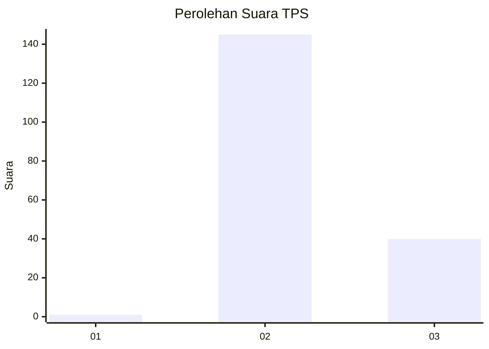
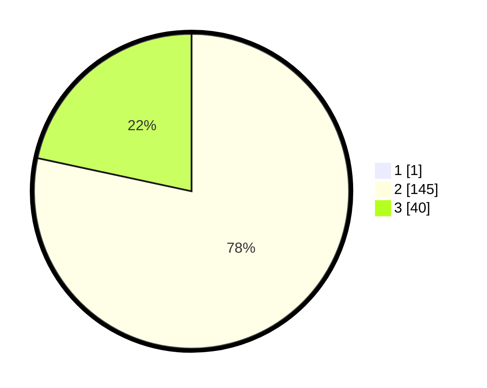

# Hasil

## Grafik

## Tabel

| No. | Nama Paslon    | Suara | Suara (raw) | Persentase |
|:--- |:-------------- | -----:| -----------:| ----------:|
| 1   | ANIES MUHAIMIN | 1     | [1][p-1]    | 0,54       |
| 2   | PRABOWO GIBRAN | 145   | [145][p-2]  | 77,96      |
| 3   | GANJAR MAHFUD  | 40    | [40][p-3]   | 21,51      |

[p-1]: https://github.com/gigit-pemilu/pemilu-2024-81-maluku/blob/main/pilpres/hitung-suara/sub/81-maluku/sub/71-kota-ambon/sub/01-nusaniwe/sub/1006-nusaniwe/sub/004-tps/sub/paslon-1.txt
[p-2]: https://github.com/gigit-pemilu/pemilu-2024-81-maluku/blob/main/pilpres/hitung-suara/sub/81-maluku/sub/71-kota-ambon/sub/01-nusaniwe/sub/1006-nusaniwe/sub/004-tps/sub/paslon-2.txt
[p-3]: https://github.com/gigit-pemilu/pemilu-2024-81-maluku/blob/main/pilpres/hitung-suara/sub/81-maluku/sub/71-kota-ambon/sub/01-nusaniwe/sub/1006-nusaniwe/sub/004-tps/sub/paslon-3.txt

## Foto C Plano

https://sirekap-obj-formc.kpu.go.id/7c36/pemilu/ppwp/81/71/01/10/06/8171011006004-20240215-041449--03d1684d-8581-47b5-88f5-eb41677e7a9e.jpg

https://sirekap-obj-formc.kpu.go.id/7c36/pemilu/ppwp/81/71/01/10/06/8171011006004-20240215-041632--c2f6f5b0-bf67-45f4-9113-d70bc03c4abf.jpg

https://sirekap-obj-formc.kpu.go.id/7c36/pemilu/ppwp/81/71/01/10/06/8171011006004-20240215-041821--22fd2fbd-8a41-4d2a-b255-50e404eeb4ba.jpg

## Metadata

| Key        | Value               |
| ---------- | ------------------- |
| Time Stamp | 2024-02-15 15:30:25 |

