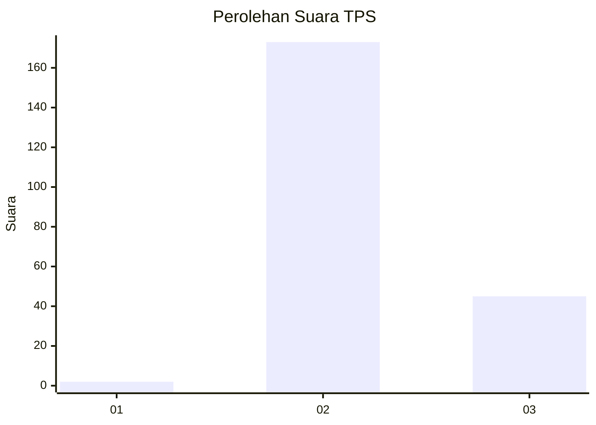
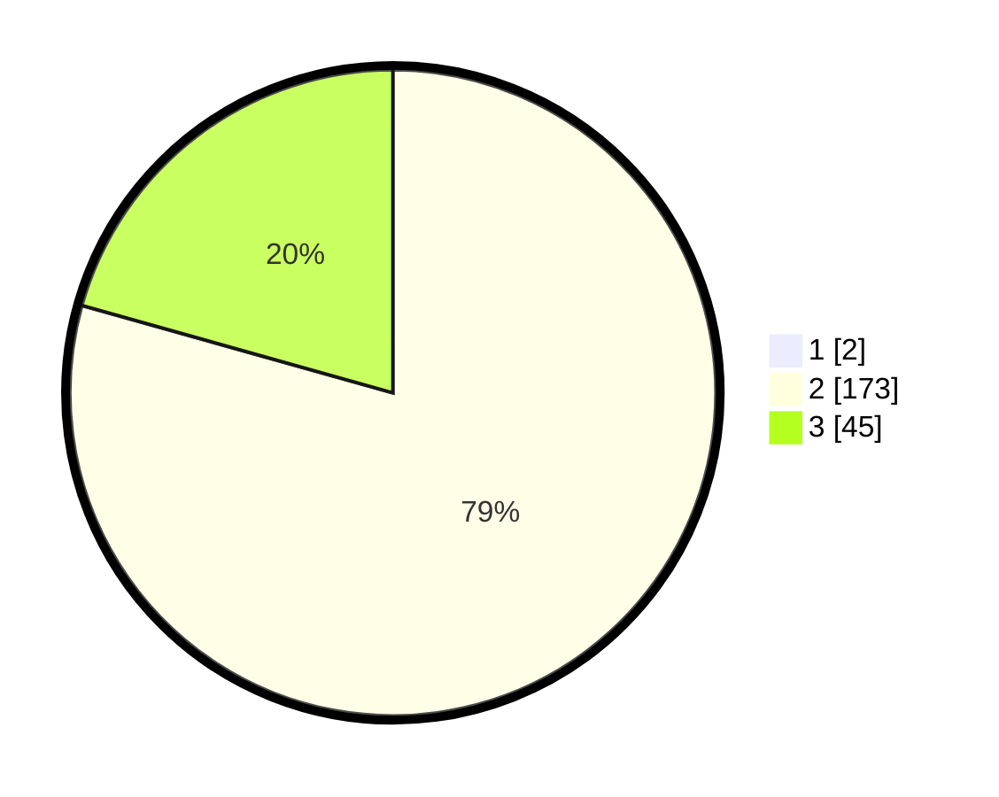

# Hasil

## Grafik

## Tabel

| No. | Nama Paslon    | Suara | Suara (raw) | Persentase |
|:--- |:-------------- | -----:| -----------:| ----------:|
| 1   | ANIES MUHAIMIN | 2     | [2][p-1]    | 0,91       |
| 2   | PRABOWO GIBRAN | 173   | [173][p-2]  | 78,64      |
| 3   | GANJAR MAHFUD  | 45    | [45][p-3]   | 20,45      |

[p-1]: https://github.com/gigit-pemilu/pemilu-2024-81-maluku/blob/main/pilpres/hitung-suara/sub/81-maluku/sub/71-kota-ambon/sub/01-nusaniwe/sub/1006-nusaniwe/sub/009-tps/sub/paslon-1.txt
[p-2]: https://github.com/gigit-pemilu/pemilu-2024-81-maluku/blob/main/pilpres/hitung-suara/sub/81-maluku/sub/71-kota-ambon/sub/01-nusaniwe/sub/1006-nusaniwe/sub/009-tps/sub/paslon-2.txt
[p-3]: https://github.com/gigit-pemilu/pemilu-2024-81-maluku/blob/main/pilpres/hitung-suara/sub/81-maluku/sub/71-kota-ambon/sub/01-nusaniwe/sub/1006-nusaniwe/sub/009-tps/sub/paslon-3.txt

## Foto C Plano

https://sirekap-obj-formc.kpu.go.id/7d8b/pemilu/ppwp/81/71/01/10/06/8171011006009-20240214-131738--a80a52ae-b3ab-4039-98fc-b6630e1264d8.jpg

https://sirekap-obj-formc.kpu.go.id/7d8b/pemilu/ppwp/81/71/01/10/06/8171011006009-20240214-131455--ca27d9e3-608d-4676-9194-7d053ca76efc.jpg

https://sirekap-obj-formc.kpu.go.id/7d8b/pemilu/ppwp/81/71/01/10/06/8171011006009-20240214-131553--c2ec4feb-a041-4062-89e5-bf70ae402d28.jpg

## Metadata

| Key        | Value               |
| ---------- | ------------------- |
| Time Stamp | 2024-02-15 19:30:26 |

