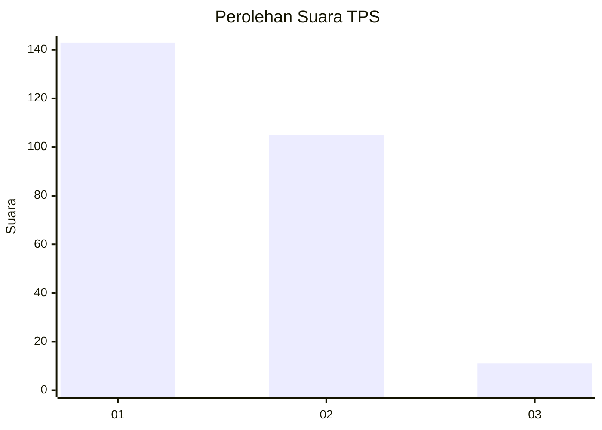
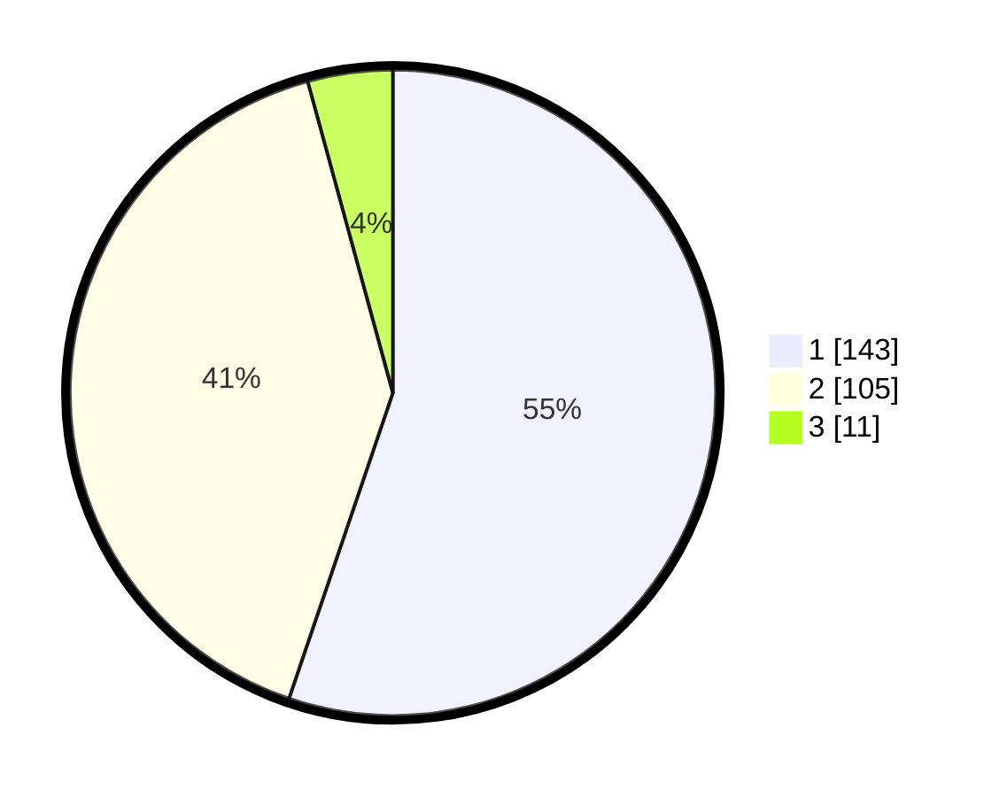

# Hasil

## Grafik

## Tabel

| No. | Nama Paslon    | Suara | Suara (raw) | Persentase |
|:--- |:-------------- | -----:| -----------:| ----------:|
| 1   | ANIES MUHAIMIN | 143   | [143][p-1]  | 55,21      |
| 2   | PRABOWO GIBRAN | 105   | [105][p-2]  | 40,54      |
| 3   | GANJAR MAHFUD  | 11    | [11][p-3]   | 4,25       |

[p-1]: https://github.com/gigit-pemilu/pemilu-2024-81-maluku/blob/main/pilpres/hitung-suara/sub/81-maluku/sub/71-kota-ambon/sub/01-nusaniwe/sub/1007-wainitu/sub/002-tps/sub/paslon-1.txt
[p-2]: https://github.com/gigit-pemilu/pemilu-2024-81-maluku/blob/main/pilpres/hitung-suara/sub/81-maluku/sub/71-kota-ambon/sub/01-nusaniwe/sub/1007-wainitu/sub/002-tps/sub/paslon-2.txt
[p-3]: https://github.com/gigit-pemilu/pemilu-2024-81-maluku/blob/main/pilpres/hitung-suara/sub/81-maluku/sub/71-kota-ambon/sub/01-nusaniwe/sub/1007-wainitu/sub/002-tps/sub/paslon-3.txt

## Foto C Plano

https://sirekap-obj-formc.kpu.go.id/ad0d/pemilu/ppwp/81/71/01/10/07/8171011007002-20240215-034443--d128d1f9-d568-468c-b261-091215237bdf.jpg

https://sirekap-obj-formc.kpu.go.id/ad0d/pemilu/ppwp/81/71/01/10/07/8171011007002-20240215-034534--72f5a9f9-d715-439b-b5cf-948a582974f9.jpg

https://sirekap-obj-formc.kpu.go.id/ad0d/pemilu/ppwp/81/71/01/10/07/8171011007002-20240215-034558--67961e13-d016-43d8-a1bb-5b1cb5415561.jpg

## Metadata

| Key        | Value               |
| ---------- | ------------------- |
| Time Stamp | 2024-02-15 19:00:26 |

