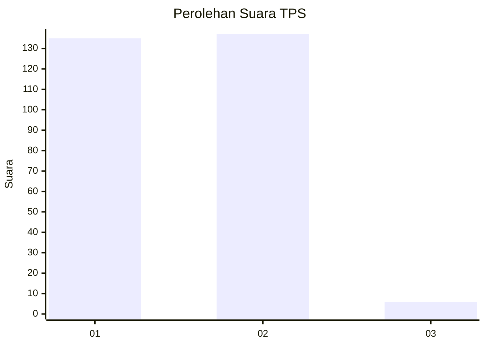
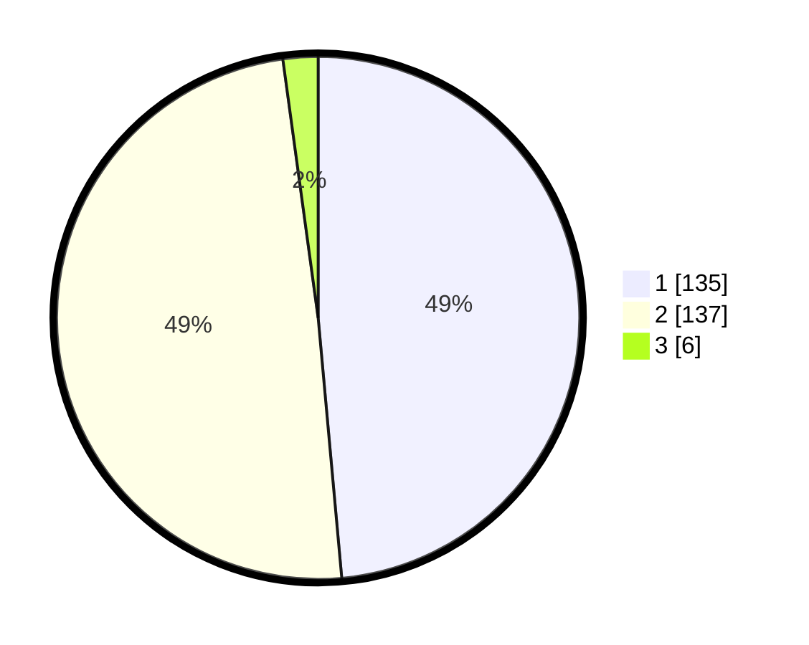

# Hasil

## Grafik

## Tabel

| No. | Nama Paslon    | Suara | Suara (raw) | Persentase |
|:--- |:-------------- | -----:| -----------:| ----------:|
| 1   | ANIES MUHAIMIN | 135   | [135][p-1]  | 48,56      |
| 2   | PRABOWO GIBRAN | 137   | [137][p-2]  | 49,28      |
| 3   | GANJAR MAHFUD  | 6     | [6][p-3]    | 2,16       |

[p-1]: https://github.com/gigit-pemilu/pemilu-2024-81-maluku/blob/main/pilpres/hitung-suara/sub/81-maluku/sub/71-kota-ambon/sub/01-nusaniwe/sub/1013-silale/sub/007-tps/sub/paslon-1.txt
[p-2]: https://github.com/gigit-pemilu/pemilu-2024-81-maluku/blob/main/pilpres/hitung-suara/sub/81-maluku/sub/71-kota-ambon/sub/01-nusaniwe/sub/1013-silale/sub/007-tps/sub/paslon-2.txt
[p-3]: https://github.com/gigit-pemilu/pemilu-2024-81-maluku/blob/main/pilpres/hitung-suara/sub/81-maluku/sub/71-kota-ambon/sub/01-nusaniwe/sub/1013-silale/sub/007-tps/sub/paslon-3.txt

## Foto C Plano

https://sirekap-obj-formc.kpu.go.id/c9ab/pemilu/ppwp/81/71/01/10/13/8171011013007-20240214-230450--a22fba2c-a82e-44ce-8352-f10fdb46e3b0.jpg

https://sirekap-obj-formc.kpu.go.id/c9ab/pemilu/ppwp/81/71/01/10/13/8171011013007-20240214-231935--b09f341f-4a5a-42e6-8dc4-82bfaed3cfb2.jpg

https://sirekap-obj-formc.kpu.go.id/c9ab/pemilu/ppwp/81/71/01/10/13/8171011013007-20240215-062327--bfbd191f-b315-4f9c-b6e5-80f28d565ea5.jpg

## Metadata

| Key        | Value               |
| ---------- | ------------------- |
| Time Stamp | 2024-02-15 22:30:27 |

