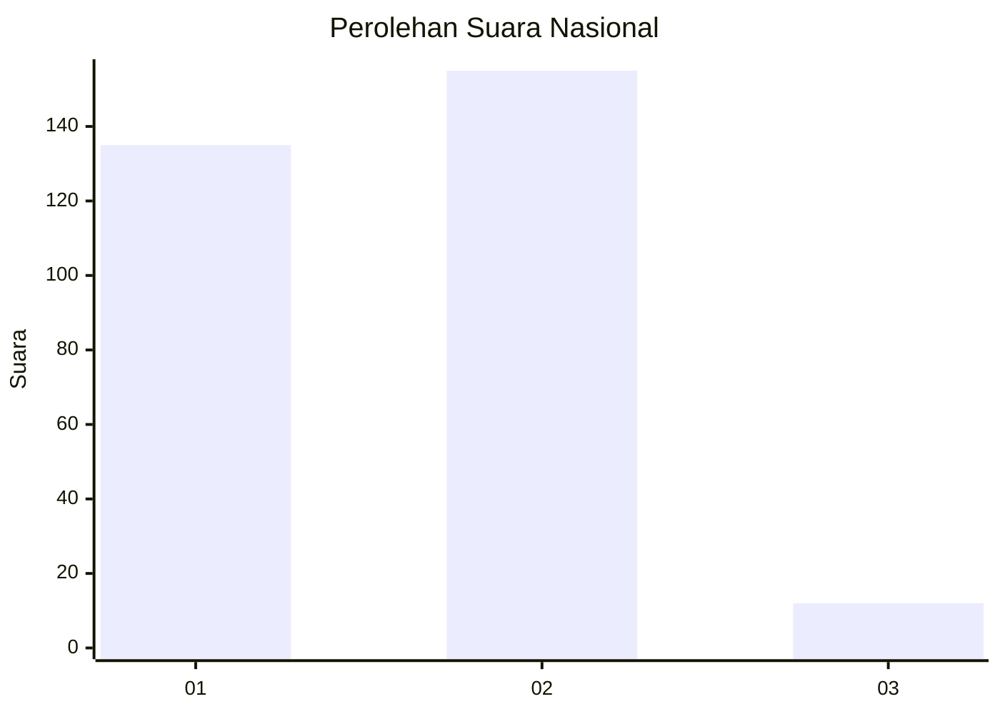
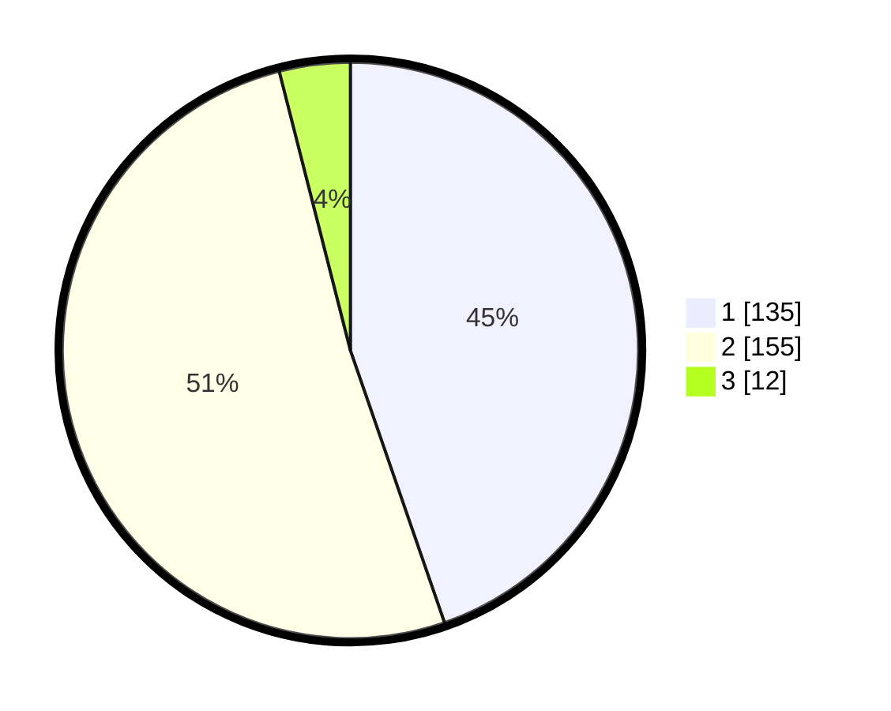

# Hasil

## Grafik

## Tabel

| No. | Nama Paslon    | Suara | Suara (raw) | Persentase |
|:--- |:-------------- | -----:| -----------:| ----------:|
| 1   | ANIES MUHAIMIN | 135   | [135][p-1]  | 44,70      |
| 2   | PRABOWO GIBRAN | 155   | [155][p-2]  | 51,32      |
| 3   | GANJAR MAHFUD  | 12    | [12][p-3]   | 3,97       |

[p-1]: https://github.com/gigit-pemilu/pemilu-2024/blob/main/pilpres/hitung-suara/sub/81-maluku/sub/71-kota-ambon/sub/01-nusaniwe/sub/1013-silale/sub/008-tps/sub/paslon-1.txt
[p-2]: https://github.com/gigit-pemilu/pemilu-2024/blob/main/pilpres/hitung-suara/sub/81-maluku/sub/71-kota-ambon/sub/01-nusaniwe/sub/1013-silale/sub/008-tps/sub/paslon-2.txt
[p-3]: https://github.com/gigit-pemilu/pemilu-2024/blob/main/pilpres/hitung-suara/sub/81-maluku/sub/71-kota-ambon/sub/01-nusaniwe/sub/1013-silale/sub/008-tps/sub/paslon-3.txt

## Foto C Plano

https://sirekap-obj-formc.kpu.go.id/895e/pemilu/ppwp/81/71/01/10/13/8171011013008-20240215-045016--51162cd9-62df-4372-abb4-38fa24b69f2b.jpg

https://sirekap-obj-formc.kpu.go.id/895e/pemilu/ppwp/81/71/01/10/13/8171011013008-20240215-032337--b0bf94d6-6a4e-43b3-99a1-4555628e9d9e.jpg

https://sirekap-obj-formc.kpu.go.id/895e/pemilu/ppwp/81/71/01/10/13/8171011013008-20240215-032002--036bf42a-41ba-4853-887d-551708884e84.jpg

## Metadata

| Key        | Value               |
| ---------- | ------------------- |
| Time Stamp | 2024-02-15 22:30:27 |

