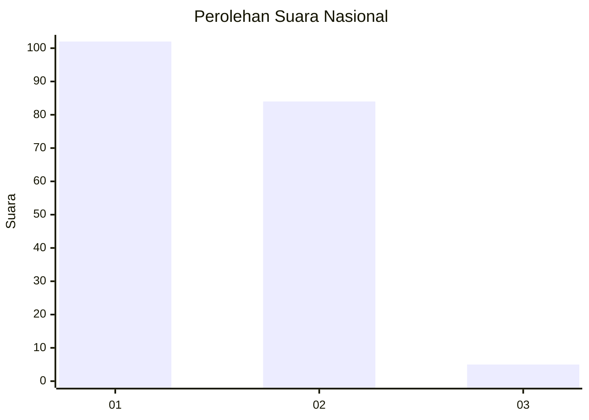
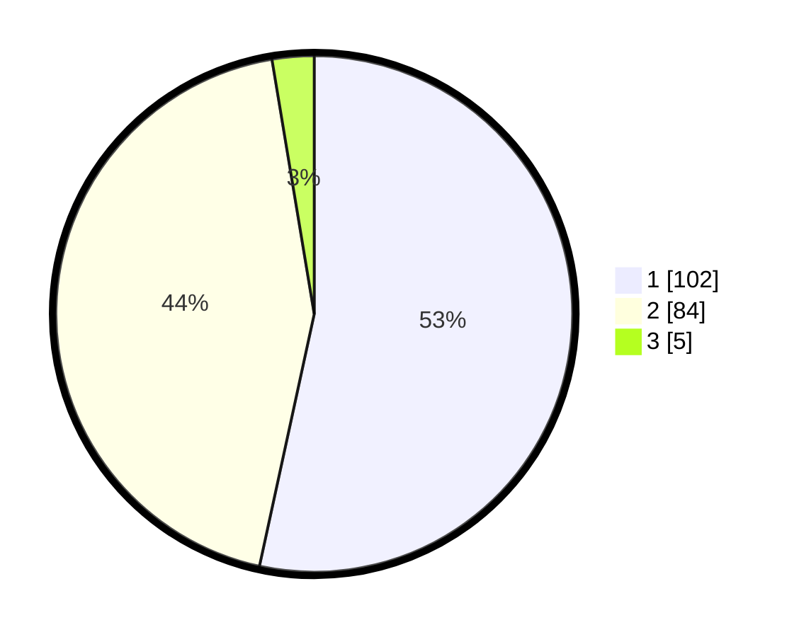

# Hasil

## Grafik

## Tabel

| No. | Nama Paslon    | Suara | Suara (raw) | Persentase |
|:--- |:-------------- | -----:| -----------:| ----------:|
| 1   | ANIES MUHAIMIN | 102   | [102][p-1]  | 53,40      |
| 2   | PRABOWO GIBRAN | 84    | [84][p-2]   | 43,98      |
| 3   | GANJAR MAHFUD  | 5     | [5][p-3]    | 2,62       |

[p-1]: https://github.com/gigit-pemilu/pemilu-2024/blob/main/pilpres/hitung-suara/sub/81-maluku/sub/71-kota-ambon/sub/02-sirimau/sub/1010-pandan-kasturi/sub/003-tps/sub/paslon-1.txt
[p-2]: https://github.com/gigit-pemilu/pemilu-2024/blob/main/pilpres/hitung-suara/sub/81-maluku/sub/71-kota-ambon/sub/02-sirimau/sub/1010-pandan-kasturi/sub/003-tps/sub/paslon-2.txt
[p-3]: https://github.com/gigit-pemilu/pemilu-2024/blob/main/pilpres/hitung-suara/sub/81-maluku/sub/71-kota-ambon/sub/02-sirimau/sub/1010-pandan-kasturi/sub/003-tps/sub/paslon-3.txt

## Foto C Plano

https://sirekap-obj-formc.kpu.go.id/d922/pemilu/ppwp/81/71/02/10/10/8171021010003-20240215-111915--564a6283-4828-4354-972d-cea560e8f6d0.jpg

https://sirekap-obj-formc.kpu.go.id/d922/pemilu/ppwp/81/71/02/10/10/8171021010003-20240215-111938--23f54118-4808-46c1-8ce6-c678b8e5137e.jpg

https://sirekap-obj-formc.kpu.go.id/d922/pemilu/ppwp/81/71/02/10/10/8171021010003-20240215-111951--81935bd9-77bf-475a-baec-96e2b360352f.jpg

## Metadata

| Key        | Value               |
| ---------- | ------------------- |
| Time Stamp | 2024-02-15 18:00:26 |

