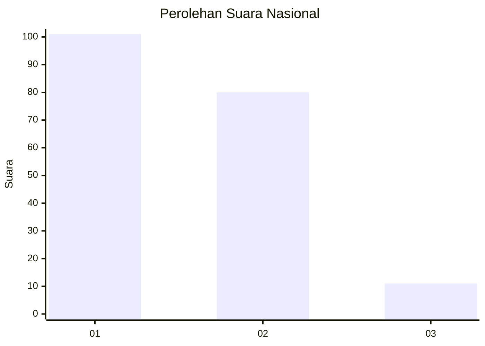
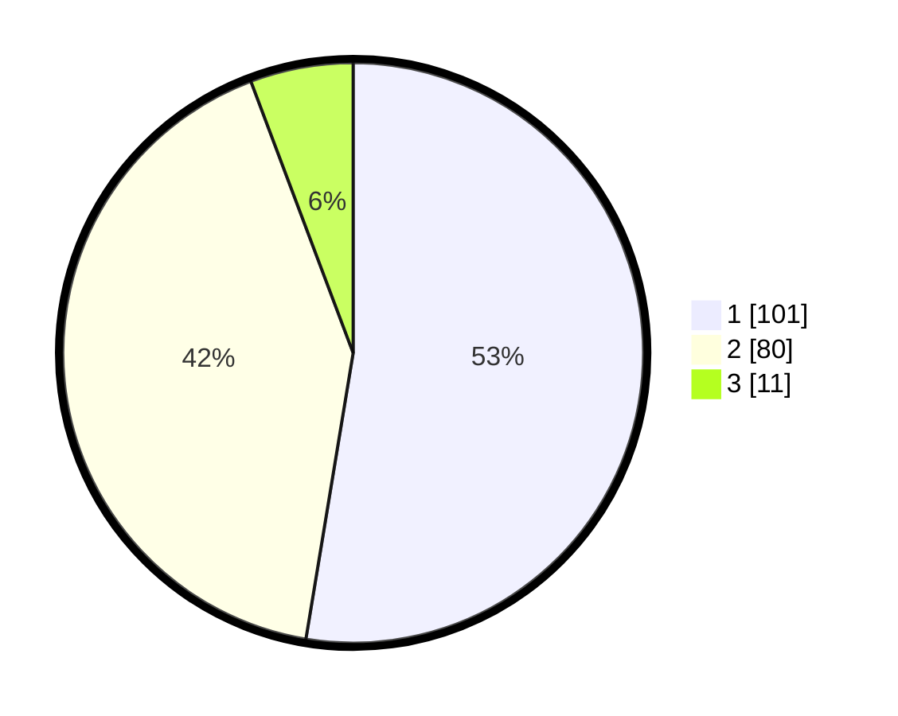

# Hasil

## Grafik

## Tabel

| No. | Nama Paslon    | Suara | Suara (raw) | Persentase |
|:--- |:-------------- | -----:| -----------:| ----------:|
| 1   | ANIES MUHAIMIN | 101   | [101][p-1]  | 52,60      |
| 2   | PRABOWO GIBRAN | 80    | [80][p-2]   | 41,67      |
| 3   | GANJAR MAHFUD  | 11    | [11][p-3]   | 5,73       |

[p-1]: https://github.com/gigit-pemilu/pemilu-2024/blob/main/pilpres/hitung-suara/sub/81-maluku/sub/71-kota-ambon/sub/02-sirimau/sub/1010-pandan-kasturi/sub/004-tps/sub/paslon-1.txt
[p-2]: https://github.com/gigit-pemilu/pemilu-2024/blob/main/pilpres/hitung-suara/sub/81-maluku/sub/71-kota-ambon/sub/02-sirimau/sub/1010-pandan-kasturi/sub/004-tps/sub/paslon-2.txt
[p-3]: https://github.com/gigit-pemilu/pemilu-2024/blob/main/pilpres/hitung-suara/sub/81-maluku/sub/71-kota-ambon/sub/02-sirimau/sub/1010-pandan-kasturi/sub/004-tps/sub/paslon-3.txt

## Foto C Plano

https://sirekap-obj-formc.kpu.go.id/8bb9/pemilu/ppwp/81/71/02/10/10/8171021010004-20240215-144718--0b995a03-508a-4dfd-b1f3-5ae4ccad9918.jpg

https://sirekap-obj-formc.kpu.go.id/8bb9/pemilu/ppwp/81/71/02/10/10/8171021010004-20240215-144801--834890a3-eef3-440f-a76b-03d5c8466359.jpg

https://sirekap-obj-formc.kpu.go.id/8bb9/pemilu/ppwp/81/71/02/10/10/8171021010004-20240215-145054--45a3649d-c6d4-4123-ba0a-253cb34ff5f9.jpg

## Metadata

| Key        | Value               |
| ---------- | ------------------- |
| Time Stamp | 2024-02-15 20:00:44 |

