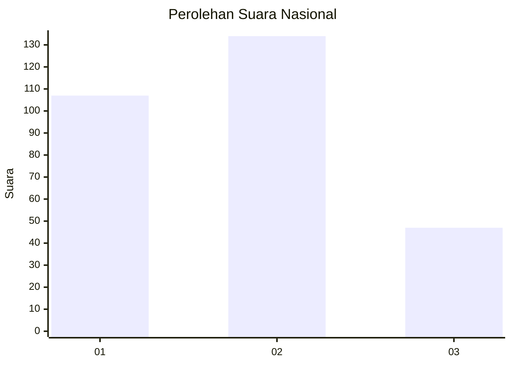
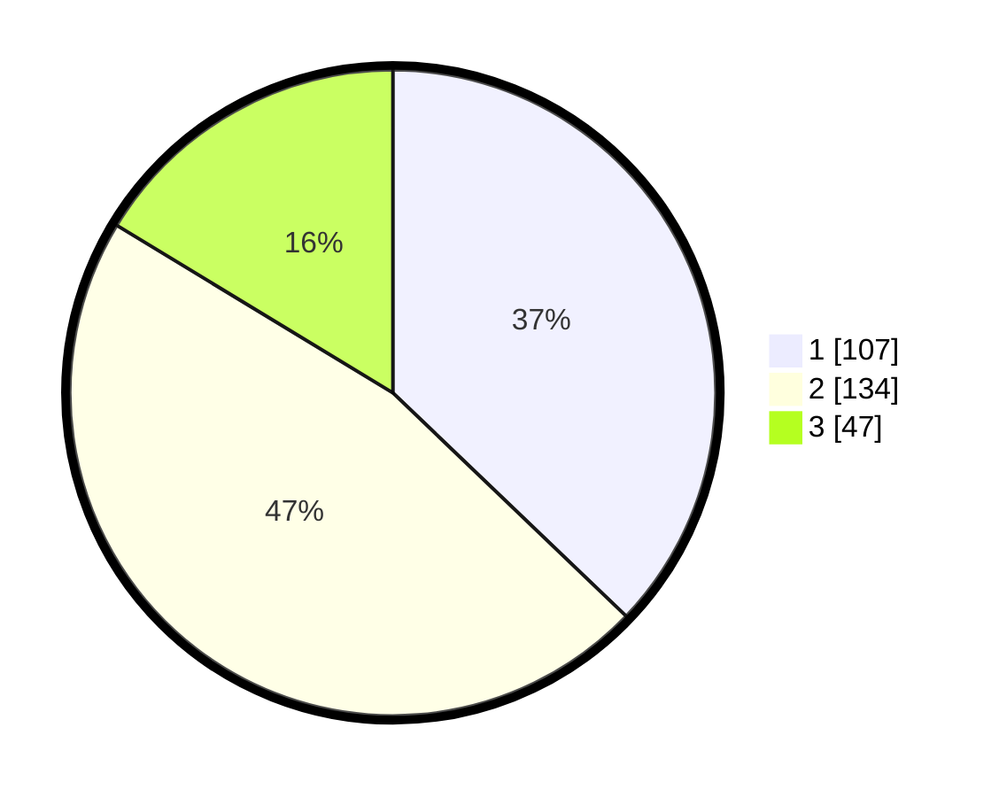

# Hasil

## Grafik

## Tabel

| No. | Nama Paslon    | Suara | Suara (raw) | Persentase |
|:--- |:-------------- | -----:| -----------:| ----------:|
| 1   | ANIES MUHAIMIN | 107   | [107][p-1]  | 37,15      |
| 2   | PRABOWO GIBRAN | 134   | [134][p-2]  | 46,53      |
| 3   | GANJAR MAHFUD  | 47    | [47][p-3]   | 16,32      |

[p-1]: https://github.com/gigit-pemilu/pemilu-2024/blob/main/pilpres/hitung-suara/sub/81-maluku/sub/71-kota-ambon/sub/02-sirimau/sub/1015-batu-meja/sub/020-tps/sub/paslon-1.txt
[p-2]: https://github.com/gigit-pemilu/pemilu-2024/blob/main/pilpres/hitung-suara/sub/81-maluku/sub/71-kota-ambon/sub/02-sirimau/sub/1015-batu-meja/sub/020-tps/sub/paslon-2.txt
[p-3]: https://github.com/gigit-pemilu/pemilu-2024/blob/main/pilpres/hitung-suara/sub/81-maluku/sub/71-kota-ambon/sub/02-sirimau/sub/1015-batu-meja/sub/020-tps/sub/paslon-3.txt

## Foto C Plano

https://sirekap-obj-formc.kpu.go.id/6941/pemilu/ppwp/81/71/02/10/15/8171021015020-20240215-082317--e302dec5-6c1e-492a-a27a-f73ab234a407.jpg

https://sirekap-obj-formc.kpu.go.id/6941/pemilu/ppwp/81/71/02/10/15/8171021015020-20240214-193714--10fb2e7f-83d6-4518-ae38-ddb4c3895a10.jpg

https://sirekap-obj-formc.kpu.go.id/6941/pemilu/ppwp/81/71/02/10/15/8171021015020-20240214-141429--4038d4ae-03bc-46f1-81d5-74557b14abb1.jpg

## Metadata

| Key        | Value               |
| ---------- | ------------------- |
| Time Stamp | 2024-02-20 14:00:00 |

