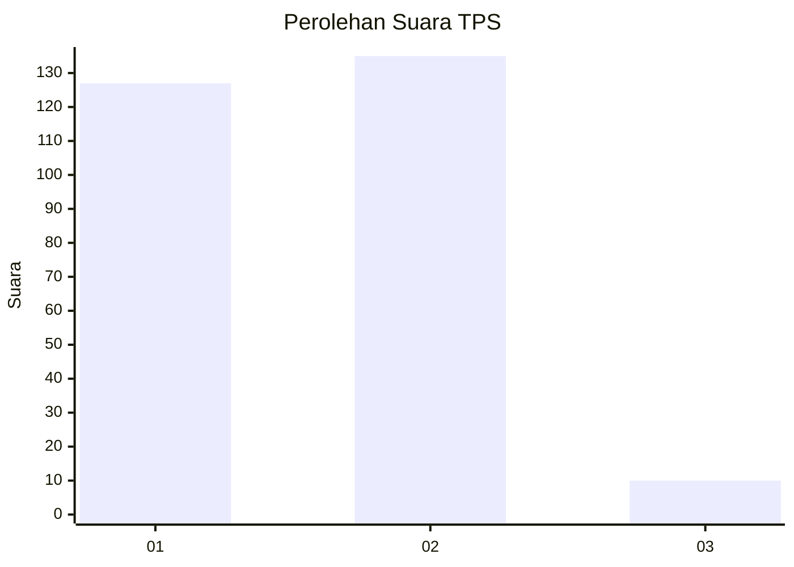
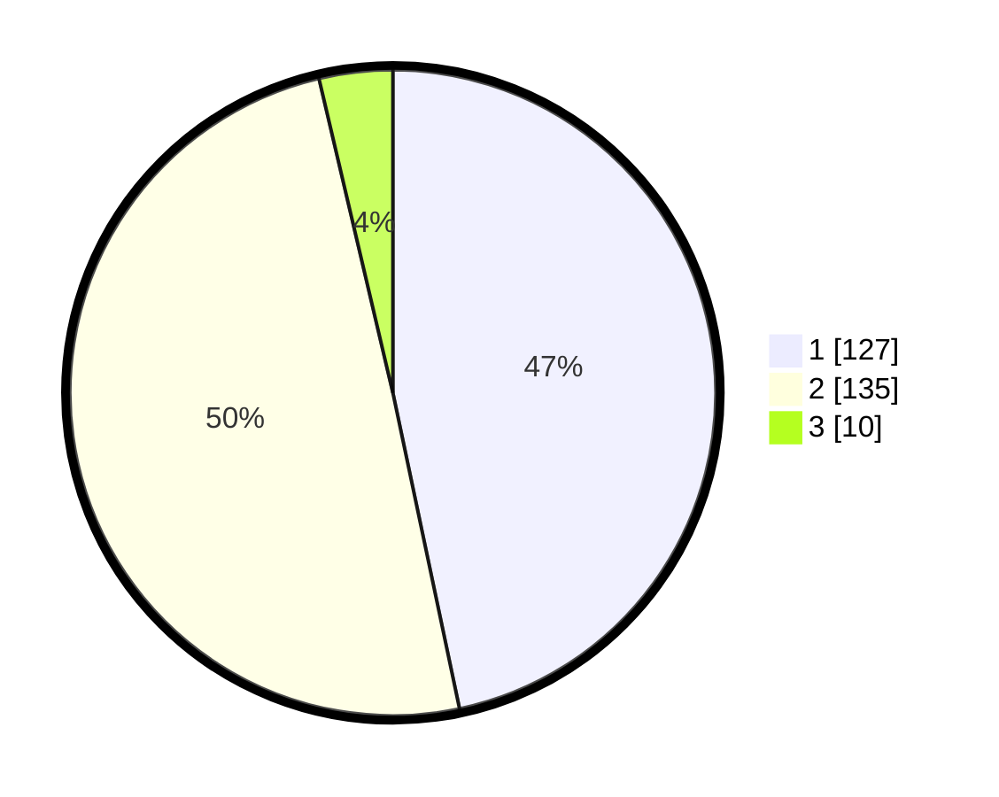

# Hasil

## Grafik

## Tabel

| No. | Nama Paslon    | Suara | Suara (raw) | Persentase |
|:--- |:-------------- | -----:| -----------:| ----------:|
| 1   | ANIES MUHAIMIN | 127   | [127][p-1]  | 46,69      |
| 2   | PRABOWO GIBRAN | 135   | [135][p-2]  | 49,63      |
| 3   | GANJAR MAHFUD  | 10    | [10][p-3]   | 3,68       |

[p-1]: https://github.com/gigit-pemilu/pemilu-2024-81-maluku/blob/main/pilpres/hitung-suara/sub/81-maluku/sub/71-kota-ambon/sub/02-sirimau/sub/2003-batu-merah/sub/003-tps/sub/paslon-1.txt
[p-2]: https://github.com/gigit-pemilu/pemilu-2024-81-maluku/blob/main/pilpres/hitung-suara/sub/81-maluku/sub/71-kota-ambon/sub/02-sirimau/sub/2003-batu-merah/sub/003-tps/sub/paslon-2.txt
[p-3]: https://github.com/gigit-pemilu/pemilu-2024-81-maluku/blob/main/pilpres/hitung-suara/sub/81-maluku/sub/71-kota-ambon/sub/02-sirimau/sub/2003-batu-merah/sub/003-tps/sub/paslon-3.txt

## Foto C Plano

https://sirekap-obj-formc.kpu.go.id/1d66/pemilu/ppwp/81/71/02/20/03/8171022003003-20240215-141801--8f656bb8-d876-4bb5-9452-99116790ae19.jpg

https://sirekap-obj-formc.kpu.go.id/1d66/pemilu/ppwp/81/71/02/20/03/8171022003003-20240215-141943--8a16c1ee-9974-4e41-b5a3-57abb4ee4896.jpg

https://sirekap-obj-formc.kpu.go.id/1d66/pemilu/ppwp/81/71/02/20/03/8171022003003-20240215-142106--1dd7b4e2-039d-4916-84e8-68e5641e7f6d.jpg

## Metadata

| Key        | Value               |
| ---------- | ------------------- |
| Time Stamp | 2024-02-20 14:00:00 |

