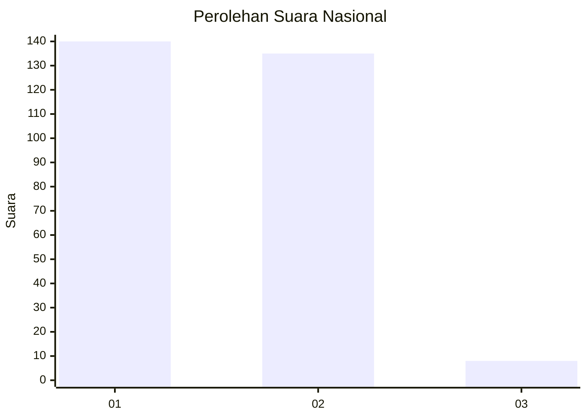
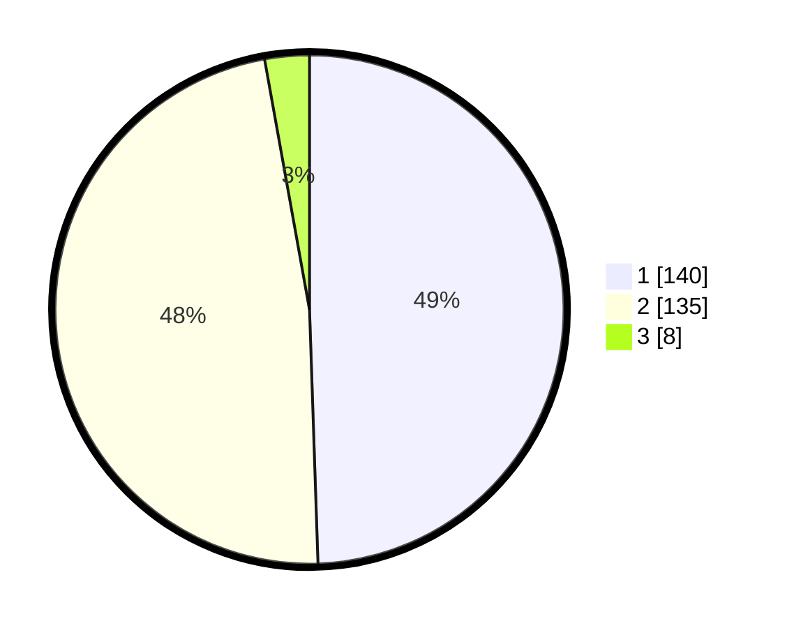

# Hasil

## Grafik

## Tabel

| No. | Nama Paslon    | Suara | Suara (raw) | Persentase |
|:--- |:-------------- | -----:| -----------:| ----------:|
| 1   | ANIES MUHAIMIN | 140   | [140][p-1]  | 49,47      |
| 2   | PRABOWO GIBRAN | 135   | [135][p-2]  | 47,70      |
| 3   | GANJAR MAHFUD  | 8     | [8][p-3]    | 2,83       |

[p-1]: https://github.com/gigit-pemilu/pemilu-2024/blob/main/pilpres/hitung-suara/sub/81-maluku/sub/71-kota-ambon/sub/02-sirimau/sub/2003-batu-merah/sub/021-tps/sub/paslon-1.txt
[p-2]: https://github.com/gigit-pemilu/pemilu-2024/blob/main/pilpres/hitung-suara/sub/81-maluku/sub/71-kota-ambon/sub/02-sirimau/sub/2003-batu-merah/sub/021-tps/sub/paslon-2.txt
[p-3]: https://github.com/gigit-pemilu/pemilu-2024/blob/main/pilpres/hitung-suara/sub/81-maluku/sub/71-kota-ambon/sub/02-sirimau/sub/2003-batu-merah/sub/021-tps/sub/paslon-3.txt

## Foto C Plano

https://sirekap-obj-formc.kpu.go.id/c50e/pemilu/ppwp/81/71/02/20/03/8171022003021-20240215-073120--a6efd11e-4f93-43dc-85e6-9492ef595451.jpg

https://sirekap-obj-formc.kpu.go.id/c50e/pemilu/ppwp/81/71/02/20/03/8171022003021-20240215-075733--0061da30-2e4a-4d18-8105-bfc2bc34a6e4.jpg

https://sirekap-obj-formc.kpu.go.id/c50e/pemilu/ppwp/81/71/02/20/03/8171022003021-20240215-055154--4a718036-f1d7-44f7-9702-2d3e83a9850f.jpg

## Metadata

| Key        | Value               |
| ---------- | ------------------- |
| Time Stamp | 2024-02-20 14:00:00 |

