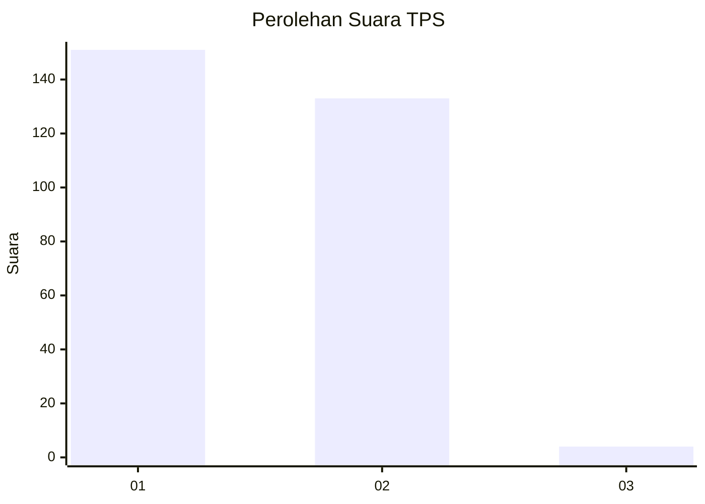
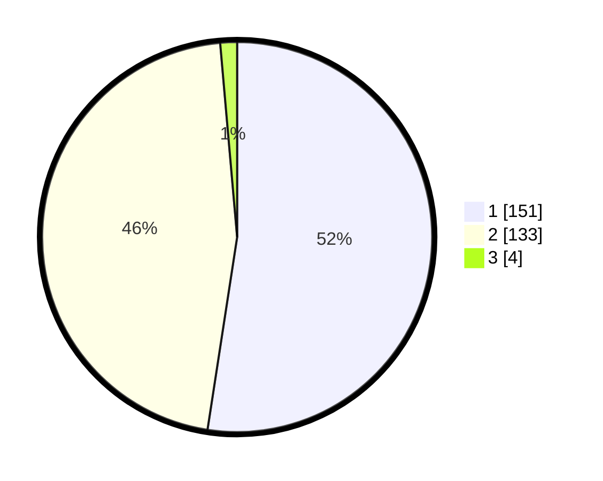

# Hasil

## Grafik

## Tabel

| No. | Nama Paslon    | Suara | Suara (raw) | Persentase |
|:--- |:-------------- | -----:| -----------:| ----------:|
| 1   | ANIES MUHAIMIN | 151   | [151][p-1]  | 52,43      |
| 2   | PRABOWO GIBRAN | 133   | [133][p-2]  | 46,18      |
| 3   | GANJAR MAHFUD  | 4     | [4][p-3]    | 1,39       |

[p-1]: https://github.com/gigit-pemilu/pemilu-2024-81-maluku/blob/main/pilpres/hitung-suara/sub/81-maluku/sub/71-kota-ambon/sub/02-sirimau/sub/2003-batu-merah/sub/023-tps/sub/paslon-1.txt
[p-2]: https://github.com/gigit-pemilu/pemilu-2024-81-maluku/blob/main/pilpres/hitung-suara/sub/81-maluku/sub/71-kota-ambon/sub/02-sirimau/sub/2003-batu-merah/sub/023-tps/sub/paslon-2.txt
[p-3]: https://github.com/gigit-pemilu/pemilu-2024-81-maluku/blob/main/pilpres/hitung-suara/sub/81-maluku/sub/71-kota-ambon/sub/02-sirimau/sub/2003-batu-merah/sub/023-tps/sub/paslon-3.txt

## Foto C Plano

https://sirekap-obj-formc.kpu.go.id/d212/pemilu/ppwp/81/71/02/20/03/8171022003023-20240215-022851--39b7baec-e757-43f7-8ccb-d94b06a17265.jpg

https://sirekap-obj-formc.kpu.go.id/d212/pemilu/ppwp/81/71/02/20/03/8171022003023-20240215-022636--9473d02d-fbc7-4b05-8b83-dd9c08b150fc.jpg

https://sirekap-obj-formc.kpu.go.id/d212/pemilu/ppwp/81/71/02/20/03/8171022003023-20240215-022456--cd25ae7f-fc10-49e0-8c52-0749af545c71.jpg

## Metadata

| Key        | Value               |
| ---------- | ------------------- |
| Time Stamp | 2024-02-20 11:00:00 |

