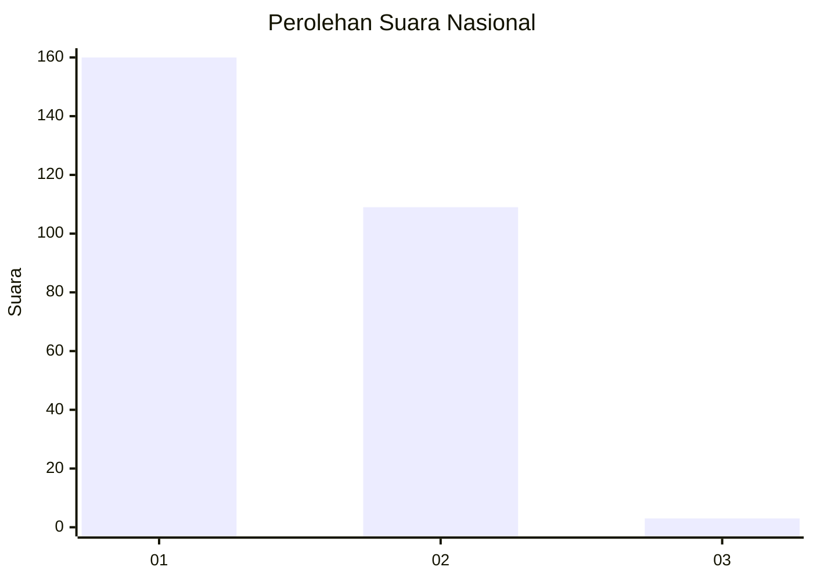
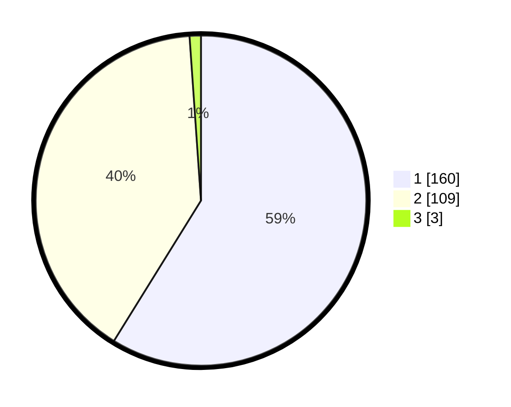

# Hasil

## Grafik

## Tabel

| No. | Nama Paslon    | Suara | Suara (raw) | Persentase |
|:--- |:-------------- | -----:| -----------:| ----------:|
| 1   | ANIES MUHAIMIN | 160   | [160][p-1]  | 58,82      |
| 2   | PRABOWO GIBRAN | 109   | [109][p-2]  | 40,07      |
| 3   | GANJAR MAHFUD  | 3     | [3][p-3]    | 1,10       |

[p-1]: https://github.com/gigit-pemilu/pemilu-2024/blob/main/pilpres/hitung-suara/sub/81-maluku/sub/71-kota-ambon/sub/02-sirimau/sub/2003-batu-merah/sub/024-tps/sub/paslon-1.txt
[p-2]: https://github.com/gigit-pemilu/pemilu-2024/blob/main/pilpres/hitung-suara/sub/81-maluku/sub/71-kota-ambon/sub/02-sirimau/sub/2003-batu-merah/sub/024-tps/sub/paslon-2.txt
[p-3]: https://github.com/gigit-pemilu/pemilu-2024/blob/main/pilpres/hitung-suara/sub/81-maluku/sub/71-kota-ambon/sub/02-sirimau/sub/2003-batu-merah/sub/024-tps/sub/paslon-3.txt

## Foto C Plano

https://sirekap-obj-formc.kpu.go.id/2be2/pemilu/ppwp/81/71/02/20/03/8171022003024-20240215-055208--e840f9fa-697d-41f1-9f08-ddbc84f418d6.jpg

https://sirekap-obj-formc.kpu.go.id/2be2/pemilu/ppwp/81/71/02/20/03/8171022003024-20240215-055223--37543dfd-337d-4756-b02e-dacd361989e5.jpg

https://sirekap-obj-formc.kpu.go.id/2be2/pemilu/ppwp/81/71/02/20/03/8171022003024-20240215-055241--94a1af9a-ebd3-4ffe-8d56-e0d6d8f92ce7.jpg

## Metadata

| Key        | Value               |
| ---------- | ------------------- |
| Time Stamp | 2024-02-20 14:00:00 |

