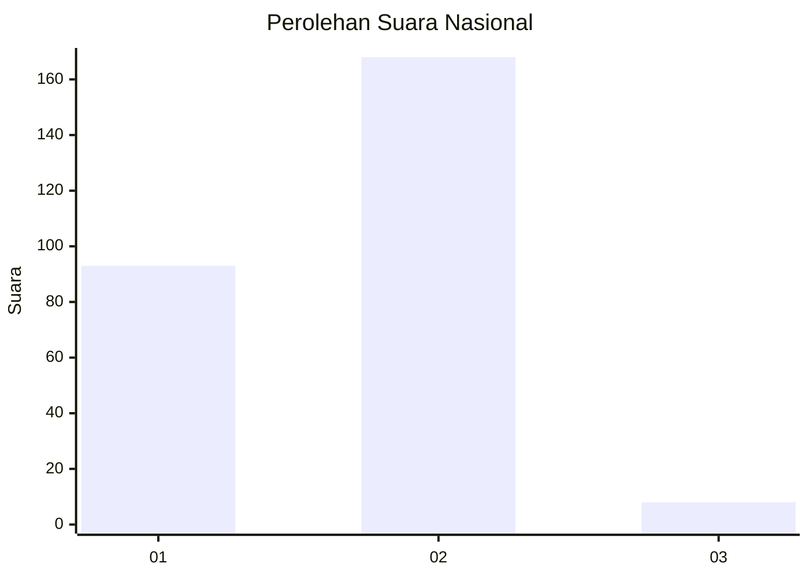
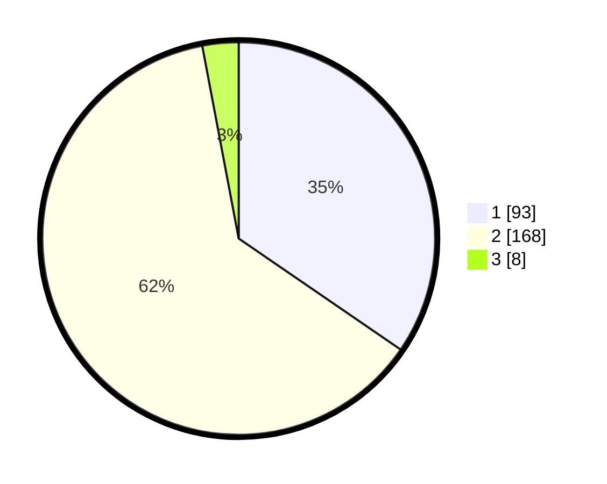

# Hasil

## Grafik

## Tabel

| No. | Nama Paslon    | Suara | Suara (raw) | Persentase |
|:--- |:-------------- | -----:| -----------:| ----------:|
| 1   | ANIES MUHAIMIN | 93    | [93][p-1]   | 34,57      |
| 2   | PRABOWO GIBRAN | 168   | [168][p-2]  | 62,45      |
| 3   | GANJAR MAHFUD  | 8     | [8][p-3]    | 2,97       |

[p-1]: https://github.com/gigit-pemilu/pemilu-2024/blob/main/pilpres/hitung-suara/sub/81-maluku/sub/71-kota-ambon/sub/02-sirimau/sub/2003-batu-merah/sub/025-tps/sub/paslon-1.txt
[p-2]: https://github.com/gigit-pemilu/pemilu-2024/blob/main/pilpres/hitung-suara/sub/81-maluku/sub/71-kota-ambon/sub/02-sirimau/sub/2003-batu-merah/sub/025-tps/sub/paslon-2.txt
[p-3]: https://github.com/gigit-pemilu/pemilu-2024/blob/main/pilpres/hitung-suara/sub/81-maluku/sub/71-kota-ambon/sub/02-sirimau/sub/2003-batu-merah/sub/025-tps/sub/paslon-3.txt

## Foto C Plano

https://sirekap-obj-formc.kpu.go.id/249f/pemilu/ppwp/81/71/02/20/03/8171022003025-20240215-080305--1ed490e7-7d58-46cc-ac3b-ebaa8f98de20.jpg

https://sirekap-obj-formc.kpu.go.id/249f/pemilu/ppwp/81/71/02/20/03/8171022003025-20240215-080621--389342ba-8cb6-4b3f-bd3b-c271b77402e9.jpg

https://sirekap-obj-formc.kpu.go.id/249f/pemilu/ppwp/81/71/02/20/03/8171022003025-20240215-081132--5246d1a3-1fc0-49a2-90a9-8c70888ab55e.jpg

## Metadata

| Key        | Value               |
| ---------- | ------------------- |
| Time Stamp | 2024-02-20 11:00:00 |

