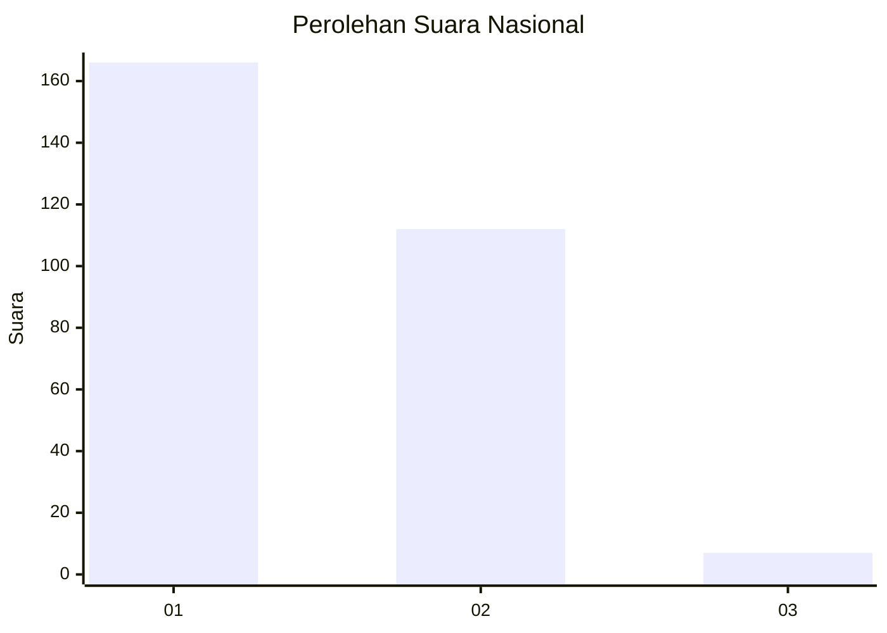
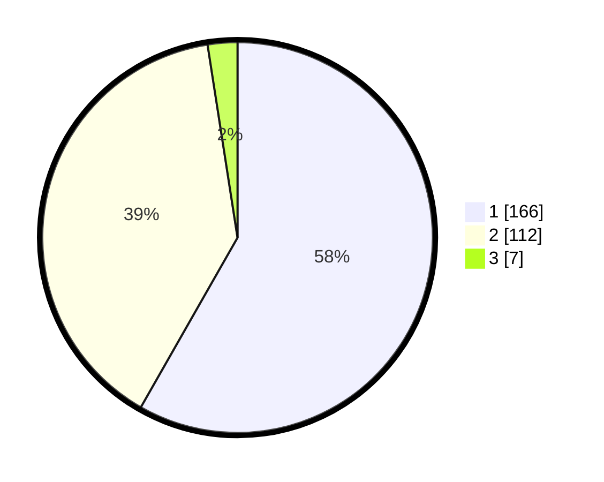

# Hasil

## Grafik

## Tabel

| No. | Nama Paslon    | Suara | Suara (raw) | Persentase |
|:--- |:-------------- | -----:| -----------:| ----------:|
| 1   | ANIES MUHAIMIN | 166   | [166][p-1]  | 58,25      |
| 2   | PRABOWO GIBRAN | 112   | [112][p-2]  | 39,30      |
| 3   | GANJAR MAHFUD  | 7     | [7][p-3]    | 2,46       |

[p-1]: https://github.com/gigit-pemilu/pemilu-2024/blob/main/pilpres/hitung-suara/sub/81-maluku/sub/71-kota-ambon/sub/02-sirimau/sub/2003-batu-merah/sub/027-tps/sub/paslon-1.txt
[p-2]: https://github.com/gigit-pemilu/pemilu-2024/blob/main/pilpres/hitung-suara/sub/81-maluku/sub/71-kota-ambon/sub/02-sirimau/sub/2003-batu-merah/sub/027-tps/sub/paslon-2.txt
[p-3]: https://github.com/gigit-pemilu/pemilu-2024/blob/main/pilpres/hitung-suara/sub/81-maluku/sub/71-kota-ambon/sub/02-sirimau/sub/2003-batu-merah/sub/027-tps/sub/paslon-3.txt

## Foto C Plano

https://sirekap-obj-formc.kpu.go.id/3900/pemilu/ppwp/81/71/02/20/03/8171022003027-20240215-052233--42d1e641-9b91-4bb6-9a96-e95c14c7b0ca.jpg

https://sirekap-obj-formc.kpu.go.id/3900/pemilu/ppwp/81/71/02/20/03/8171022003027-20240215-052424--ad729aad-2361-4b47-8827-111a51d45c76.jpg

https://sirekap-obj-formc.kpu.go.id/3900/pemilu/ppwp/81/71/02/20/03/8171022003027-20240215-052635--e931d068-5746-4124-b912-9fc14252bdc5.jpg

## Metadata

| Key        | Value               |
| ---------- | ------------------- |
| Time Stamp | 2024-02-20 11:00:00 |

