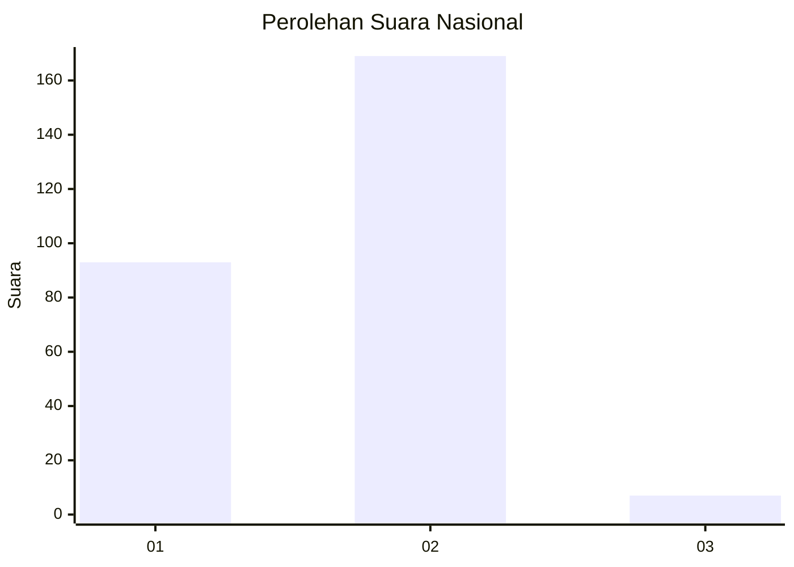
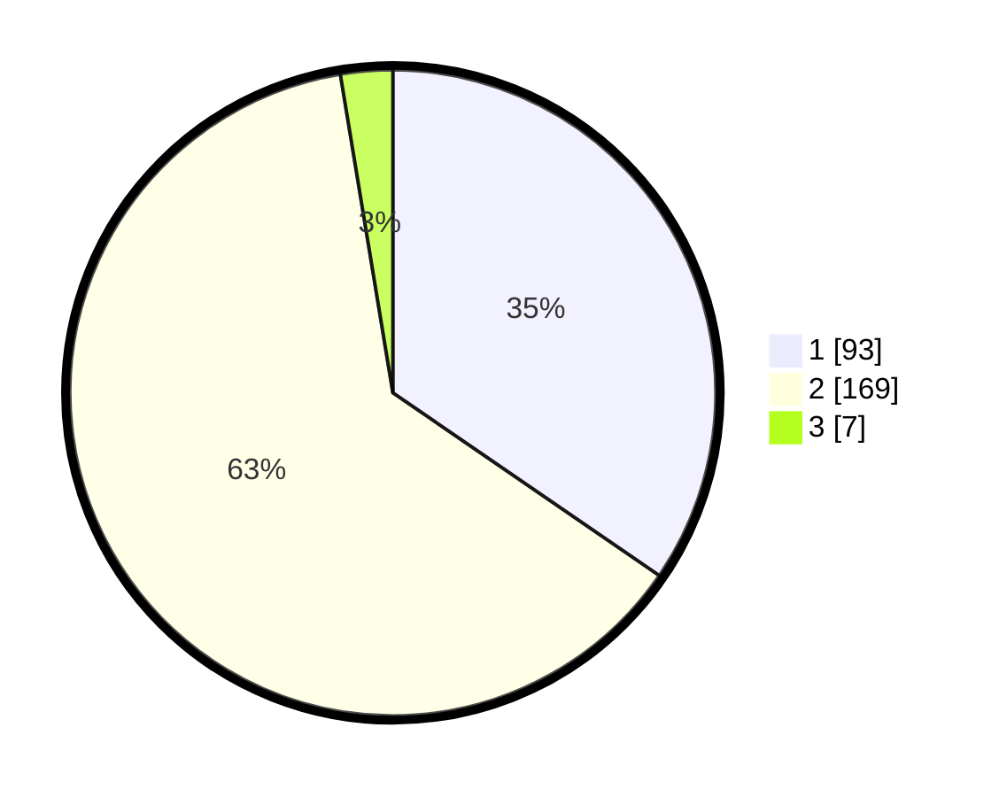

# Hasil

## Grafik

## Tabel

| No. | Nama Paslon    | Suara | Suara (raw) | Persentase |
|:--- |:-------------- | -----:| -----------:| ----------:|
| 1   | ANIES MUHAIMIN | 93    | [93][p-1]   | 34,57      |
| 2   | PRABOWO GIBRAN | 169   | [169][p-2]  | 62,83      |
| 3   | GANJAR MAHFUD  | 7     | [7][p-3]    | 2,60       |

[p-1]: https://github.com/gigit-pemilu/pemilu-2024/blob/main/pilpres/hitung-suara/sub/81-maluku/sub/71-kota-ambon/sub/02-sirimau/sub/2003-batu-merah/sub/028-tps/sub/paslon-1.txt
[p-2]: https://github.com/gigit-pemilu/pemilu-2024/blob/main/pilpres/hitung-suara/sub/81-maluku/sub/71-kota-ambon/sub/02-sirimau/sub/2003-batu-merah/sub/028-tps/sub/paslon-2.txt
[p-3]: https://github.com/gigit-pemilu/pemilu-2024/blob/main/pilpres/hitung-suara/sub/81-maluku/sub/71-kota-ambon/sub/02-sirimau/sub/2003-batu-merah/sub/028-tps/sub/paslon-3.txt

## Foto C Plano

https://sirekap-obj-formc.kpu.go.id/e210/pemilu/ppwp/81/71/02/20/03/8171022003028-20240215-134251--1b3dfb1f-48fa-4154-84e0-5c481e8757a9.jpg

https://sirekap-obj-formc.kpu.go.id/e210/pemilu/ppwp/81/71/02/20/03/8171022003028-20240215-134355--356a3b81-79de-43f1-bf49-debd84dc8197.jpg

https://sirekap-obj-formc.kpu.go.id/e210/pemilu/ppwp/81/71/02/20/03/8171022003028-20240215-134351--af7c8e5b-7f4a-4c69-a31a-85329ba68e8e.jpg

## Metadata

| Key        | Value               |
| ---------- | ------------------- |
| Time Stamp | 2024-02-20 11:00:00 |

