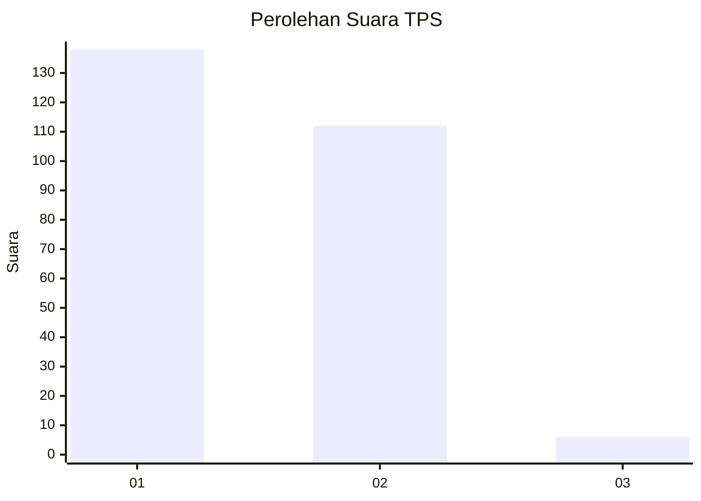
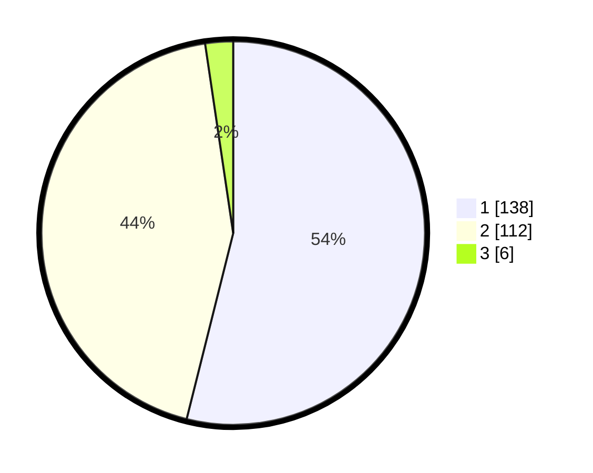

# Hasil

## Grafik

## Tabel

| No. | Nama Paslon    | Suara | Suara (raw) | Persentase |
|:--- |:-------------- | -----:| -----------:| ----------:|
| 1   | ANIES MUHAIMIN | 138   | [138][p-1]  | 53,91      |
| 2   | PRABOWO GIBRAN | 112   | [112][p-2]  | 43,75      |
| 3   | GANJAR MAHFUD  | 6     | [6][p-3]    | 2,34       |

[p-1]: https://github.com/gigit-pemilu/pemilu-2024-81-maluku/blob/main/pilpres/hitung-suara/sub/81-maluku/sub/71-kota-ambon/sub/02-sirimau/sub/2003-batu-merah/sub/034-tps/sub/paslon-1.txt
[p-2]: https://github.com/gigit-pemilu/pemilu-2024-81-maluku/blob/main/pilpres/hitung-suara/sub/81-maluku/sub/71-kota-ambon/sub/02-sirimau/sub/2003-batu-merah/sub/034-tps/sub/paslon-2.txt
[p-3]: https://github.com/gigit-pemilu/pemilu-2024-81-maluku/blob/main/pilpres/hitung-suara/sub/81-maluku/sub/71-kota-ambon/sub/02-sirimau/sub/2003-batu-merah/sub/034-tps/sub/paslon-3.txt

## Foto C Plano

https://sirekap-obj-formc.kpu.go.id/43df/pemilu/ppwp/81/71/02/20/03/8171022003034-20240215-043159--24ef2e93-2888-4a27-bf0e-6e89c4748a78.jpg

https://sirekap-obj-formc.kpu.go.id/43df/pemilu/ppwp/81/71/02/20/03/8171022003034-20240215-043337--4a0b76b6-2a7e-4f37-a6c6-169df51217f8.jpg

https://sirekap-obj-formc.kpu.go.id/43df/pemilu/ppwp/81/71/02/20/03/8171022003034-20240215-043615--22d73bce-5a90-4271-b3c3-1f7202b818da.jpg

## Metadata

| Key        | Value               |
| ---------- | ------------------- |
| Time Stamp | 2024-02-20 11:00:00 |

