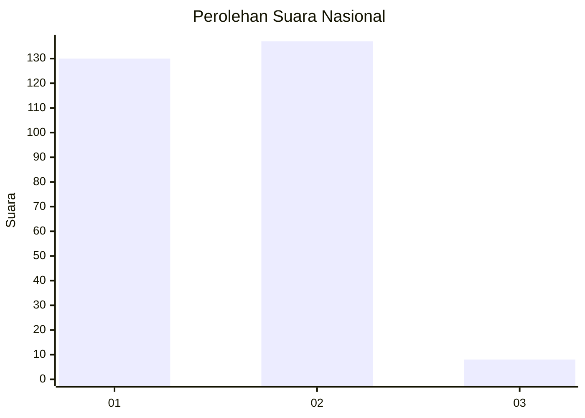
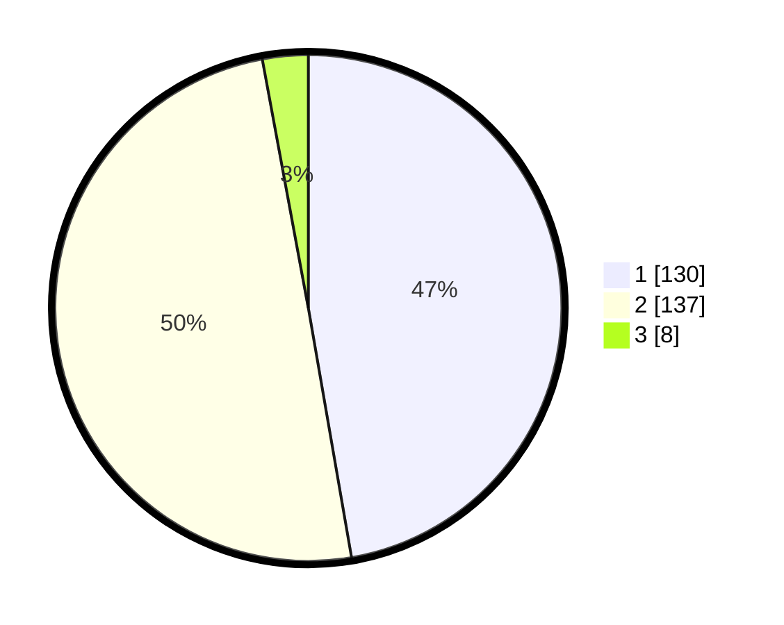

# Hasil

## Grafik

## Tabel

| No. | Nama Paslon    | Suara | Suara (raw) | Persentase |
|:--- |:-------------- | -----:| -----------:| ----------:|
| 1   | ANIES MUHAIMIN | 130   | [130][p-1]  | 47,27      |
| 2   | PRABOWO GIBRAN | 137   | [137][p-2]  | 49,82      |
| 3   | GANJAR MAHFUD  | 8     | [8][p-3]    | 2,91       |

[p-1]: https://github.com/gigit-pemilu/pemilu-2024/blob/main/pilpres/hitung-suara/sub/81-maluku/sub/71-kota-ambon/sub/02-sirimau/sub/2003-batu-merah/sub/067-tps/sub/paslon-1.txt
[p-2]: https://github.com/gigit-pemilu/pemilu-2024/blob/main/pilpres/hitung-suara/sub/81-maluku/sub/71-kota-ambon/sub/02-sirimau/sub/2003-batu-merah/sub/067-tps/sub/paslon-2.txt
[p-3]: https://github.com/gigit-pemilu/pemilu-2024/blob/main/pilpres/hitung-suara/sub/81-maluku/sub/71-kota-ambon/sub/02-sirimau/sub/2003-batu-merah/sub/067-tps/sub/paslon-3.txt

## Foto C Plano

https://sirekap-obj-formc.kpu.go.id/070f/pemilu/ppwp/81/71/02/20/03/8171022003067-20240215-093339--853532f2-35c8-435d-aed4-7f08f0833607.jpg

https://sirekap-obj-formc.kpu.go.id/070f/pemilu/ppwp/81/71/02/20/03/8171022003067-20240215-101644--a6755627-2f9d-4a81-9c65-68984e6d8fb5.jpg

https://sirekap-obj-formc.kpu.go.id/070f/pemilu/ppwp/81/71/02/20/03/8171022003067-20240215-101849--ac649a10-921e-4dd0-9978-eb498ea7f96a.jpg

## Metadata

| Key        | Value               |
| ---------- | ------------------- |
| Time Stamp | 2024-02-20 14:00:00 |

