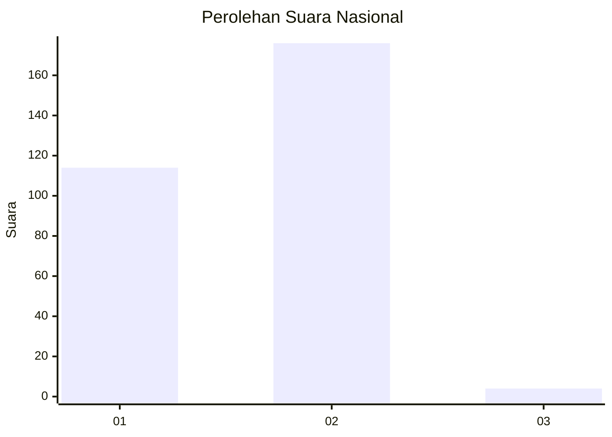
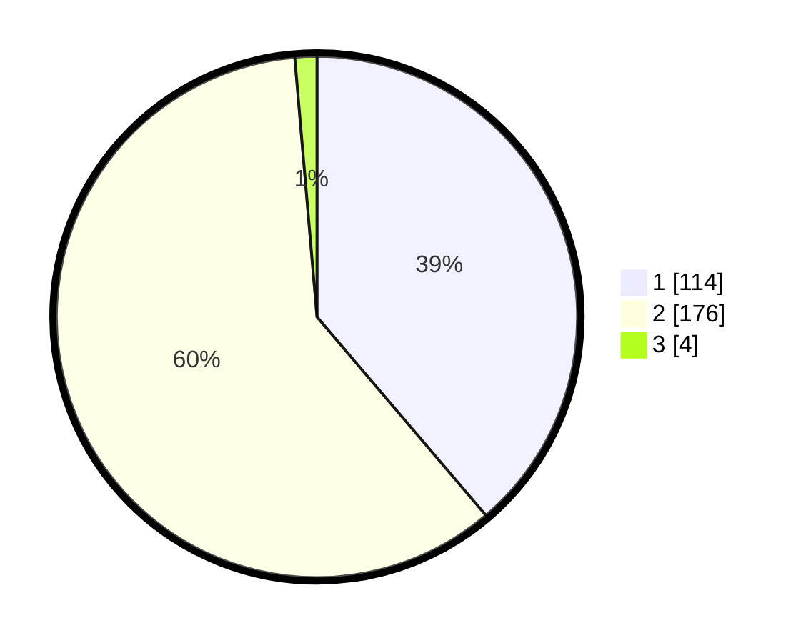

# Hasil

## Grafik

## Tabel

| No. | Nama Paslon    | Suara | Suara (raw) | Persentase |
|:--- |:-------------- | -----:| -----------:| ----------:|
| 1   | ANIES MUHAIMIN | 114   | [114][p-1]  | 38,78      |
| 2   | PRABOWO GIBRAN | 176   | [176][p-2]  | 59,86      |
| 3   | GANJAR MAHFUD  | 4     | [4][p-3]    | 1,36       |

[p-1]: https://github.com/gigit-pemilu/pemilu-2024/blob/main/pilpres/hitung-suara/sub/81-maluku/sub/71-kota-ambon/sub/02-sirimau/sub/2003-batu-merah/sub/068-tps/sub/paslon-1.txt
[p-2]: https://github.com/gigit-pemilu/pemilu-2024/blob/main/pilpres/hitung-suara/sub/81-maluku/sub/71-kota-ambon/sub/02-sirimau/sub/2003-batu-merah/sub/068-tps/sub/paslon-2.txt
[p-3]: https://github.com/gigit-pemilu/pemilu-2024/blob/main/pilpres/hitung-suara/sub/81-maluku/sub/71-kota-ambon/sub/02-sirimau/sub/2003-batu-merah/sub/068-tps/sub/paslon-3.txt

## Foto C Plano

https://sirekap-obj-formc.kpu.go.id/7be2/pemilu/ppwp/81/71/02/20/03/8171022003068-20240215-043829--9c4f1ddc-3793-4959-a344-de20e96e6fd8.jpg

https://sirekap-obj-formc.kpu.go.id/7be2/pemilu/ppwp/81/71/02/20/03/8171022003068-20240215-090300--6548a1b2-d88b-4e68-a496-3784a752689f.jpg

https://sirekap-obj-formc.kpu.go.id/7be2/pemilu/ppwp/81/71/02/20/03/8171022003068-20240215-043402--21e7c33d-2b83-4c55-a795-53c768947451.jpg

## Metadata

| Key        | Value               |
| ---------- | ------------------- |
| Time Stamp | 2024-02-15 20:30:46 |

