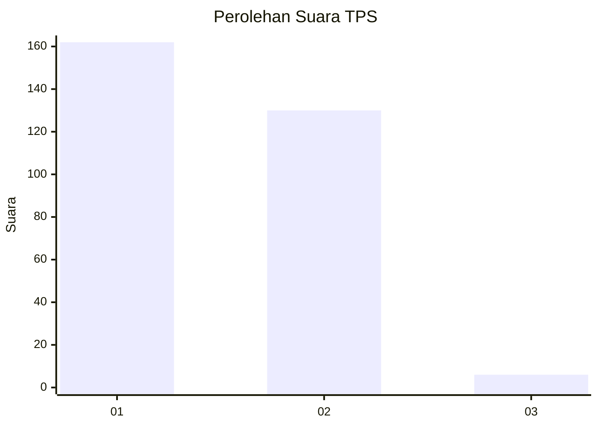
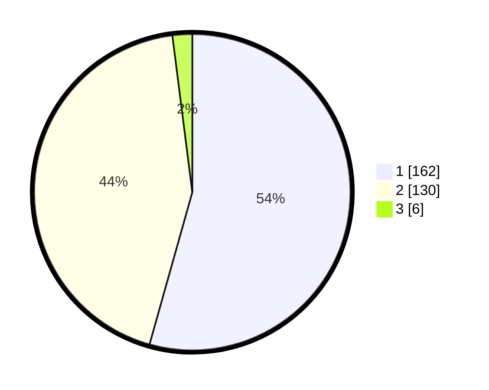

# Hasil

## Grafik

## Tabel

| No. | Nama Paslon    | Suara | Suara (raw) | Persentase |
|:--- |:-------------- | -----:| -----------:| ----------:|
| 1   | ANIES MUHAIMIN | 162   | [162][p-1]  | 54,36      |
| 2   | PRABOWO GIBRAN | 130   | [130][p-2]  | 43,62      |
| 3   | GANJAR MAHFUD  | 6     | [6][p-3]    | 2,01       |

[p-1]: https://github.com/gigit-pemilu/pemilu-2024-81-maluku/blob/main/pilpres/hitung-suara/sub/81-maluku/sub/71-kota-ambon/sub/02-sirimau/sub/2003-batu-merah/sub/069-tps/sub/paslon-1.txt
[p-2]: https://github.com/gigit-pemilu/pemilu-2024-81-maluku/blob/main/pilpres/hitung-suara/sub/81-maluku/sub/71-kota-ambon/sub/02-sirimau/sub/2003-batu-merah/sub/069-tps/sub/paslon-2.txt
[p-3]: https://github.com/gigit-pemilu/pemilu-2024-81-maluku/blob/main/pilpres/hitung-suara/sub/81-maluku/sub/71-kota-ambon/sub/02-sirimau/sub/2003-batu-merah/sub/069-tps/sub/paslon-3.txt

## Foto C Plano

https://sirekap-obj-formc.kpu.go.id/2f49/pemilu/ppwp/81/71/02/20/03/8171022003069-20240215-082742--138b0fea-0cb5-4353-b39c-3614ac022df7.jpg

https://sirekap-obj-formc.kpu.go.id/2f49/pemilu/ppwp/81/71/02/20/03/8171022003069-20240215-083723--73b9f77f-8198-494c-9a56-2d469da88c05.jpg

https://sirekap-obj-formc.kpu.go.id/2f49/pemilu/ppwp/81/71/02/20/03/8171022003069-20240215-083931--e4b3e669-8700-4350-be46-f627e893f21e.jpg

## Metadata

| Key        | Value               |
| ---------- | ------------------- |
| Time Stamp | 2024-02-20 14:00:00 |

