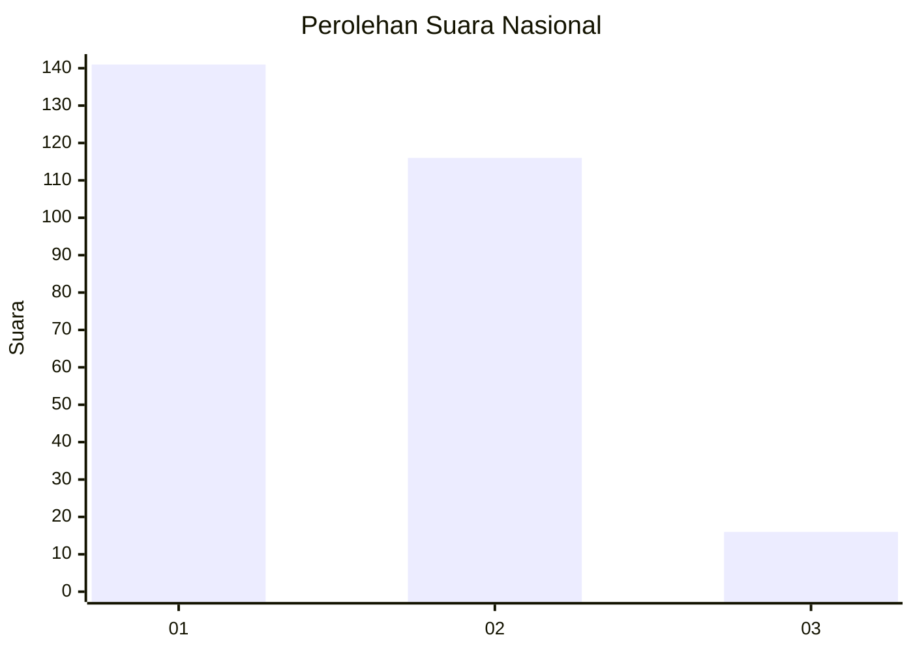
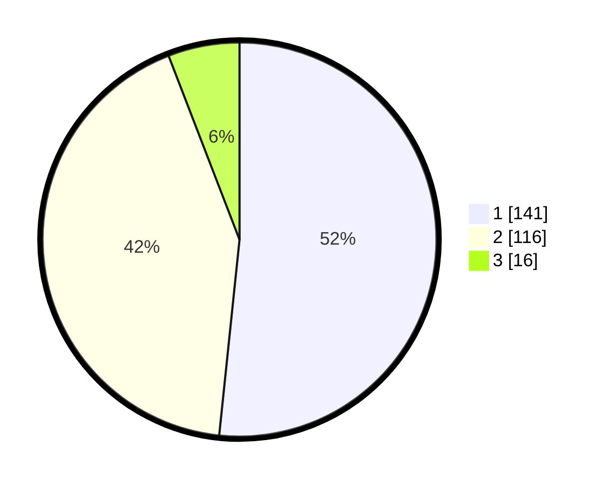

# Hasil

## Grafik

## Tabel

| No. | Nama Paslon    | Suara | Suara (raw) | Persentase |
|:--- |:-------------- | -----:| -----------:| ----------:|
| 1   | ANIES MUHAIMIN | 141   | [141][p-1]  | 51,65      |
| 2   | PRABOWO GIBRAN | 116   | [116][p-2]  | 42,49      |
| 3   | GANJAR MAHFUD  | 16    | [16][p-3]   | 5,86       |

[p-1]: https://github.com/gigit-pemilu/pemilu-2024/blob/main/pilpres/hitung-suara/sub/81-maluku/sub/71-kota-ambon/sub/02-sirimau/sub/2003-batu-merah/sub/077-tps/sub/paslon-1.txt
[p-2]: https://github.com/gigit-pemilu/pemilu-2024/blob/main/pilpres/hitung-suara/sub/81-maluku/sub/71-kota-ambon/sub/02-sirimau/sub/2003-batu-merah/sub/077-tps/sub/paslon-2.txt
[p-3]: https://github.com/gigit-pemilu/pemilu-2024/blob/main/pilpres/hitung-suara/sub/81-maluku/sub/71-kota-ambon/sub/02-sirimau/sub/2003-batu-merah/sub/077-tps/sub/paslon-3.txt

## Foto C Plano

https://sirekap-obj-formc.kpu.go.id/7bfd/pemilu/ppwp/81/71/02/20/03/8171022003077-20240215-015603--a0c14f65-3d71-476c-9347-6f0d1141c812.jpg

https://sirekap-obj-formc.kpu.go.id/7bfd/pemilu/ppwp/81/71/02/20/03/8171022003077-20240215-052713--105273c8-71d4-420f-9499-b3eb8454c5a1.jpg

https://sirekap-obj-formc.kpu.go.id/7bfd/pemilu/ppwp/81/71/02/20/03/8171022003077-20240215-052754--a3fa48b0-639f-4cf3-b193-61658aa661c2.jpg

## Metadata

| Key        | Value               |
| ---------- | ------------------- |
| Time Stamp | 2024-02-19 06:16:00 |

