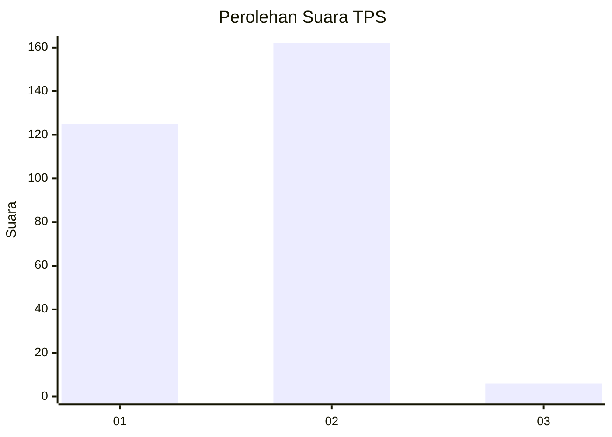
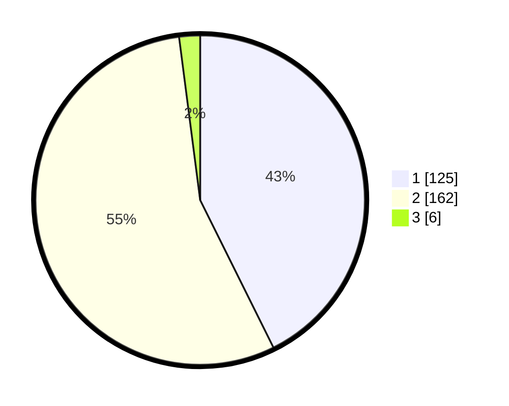

# Hasil

## Grafik

## Tabel

| No. | Nama Paslon    | Suara | Suara (raw) | Persentase |
|:--- |:-------------- | -----:| -----------:| ----------:|
| 1   | ANIES MUHAIMIN | 125   | [125][p-1]  | 42,66      |
| 2   | PRABOWO GIBRAN | 162   | [162][p-2]  | 55,29      |
| 3   | GANJAR MAHFUD  | 6     | [6][p-3]    | 2,05       |

[p-1]: https://github.com/gigit-pemilu/pemilu-2024-81-maluku/blob/main/pilpres/hitung-suara/sub/81-maluku/sub/71-kota-ambon/sub/02-sirimau/sub/2003-batu-merah/sub/106-tps/sub/paslon-1.txt
[p-2]: https://github.com/gigit-pemilu/pemilu-2024-81-maluku/blob/main/pilpres/hitung-suara/sub/81-maluku/sub/71-kota-ambon/sub/02-sirimau/sub/2003-batu-merah/sub/106-tps/sub/paslon-2.txt
[p-3]: https://github.com/gigit-pemilu/pemilu-2024-81-maluku/blob/main/pilpres/hitung-suara/sub/81-maluku/sub/71-kota-ambon/sub/02-sirimau/sub/2003-batu-merah/sub/106-tps/sub/paslon-3.txt

## Foto C Plano

https://sirekap-obj-formc.kpu.go.id/17d7/pemilu/ppwp/81/71/02/20/03/8171022003106-20240215-061054--b53064a0-fc7f-46b0-a787-b5b6241f95b1.jpg

https://sirekap-obj-formc.kpu.go.id/17d7/pemilu/ppwp/81/71/02/20/03/8171022003106-20240215-061225--1d28db98-5e1f-4019-a3b2-891fcff38905.jpg

https://sirekap-obj-formc.kpu.go.id/17d7/pemilu/ppwp/81/71/02/20/03/8171022003106-20240215-061743--5a344879-c484-4739-9790-673a6e4ce1ef.jpg

## Metadata

| Key        | Value               |
| ---------- | ------------------- |
| Time Stamp | 2024-02-20 14:00:00 |

