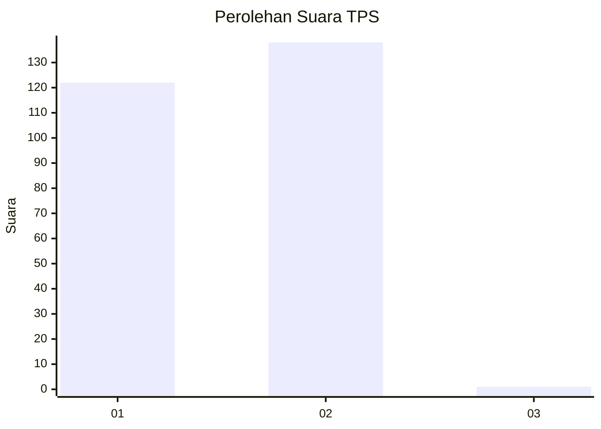
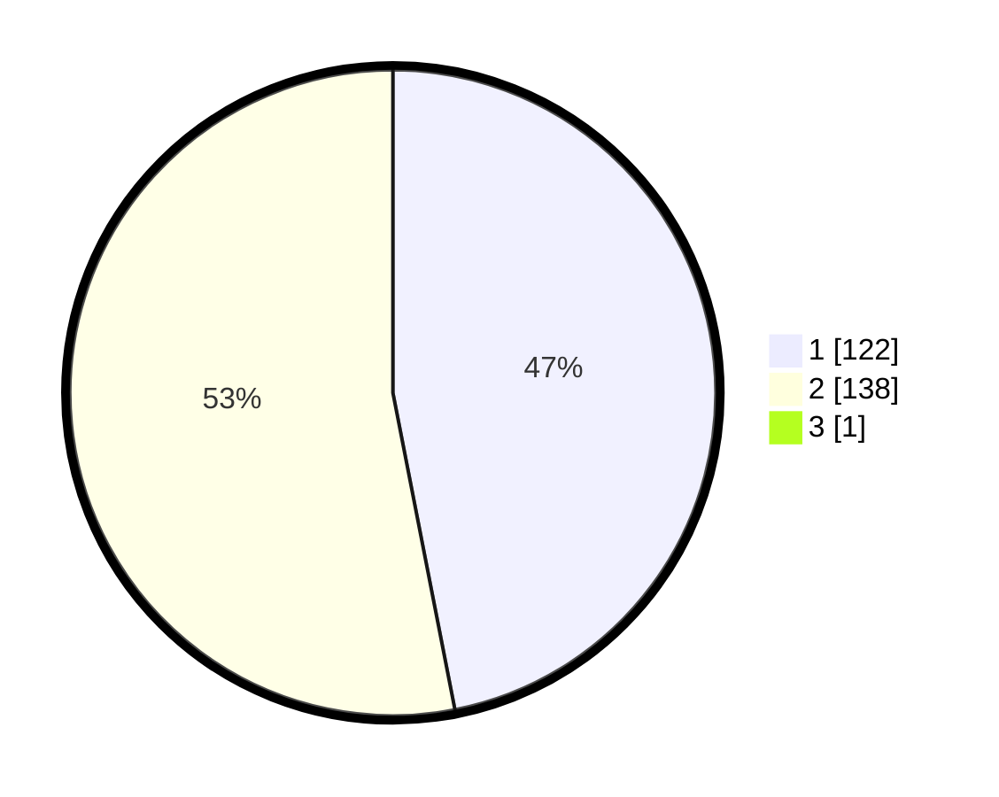

# Hasil

## Grafik

## Tabel

| No. | Nama Paslon    | Suara | Suara (raw) | Persentase |
|:--- |:-------------- | -----:| -----------:| ----------:|
| 1   | ANIES MUHAIMIN | 122   | [122][p-1]  | 46,74      |
| 2   | PRABOWO GIBRAN | 138   | [138][p-2]  | 52,87      |
| 3   | GANJAR MAHFUD  | 1     | [1][p-3]    | 0,38       |

[p-1]: https://github.com/gigit-pemilu/pemilu-2024-81-maluku/blob/main/pilpres/hitung-suara/sub/81-maluku/sub/71-kota-ambon/sub/02-sirimau/sub/2003-batu-merah/sub/110-tps/sub/paslon-1.txt
[p-2]: https://github.com/gigit-pemilu/pemilu-2024-81-maluku/blob/main/pilpres/hitung-suara/sub/81-maluku/sub/71-kota-ambon/sub/02-sirimau/sub/2003-batu-merah/sub/110-tps/sub/paslon-2.txt
[p-3]: https://github.com/gigit-pemilu/pemilu-2024-81-maluku/blob/main/pilpres/hitung-suara/sub/81-maluku/sub/71-kota-ambon/sub/02-sirimau/sub/2003-batu-merah/sub/110-tps/sub/paslon-3.txt

## Foto C Plano

https://sirekap-obj-formc.kpu.go.id/eb94/pemilu/ppwp/81/71/02/20/03/8171022003110-20240215-020924--1e61bddb-1dd2-4b26-86b0-03fa4759af2b.jpg

https://sirekap-obj-formc.kpu.go.id/eb94/pemilu/ppwp/81/71/02/20/03/8171022003110-20240215-021210--37e30b2a-35bb-4534-a032-e3cfdcd112b9.jpg

https://sirekap-obj-formc.kpu.go.id/eb94/pemilu/ppwp/81/71/02/20/03/8171022003110-20240215-030132--1b9623e8-3a6b-4d50-af44-126df53892c4.jpg

## Metadata

| Key        | Value               |
| ---------- | ------------------- |
| Time Stamp | 2024-02-20 11:00:00 |

