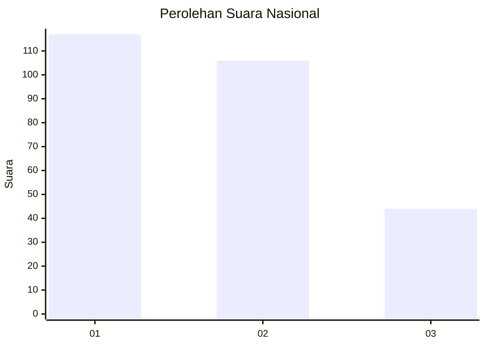
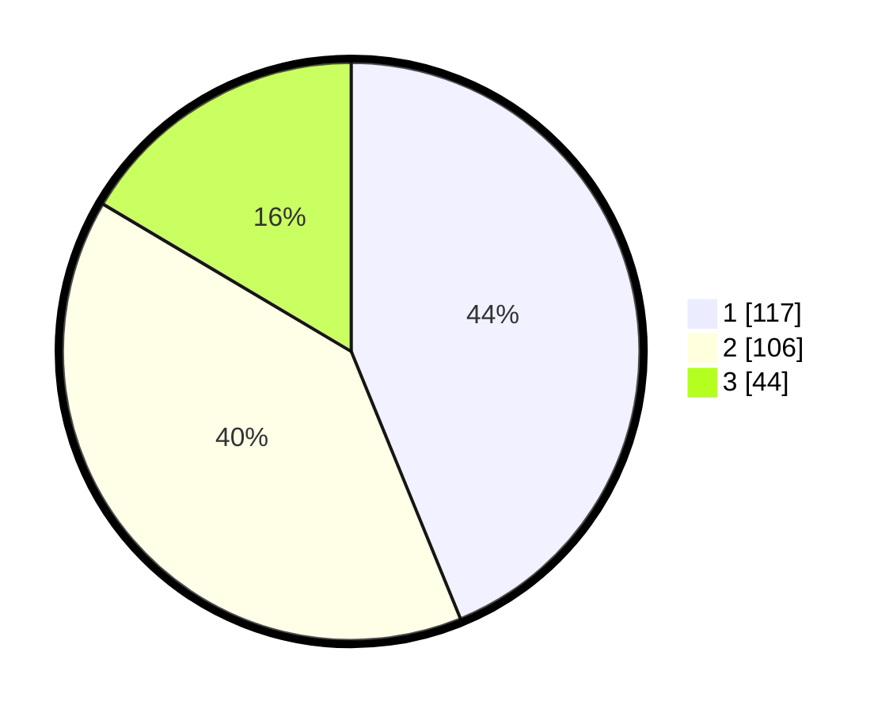

# Hasil

## Grafik

## Tabel

| No. | Nama Paslon    | Suara | Suara (raw) | Persentase |
|:--- |:-------------- | -----:| -----------:| ----------:|
| 1   | ANIES MUHAIMIN | 117   | [117][p-1]  | 43,82      |
| 2   | PRABOWO GIBRAN | 106   | [106][p-2]  | 39,70      |
| 3   | GANJAR MAHFUD  | 44    | [44][p-3]   | 16,48      |

[p-1]: https://github.com/gigit-pemilu/pemilu-2024/blob/main/pilpres/hitung-suara/sub/81-maluku/sub/71-kota-ambon/sub/02-sirimau/sub/2003-batu-merah/sub/117-tps/sub/paslon-1.txt
[p-2]: https://github.com/gigit-pemilu/pemilu-2024/blob/main/pilpres/hitung-suara/sub/81-maluku/sub/71-kota-ambon/sub/02-sirimau/sub/2003-batu-merah/sub/117-tps/sub/paslon-2.txt
[p-3]: https://github.com/gigit-pemilu/pemilu-2024/blob/main/pilpres/hitung-suara/sub/81-maluku/sub/71-kota-ambon/sub/02-sirimau/sub/2003-batu-merah/sub/117-tps/sub/paslon-3.txt

## Foto C Plano

https://sirekap-obj-formc.kpu.go.id/539d/pemilu/ppwp/81/71/02/20/03/8171022003117-20240214-193219--04e6fbd8-17eb-40a3-9162-765f9fca3b66.jpg

https://sirekap-obj-formc.kpu.go.id/539d/pemilu/ppwp/81/71/02/20/03/8171022003117-20240214-193354--b9b925b8-4d21-4804-aac8-405f4dc3ca68.jpg

https://sirekap-obj-formc.kpu.go.id/539d/pemilu/ppwp/81/71/02/20/03/8171022003117-20240214-193523--0fd5a822-19d5-4061-abcb-80012b4fe5cd.jpg

## Metadata

| Key        | Value               |
| ---------- | ------------------- |
| Time Stamp | 2024-02-20 15:00:00 |

