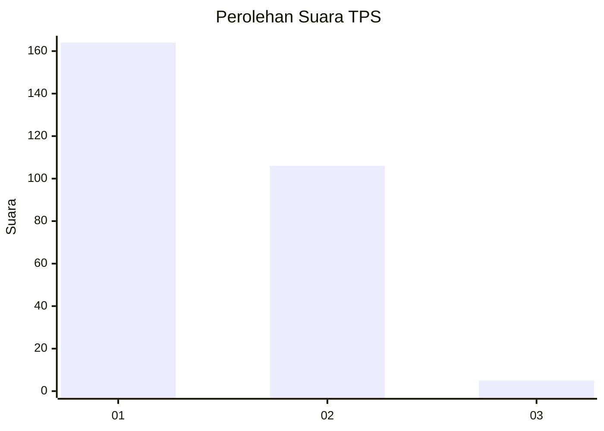
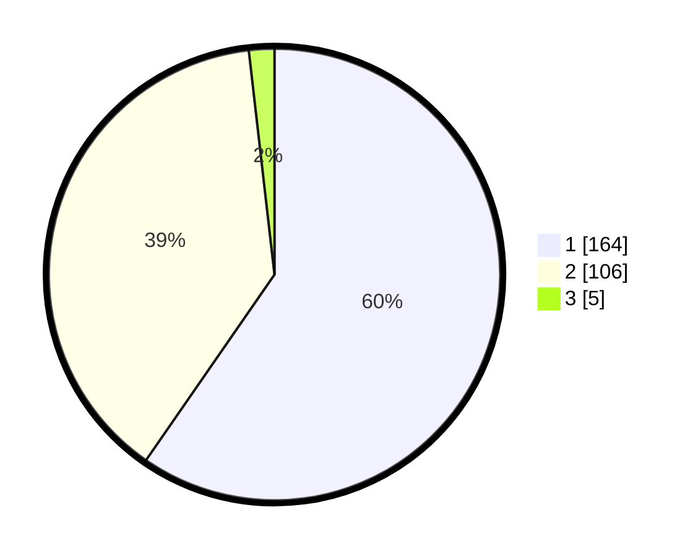

# Hasil

## Grafik

## Tabel

| No. | Nama Paslon    | Suara | Suara (raw) | Persentase |
|:--- |:-------------- | -----:| -----------:| ----------:|
| 1   | ANIES MUHAIMIN | 164   | [164][p-1]  | 59,64      |
| 2   | PRABOWO GIBRAN | 106   | [106][p-2]  | 38,55      |
| 3   | GANJAR MAHFUD  | 5     | [5][p-3]    | 1,82       |

[p-1]: https://github.com/gigit-pemilu/pemilu-2024-81-maluku/blob/main/pilpres/hitung-suara/sub/81-maluku/sub/71-kota-ambon/sub/02-sirimau/sub/2003-batu-merah/sub/121-tps/sub/paslon-1.txt
[p-2]: https://github.com/gigit-pemilu/pemilu-2024-81-maluku/blob/main/pilpres/hitung-suara/sub/81-maluku/sub/71-kota-ambon/sub/02-sirimau/sub/2003-batu-merah/sub/121-tps/sub/paslon-2.txt
[p-3]: https://github.com/gigit-pemilu/pemilu-2024-81-maluku/blob/main/pilpres/hitung-suara/sub/81-maluku/sub/71-kota-ambon/sub/02-sirimau/sub/2003-batu-merah/sub/121-tps/sub/paslon-3.txt

## Foto C Plano

https://sirekap-obj-formc.kpu.go.id/308a/pemilu/ppwp/81/71/02/20/03/8171022003121-20240215-121112--9da9e6d6-fc85-4b50-9def-f1ce1d66320a.jpg

https://sirekap-obj-formc.kpu.go.id/308a/pemilu/ppwp/81/71/02/20/03/8171022003121-20240215-030527--707c6a3e-80a2-4787-b2a3-b8cdd497bd88.jpg

https://sirekap-obj-formc.kpu.go.id/308a/pemilu/ppwp/81/71/02/20/03/8171022003121-20240215-030633--ada1e94f-c3ea-4ec8-aa26-965e7d8659c2.jpg

## Metadata

| Key        | Value               |
| ---------- | ------------------- |
| Time Stamp | 2024-02-15 19:30:26 |

