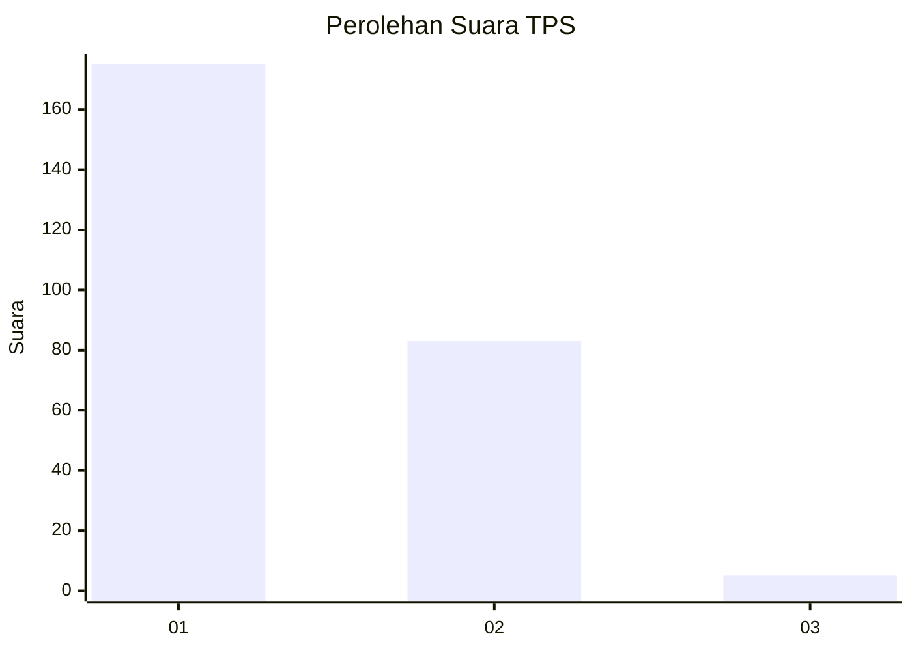
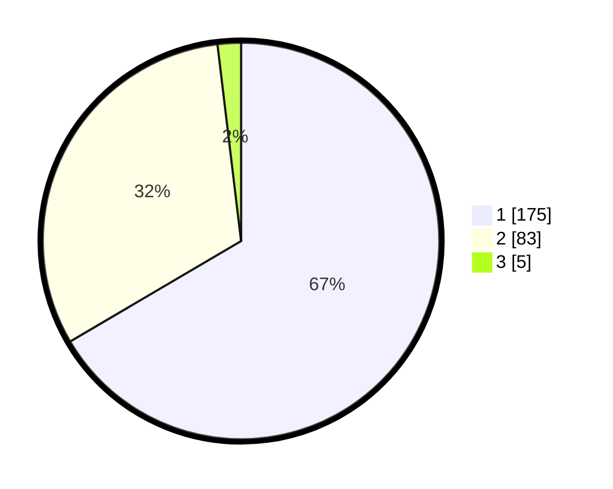

# Hasil

## Grafik

## Tabel

| No. | Nama Paslon    | Suara | Suara (raw) | Persentase |
|:--- |:-------------- | -----:| -----------:| ----------:|
| 1   | ANIES MUHAIMIN | 175   | [175][p-1]  | 66,54      |
| 2   | PRABOWO GIBRAN | 83    | [83][p-2]   | 31,56      |
| 3   | GANJAR MAHFUD  | 5     | [5][p-3]    | 1,90       |

[p-1]: https://github.com/gigit-pemilu/pemilu-2024-81-maluku/blob/main/pilpres/hitung-suara/sub/81-maluku/sub/71-kota-ambon/sub/02-sirimau/sub/2003-batu-merah/sub/132-tps/sub/paslon-1.txt
[p-2]: https://github.com/gigit-pemilu/pemilu-2024-81-maluku/blob/main/pilpres/hitung-suara/sub/81-maluku/sub/71-kota-ambon/sub/02-sirimau/sub/2003-batu-merah/sub/132-tps/sub/paslon-2.txt
[p-3]: https://github.com/gigit-pemilu/pemilu-2024-81-maluku/blob/main/pilpres/hitung-suara/sub/81-maluku/sub/71-kota-ambon/sub/02-sirimau/sub/2003-batu-merah/sub/132-tps/sub/paslon-3.txt

## Foto C Plano

https://sirekap-obj-formc.kpu.go.id/d1a8/pemilu/ppwp/81/71/02/20/03/8171022003132-20240215-083627--24cc7ade-8288-4488-9144-08c2e41119dd.jpg

https://sirekap-obj-formc.kpu.go.id/d1a8/pemilu/ppwp/81/71/02/20/03/8171022003132-20240215-083912--d4b426d4-1acf-47c2-b64a-51b94f792cc3.jpg

https://sirekap-obj-formc.kpu.go.id/d1a8/pemilu/ppwp/81/71/02/20/03/8171022003132-20240215-084218--3cc4509d-9bf7-4fc0-965f-eed764197184.jpg

## Metadata

| Key        | Value               |
| ---------- | ------------------- |
| Time Stamp | 2024-02-20 12:00:00 |

