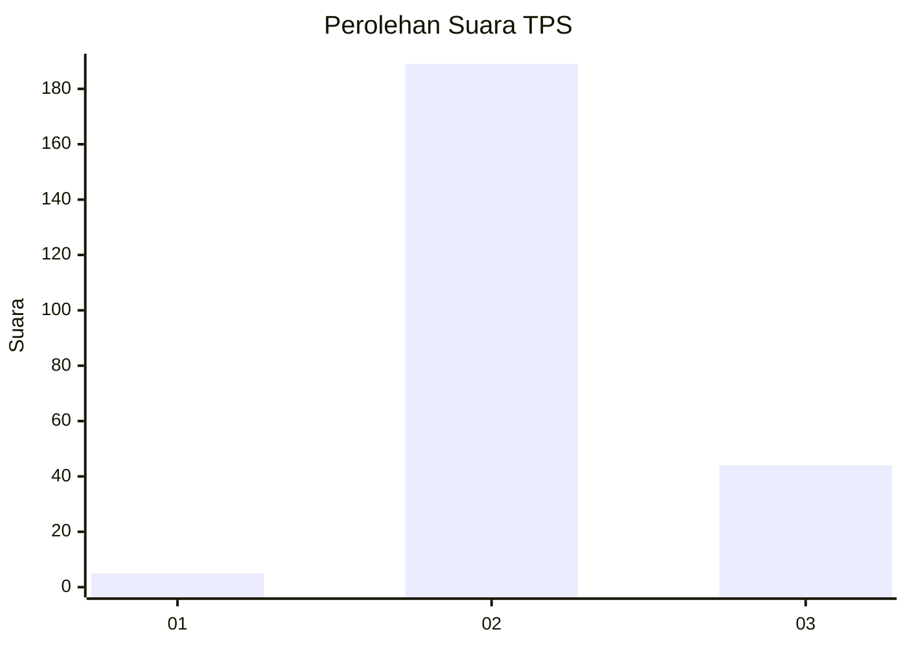
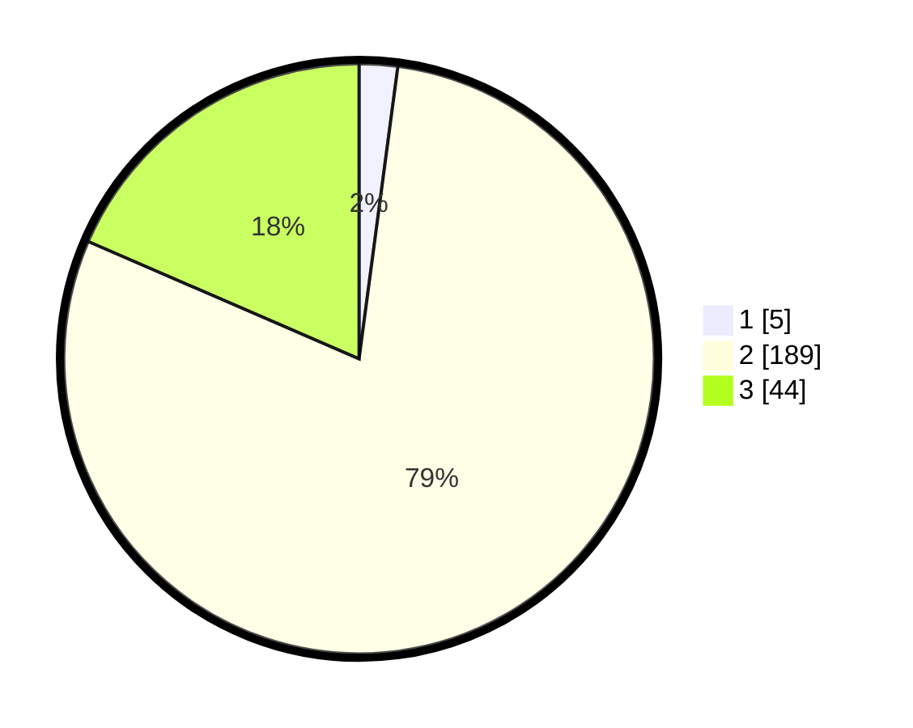

# Hasil

## Grafik

## Tabel

| No. | Nama Paslon    | Suara | Suara (raw) | Persentase |
|:--- |:-------------- | -----:| -----------:| ----------:|
| 1   | ANIES MUHAIMIN | 5     | [5][p-1]    | 2,10       |
| 2   | PRABOWO GIBRAN | 189   | [189][p-2]  | 79,41      |
| 3   | GANJAR MAHFUD  | 44    | [44][p-3]   | 18,49      |

[p-1]: https://github.com/gigit-pemilu/pemilu-2024-81-maluku/blob/main/pilpres/hitung-suara/sub/81-maluku/sub/71-kota-ambon/sub/03-baguala/sub/1018-lateri/sub/001-tps/sub/paslon-1.txt
[p-2]: https://github.com/gigit-pemilu/pemilu-2024-81-maluku/blob/main/pilpres/hitung-suara/sub/81-maluku/sub/71-kota-ambon/sub/03-baguala/sub/1018-lateri/sub/001-tps/sub/paslon-2.txt
[p-3]: https://github.com/gigit-pemilu/pemilu-2024-81-maluku/blob/main/pilpres/hitung-suara/sub/81-maluku/sub/71-kota-ambon/sub/03-baguala/sub/1018-lateri/sub/001-tps/sub/paslon-3.txt

## Foto C Plano

https://sirekap-obj-formc.kpu.go.id/5d27/pemilu/ppwp/81/71/03/10/18/8171031018001-20240214-210426--cd0ba541-1116-4303-a964-5e34af43334d.jpg

https://sirekap-obj-formc.kpu.go.id/5d27/pemilu/ppwp/81/71/03/10/18/8171031018001-20240214-200439--229b35e1-43e3-4d89-b783-c03467e93a64.jpg

https://sirekap-obj-formc.kpu.go.id/5d27/pemilu/ppwp/81/71/03/10/18/8171031018001-20240214-200657--b091e8b3-9cf7-46af-9861-29f3c544a756.jpg

## Metadata

| Key        | Value               |
| ---------- | ------------------- |
| Time Stamp | 2024-02-14 21:46:01 |

