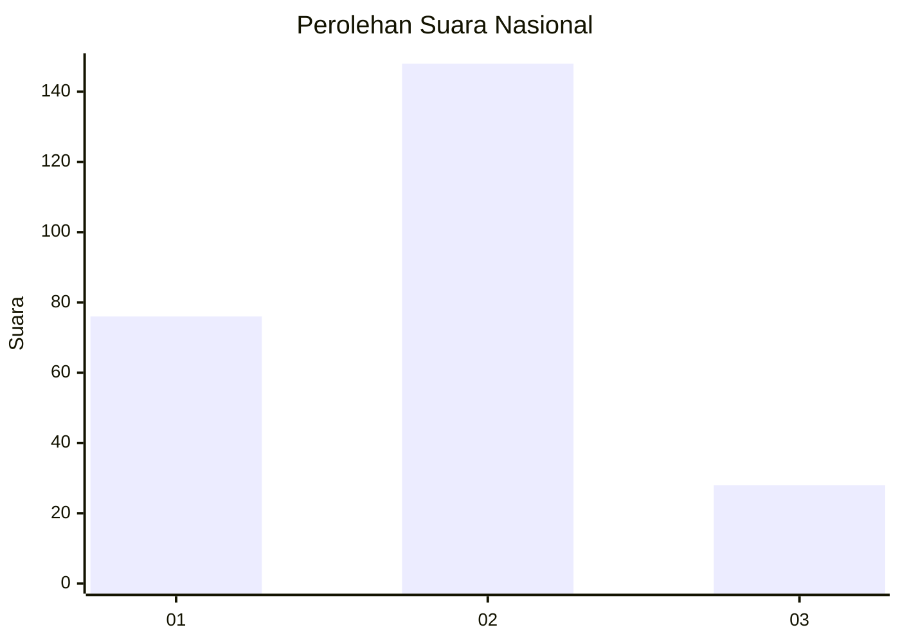
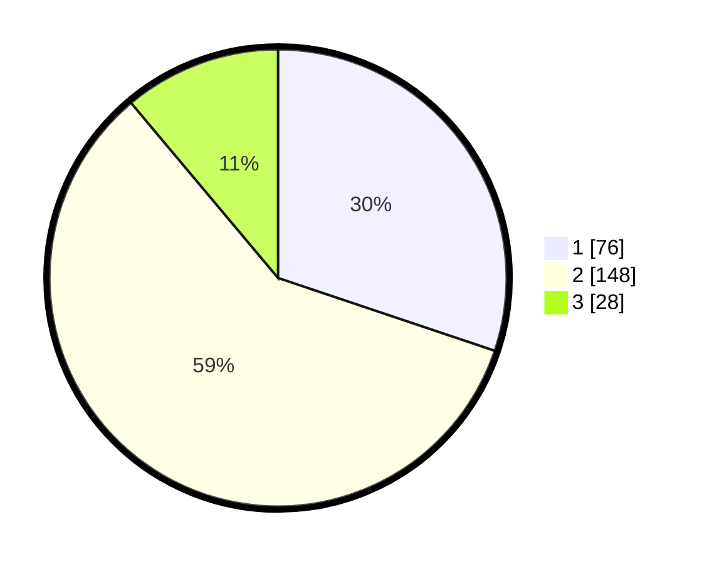

# Hasil

## Grafik

## Tabel

| No. | Nama Paslon    | Suara | Suara (raw) | Persentase |
|:--- |:-------------- | -----:| -----------:| ----------:|
| 1   | ANIES MUHAIMIN | 76    | [76][p-1]   | 30,16      |
| 2   | PRABOWO GIBRAN | 148   | [148][p-2]  | 58,73      |
| 3   | GANJAR MAHFUD  | 28    | [28][p-3]   | 11,11      |

[p-1]: https://github.com/gigit-pemilu/pemilu-2024/blob/main/pilpres/hitung-suara/sub/81-maluku/sub/71-kota-ambon/sub/04-teluk-ambon/sub/1008-tihu/sub/001-tps/sub/paslon-1.txt
[p-2]: https://github.com/gigit-pemilu/pemilu-2024/blob/main/pilpres/hitung-suara/sub/81-maluku/sub/71-kota-ambon/sub/04-teluk-ambon/sub/1008-tihu/sub/001-tps/sub/paslon-2.txt
[p-3]: https://github.com/gigit-pemilu/pemilu-2024/blob/main/pilpres/hitung-suara/sub/81-maluku/sub/71-kota-ambon/sub/04-teluk-ambon/sub/1008-tihu/sub/001-tps/sub/paslon-3.txt

## Foto C Plano

https://sirekap-obj-formc.kpu.go.id/0262/pemilu/ppwp/81/71/04/10/08/8171041008001-20240215-110852--cf83370c-b000-4e90-b46b-573ccce6be87.jpg

https://sirekap-obj-formc.kpu.go.id/0262/pemilu/ppwp/81/71/04/10/08/8171041008001-20240215-112707--3efaace0-6204-4ddb-b936-5dec4b082d01.jpg

https://sirekap-obj-formc.kpu.go.id/0262/pemilu/ppwp/81/71/04/10/08/8171041008001-20240215-112445--0eecf094-ed0d-49f2-80bd-e18ceaa49be5.jpg

## Metadata

| Key        | Value               |
| ---------- | ------------------- |
| Time Stamp | 2024-02-15 16:00:26 |

