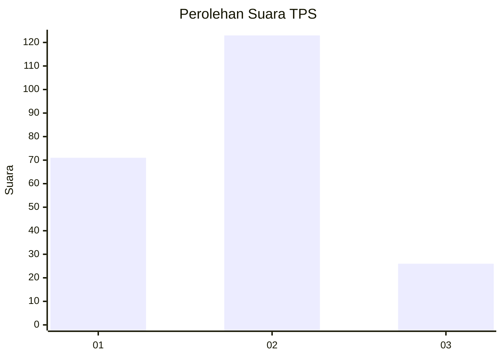
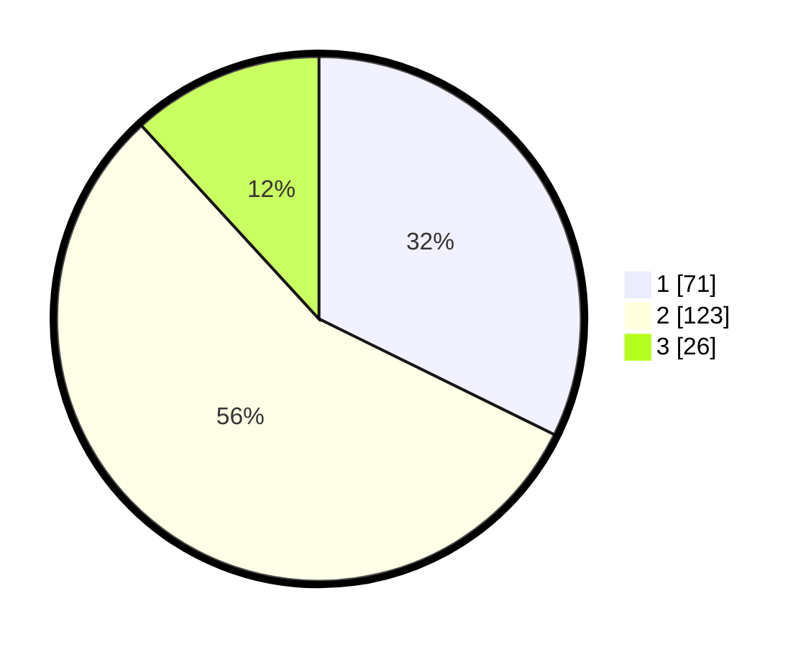

# Hasil

## Grafik

## Tabel

| No. | Nama Paslon    | Suara | Suara (raw) | Persentase |
|:--- |:-------------- | -----:| -----------:| ----------:|
| 1   | ANIES MUHAIMIN | 71    | [71][p-1]   | 32,27      |
| 2   | PRABOWO GIBRAN | 123   | [123][p-2]  | 55,91      |
| 3   | GANJAR MAHFUD  | 26    | [26][p-3]   | 11,82      |

[p-1]: https://github.com/gigit-pemilu/pemilu-2024-81-maluku/blob/main/pilpres/hitung-suara/sub/81-maluku/sub/71-kota-ambon/sub/04-teluk-ambon/sub/1008-tihu/sub/002-tps/sub/paslon-1.txt
[p-2]: https://github.com/gigit-pemilu/pemilu-2024-81-maluku/blob/main/pilpres/hitung-suara/sub/81-maluku/sub/71-kota-ambon/sub/04-teluk-ambon/sub/1008-tihu/sub/002-tps/sub/paslon-2.txt
[p-3]: https://github.com/gigit-pemilu/pemilu-2024-81-maluku/blob/main/pilpres/hitung-suara/sub/81-maluku/sub/71-kota-ambon/sub/04-teluk-ambon/sub/1008-tihu/sub/002-tps/sub/paslon-3.txt

## Foto C Plano

https://sirekap-obj-formc.kpu.go.id/cd50/pemilu/ppwp/81/71/04/10/08/8171041008002-20240215-010257--bde778c2-4869-418a-a756-394d9d5407fb.jpg

https://sirekap-obj-formc.kpu.go.id/cd50/pemilu/ppwp/81/71/04/10/08/8171041008002-20240215-010627--8fddd97e-2c45-40eb-8439-0d7f24f37ad4.jpg

https://sirekap-obj-formc.kpu.go.id/cd50/pemilu/ppwp/81/71/04/10/08/8171041008002-20240215-010830--e81a41ac-9a35-409b-a4d5-24c5ac715502.jpg

## Metadata

| Key        | Value               |
| ---------- | ------------------- |
| Time Stamp | 2024-02-15 16:00:26 |

