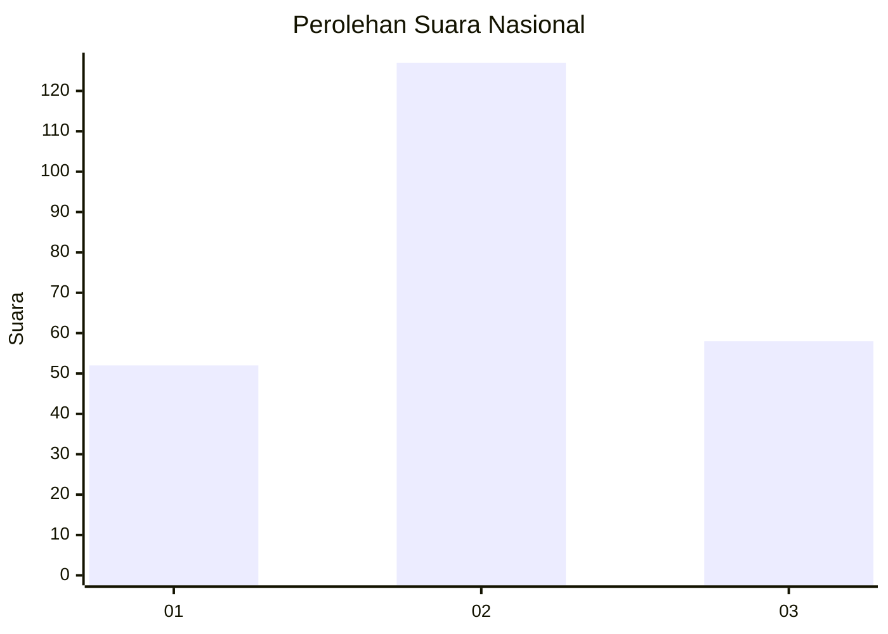
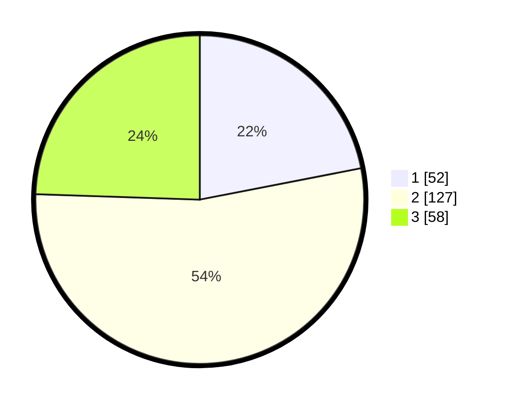

# Hasil

## Grafik

## Tabel

| No. | Nama Paslon    | Suara | Suara (raw) | Persentase |
|:--- |:-------------- | -----:| -----------:| ----------:|
| 1   | ANIES MUHAIMIN | 52    | [52][p-1]   | 21,94      |
| 2   | PRABOWO GIBRAN | 127   | [127][p-2]  | 53,59      |
| 3   | GANJAR MAHFUD  | 58    | [58][p-3]   | 24,47      |

[p-1]: https://github.com/gigit-pemilu/pemilu-2024/blob/main/pilpres/hitung-suara/sub/81-maluku/sub/71-kota-ambon/sub/04-teluk-ambon/sub/1008-tihu/sub/003-tps/sub/paslon-1.txt
[p-2]: https://github.com/gigit-pemilu/pemilu-2024/blob/main/pilpres/hitung-suara/sub/81-maluku/sub/71-kota-ambon/sub/04-teluk-ambon/sub/1008-tihu/sub/003-tps/sub/paslon-2.txt
[p-3]: https://github.com/gigit-pemilu/pemilu-2024/blob/main/pilpres/hitung-suara/sub/81-maluku/sub/71-kota-ambon/sub/04-teluk-ambon/sub/1008-tihu/sub/003-tps/sub/paslon-3.txt

## Foto C Plano

https://sirekap-obj-formc.kpu.go.id/08b4/pemilu/ppwp/81/71/04/10/08/8171041008003-20240215-004632--58870f62-91b0-470a-baa4-d840541c47cf.jpg

https://sirekap-obj-formc.kpu.go.id/08b4/pemilu/ppwp/81/71/04/10/08/8171041008003-20240215-004748--cabb8c05-444b-446f-9a4e-ec9f487313b6.jpg

https://sirekap-obj-formc.kpu.go.id/08b4/pemilu/ppwp/81/71/04/10/08/8171041008003-20240215-004846--b87d3bbb-a376-4f06-a286-e328e1b3d6af.jpg

## Metadata

| Key        | Value               |
| ---------- | ------------------- |
| Time Stamp | 2024-02-15 15:00:29 |

