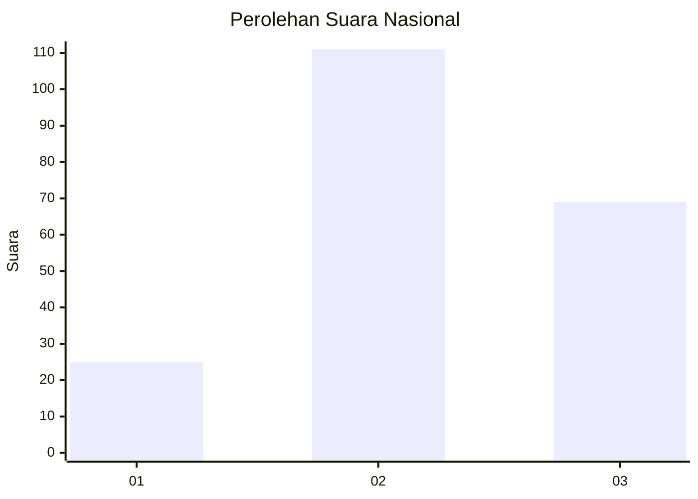
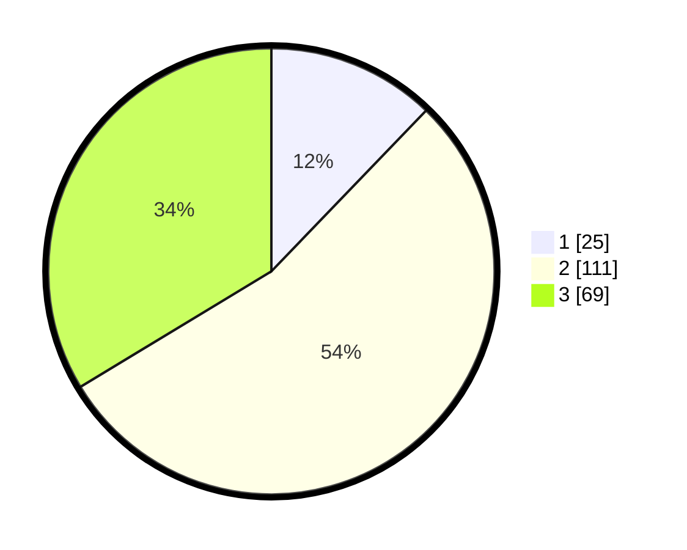

# Hasil

## Grafik

## Tabel

| No. | Nama Paslon    | Suara | Suara (raw) | Persentase |
|:--- |:-------------- | -----:| -----------:| ----------:|
| 1   | ANIES MUHAIMIN | 25    | [25][p-1]   | 12,20      |
| 2   | PRABOWO GIBRAN | 111   | [111][p-2]  | 54,15      |
| 3   | GANJAR MAHFUD  | 69    | [69][p-3]   | 33,66      |

[p-1]: https://github.com/gigit-pemilu/pemilu-2024/blob/main/pilpres/hitung-suara/sub/81-maluku/sub/71-kota-ambon/sub/04-teluk-ambon/sub/2002-poka/sub/002-tps/sub/paslon-1.txt
[p-2]: https://github.com/gigit-pemilu/pemilu-2024/blob/main/pilpres/hitung-suara/sub/81-maluku/sub/71-kota-ambon/sub/04-teluk-ambon/sub/2002-poka/sub/002-tps/sub/paslon-2.txt
[p-3]: https://github.com/gigit-pemilu/pemilu-2024/blob/main/pilpres/hitung-suara/sub/81-maluku/sub/71-kota-ambon/sub/04-teluk-ambon/sub/2002-poka/sub/002-tps/sub/paslon-3.txt

## Foto C Plano

https://sirekap-obj-formc.kpu.go.id/a6d9/pemilu/ppwp/81/71/04/20/02/8171042002002-20240215-015249--3d2dca18-8d5c-4b52-ad78-3f3d33ce7d4b.jpg

https://sirekap-obj-formc.kpu.go.id/a6d9/pemilu/ppwp/81/71/04/20/02/8171042002002-20240215-015354--952cf94c-e173-4952-8399-c964040623be.jpg

https://sirekap-obj-formc.kpu.go.id/a6d9/pemilu/ppwp/81/71/04/20/02/8171042002002-20240215-015503--e630cc44-2d71-4a92-a40c-f86d5fed2308.jpg

## Metadata

| Key        | Value               |
| ---------- | ------------------- |
| Time Stamp | 2024-02-15 16:30:25 |

